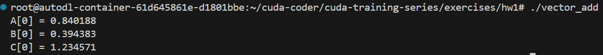

[TOC]

# CUDA-1作业学习

因为在课上就说过作业中有多维的情况，所以开帖记录。作业是那种给框架要求填空的形式，已经上传在github上。第一次落实好作业心里真的很自豪+欣慰自己的行动力。继续努力:)

## 终端命令

1. CUDA 编译器调用

   ```
   nvcc -o <运行程序名> <cu程序名>.cu
   ```

   例如：nvcc -o hello hello.cu

2. 运行

   ```
   ./<运行程序名>
   ```

​	例如：./hello

## Q1:hello.cu

- 要求创建一个简单的hello world应用程序。示例输出如下（行的顺序可能会有所不同）：

```c++
Hello from block: 0, thread: 0
Hello from block: 0, thread: 1
Hello from block: 1, thread: 0
Hello from block: 1, thread: 1
```

- 完善框架后代码如下：

```c++
#include <stdio.h>

__global__ void hello(){

  printf("Hello from block: %u, thread: %u\n", blockIdx.x,threadIdx.x);
}

int main(){

  hello<<<2,2>>>();
  cudaDeviceSynchronize();
}
```

- 执行效果

  


- 学习：

1. 输出里有明显的block和thread，所以很自然想到是个2\*2的结构

2. **cudaDeviceSynchronize()**是什么？

   用于同步host（CPU）和device（GPU）。CUDA 中的许多操作（如内核函数调用、内存传输）是异步的，即主机在启动这些操作后不会等待它们完成，而是继续执行后续的代码。cudaDeviceSynchronize() 函数会暂停主机程序的执行，直到当前设备上所有未完成的 CUDA 操作都执行完毕，从而确保主机和设备之间的同步。

## Q2:vector_add.cu

- 以构建完整的 vector_add 程序，完成时的典型输出如下：

```c++
A[0] = 0.840188
B[0] = 0.394383
C[0] = 1.234571
```

- 完善后代码如下：

```c++
#include <stdio.h>

//错误检查宏
#define cudaCheckErrors(msg) \
    do { \
        cudaError_t __err = cudaGetLastError(); \
        if (__err != cudaSuccess) { \
            fprintf(stderr, "Fatal error: %s (%s at %s:%d)\n", \
                msg, cudaGetErrorString(__err), \
                __FILE__, __LINE__); \
            fprintf(stderr, "*** FAILED - ABORTING\n"); \
            exit(1); \
        } \
    } while (0)


const int DSIZE = 4096;
const int block_size = 256;  // CUDA maximum is 1024
// vector add kernel: C = A + B
__global__ void vadd(const float *A, const float *B, float *C, int ds){

  int idx = threadIdx.x; // create typical 1D thread index from built-in variables
  if (idx < ds)  //处理blockIdx.x不能整除threadIdx.x的情况
    C[idx] = A[idx] + B[idx];        // do the vector (element) add here
}

int main(){
  float *h_A, *h_B, *h_C, *d_A, *d_B, *d_C;
  h_A = new float[DSIZE];  // allocate space for vectors in host memory
  h_B = new float[DSIZE];
  h_C = new float[DSIZE];
  for (int i = 0; i < DSIZE; i++){  // initialize vectors in host memory
    h_A[i] = rand()/(float)RAND_MAX;
    h_B[i] = rand()/(float)RAND_MAX;
    h_C[i] = 0;}
  //A、B为随机浮点数，C全是0
  cudaMalloc(&d_A, DSIZE*sizeof(float));  // allocate device space for vector A
  cudaMalloc(&d_B, DSIZE*sizeof(float));  // allocate device space for vector B
  cudaMalloc(&d_C, DSIZE*sizeof(float));  // allocate device space for vector C
  cudaCheckErrors("cudaMalloc failure"); // error checking
  // copy vector to device:
  cudaMemcpy(d_A, h_A, DSIZE*sizeof(float), cudaMemcpyHostToDevice);
  cudaMemcpy(d_B, h_B, DSIZE*sizeof(float), cudaMemcpyHostToDevice);
  cudaCheckErrors("cudaMemcpy H2D failure");
  //cuda processing sequence step 1 is complete
  
  vadd<<<(DSIZE+block_size-1)/block_size, block_size>>>(d_A, d_B, d_C, DSIZE);
  cudaCheckErrors("kernel launch failure");
  //cuda processing sequence step 2 is complete
  
  // copy vector C from device to host:
  cudaMemcpy(h_C, d_C, DSIZE*sizeof(float), cudaMemcpyDeviceToHost);
  cudaCheckErrors("kernel execution failure or cudaMemcpy H2D failure");
  //cuda processing sequence step 3 is complete

  printf("A[0] = %f\n", h_A[0]);
  printf("B[0] = %f\n", h_B[0]);
  printf("C[0] = %f\n", h_C[0]);
  return 0;
}
```

- 执行效果：

  

- 学习：

  1. 为什么用了rand()最终结果是一样的？

     **rand()** 函数生成的是伪随机数，其生成的随机数序列依赖于一个初始值seed。如果没有显式地设置种子，rand() 函数会默认使用固定的种子值（通常是 1），因此每次程序运行时，它都会生成相同的随机数序列。

  2. 错误检查宏define cudaCheckErrors(msg)的理解：
  
     - \：换行；
  
     - cudaError_t \_\_err = cudaGetLastError()：定义了一个**cudaError_t**类型的变量**\_\_err**，获取最近一次 CUDA 操作产生的错误码；
  
     - if (\_\_err != cudaSuccess)：cudaSuccess 是 CUDA 运行时库中定义的一个常量，表示操作成功；
  
     - fprintf(stderr, "Fatal error: %s (%s at %s:%d)\n",msg, cudaGetErrorString(\_\_err),\_\_FILE\_\_, \_\_LINE\_\_)：
     
       （1）msg：宏参数，需要用户给定，例如：
     
       ```c++
       cudaMalloc(&d_A, DSIZE*sizeof(float));  // 可能产生错误的 CUDA 操作
       cudaCheckErrors("cudaMalloc failure");  // 检查是否有错误
       ```
     
       （2）**cudaGetErrorString(__err)**：CUDA 运行时库中的一个函数，用于将 `__err` 对应的错误码转换为可读的错误信息字符串。
     
       （3）\_\_FILE__ 和 \_\_LINE\_\_：C 语言中的预定义宏，分别表示当前源文件的文件名和当前代码所在的行号，指定错误出现的位置。
     
     - fprintf(stderr, "FAILED - ABORTING\n")：向标准错误流输出一条提示信息，表示程序因错误而终止。
     - exit(1)：程序异常终止

## Q3:matrix_mul.cu矩阵乘法

- 此示例介绍了2D线程块/网格索引
- 完善代码如下：

```c++
#include <stdio.h>
#include <time.h>

// error checking macro
#define cudaCheckErrors(msg) \
    do { \
        cudaError_t __err = cudaGetLastError(); \
        if (__err != cudaSuccess) { \
            fprintf(stderr, "Fatal error: %s (%s at %s:%d)\n", \
                msg, cudaGetErrorString(__err), \
                __FILE__, __LINE__); \
            fprintf(stderr, "*** FAILED - ABORTING\n"); \
            exit(1); \
        } \
    } while (0)


const int DSIZE = 4096;
const int block_size = 16;  // CUDA maximum is 1024 *total* threads in block
const float A_val = 1.0f;
const float B_val = 2.0f;

// matrix multiply (naive) kernel: C = A * B
__global__ void mmul(const float *A, const float *B, float *C, int ds) {

  int idx = threadIdx.x+blockDim.x*blockIdx.x; // create thread x index
  int idy = threadIdx.y+blockDim.y*blockIdx.y; // create thread y index

  if ((idx < ds) && (idy < ds)){
    float temp = 0;
    for (int i = 0; i < ds; i++)
      temp += A[idy*ds+i] * B[i*ds+idx];   // dot product of row and column,行*列
    C[idy*ds+idx] = temp;
  }
}

int main(){

  float *h_A, *h_B, *h_C, *d_A, *d_B, *d_C;
  // these are just for timing
  clock_t t0, t1, t2;
  double t1sum=0.0;
  double t2sum=0.0;
    
  // start timing
  t0 = clock();
  h_A = new float[DSIZE*DSIZE];  //定义的还是一维数组
  h_B = new float[DSIZE*DSIZE];
  h_C = new float[DSIZE*DSIZE];
  for (int i = 0; i < DSIZE*DSIZE; i++){
    h_A[i] = A_val; 
    h_B[i] = B_val;
    h_C[i] = 0;}

  // Initialization timing
  t1 = clock();
  t1sum = ((double)(t1-t0))/CLOCKS_PER_SEC;
  printf("Init took %f seconds.  Begin compute\n", t1sum);

  // Allocate device memory and copy input data over to GPU
  cudaMalloc(&d_A, DSIZE*DSIZE*sizeof(float));
  cudaMalloc(&d_B, DSIZE*DSIZE*sizeof(float));
  cudaMalloc(&d_C, DSIZE*DSIZE*sizeof(float));
  cudaCheckErrors("cudaMalloc failure");
  cudaMemcpy(d_A, h_A, DSIZE*DSIZE*sizeof(float), cudaMemcpyHostToDevice);
  cudaMemcpy(d_B, h_B, DSIZE*DSIZE*sizeof(float), cudaMemcpyHostToDevice);
  cudaCheckErrors("cudaMemcpy H2D failure");
  // Cuda processing sequence step 1 is complete

  // Launch kernel
  dim3 block(block_size, block_size);  // dim3 variable holds 3 dimensions
  dim3 grid((DSIZE+block.x-1)/block.x, (DSIZE+block.y-1)/block.y);
  mmul<<<grid, block>>>(d_A, d_B, d_C, DSIZE);
  cudaCheckErrors("kernel launch failure");
  // Cuda processing sequence step 2 is complete

  // Copy results back to host
  cudaMemcpy(h_C, d_C, DSIZE*DSIZE*sizeof(float), cudaMemcpyDeviceToHost);

  // GPU timing
  t2 = clock();
  t2sum = ((double)(t2-t1))/CLOCKS_PER_SEC;
  printf ("Done. Compute took %f seconds\n", t2sum);

  // Cuda processing sequence step 3 is complete

  // Verify results
  cudaCheckErrors("kernel execution failure or cudaMemcpy H2D failure");
  for (int i = 0; i < DSIZE*DSIZE; i++) if (h_C[i] != A_val*B_val*DSIZE) {printf("mismatch at index %d, was: %f, should be: %f\n", i, h_C[i], A_val*B_val*DSIZE); return -1;}
  printf("Success!\n"); 

  return 0;
}
```

- 运行效果

  

- 学习：

  1. 2D线程块在代码中如何体现：

     **（1）内核启动**

     ```c++
     dim3 block(block_size, block_size);  // dim3 variable holds 3 dimensions
     dim3 grid((DSIZE+block.x-1)/block.x, (DSIZE+block.y-1)/block.y);
     mmul<<<grid, block>>>(d_A, d_B, d_C, DSIZE);
     ```

     **dim3**：是CUDA 中用于定义三维线程块和网格的一种数据类型。定义语法

     ```c++
     dim3 <变量名>(<x维度上线程的数量>,<y维度上线程的数量>,<z维度上线程的数量>)
     ```

     未指定数量就为1。因此：

     ```c++
     dim3 block(block_size, block_size);
     ```

     block是二维结构，x 和 y 维度的大小都为 block_size。

     ```c++
     dim3 grid((DSIZE+block.x-1)/block.x, (DSIZE+block.y-1)/block.y);
     ```

     计算网格在 x和 y维度上所需线程块数量，向上取整。

     ```c++
     mmul<<<grid, block>>>(d_A, d_B, d_C, DSIZE);
     ```

     注意内核启动的两个参数：网格配置，线程块配置。并不需要都是整型变量。CUDA 运行时系统会读取 grid和 block变量中的 x、y、z成员变量，从而得知网格和线程块在三个维度上的大小。

     （2）二维当作一维处理：
  
     ```c++
     h_A = new float[DSIZE*DSIZE];  //定义的还是一维数组
     h_B = new float[DSIZE*DSIZE];
     h_C = new float[DSIZE*DSIZE];
     ```
  
     也是便于之后用单一下标访问元素。
  
  2. 矩阵乘法内部逻辑：

```c++
__global__ void mmul(const float *A, const float *B, float *C, int ds) {

  int idx = threadIdx.x+blockDim.x*blockIdx.x; // create thread x index
  int idy = threadIdx.y+blockDim.y*blockIdx.y; // create thread y index

  if ((idx < ds) && (idy < ds)){
    float temp = 0;
    for (int i = 0; i < ds; i++)
      temp += A[idy*ds+i] * B[i*ds+idx];   // dot product of row and column,行*列
    C[idy*ds+idx] = temp;
  }
}
```

​     （1）下标实现：让整个网格有一个唯一的二维坐标

​		idx：从行方向定义唯一坐标，x维度的全局索引，事实上是**列索引**

​		idy：从列方向定义唯一坐标，y维度的全局索引，事实上是**行索引**

​		此时idx与idy都是一维的，正常情况下只能取到dsize-1

​    （2）矩阵乘法核心：

```c++
if ((idx < ds) && (idy < ds)){
    float temp = 0;
    for (int i = 0; i < ds; i++)
      temp += A[idy*ds+i] * B[i*ds+idx];   //行*列
    C[idy*ds+idx] = temp;
  }
```

idy\*ds+i和i*ds


A[idy \* ds + i]：矩阵中第 idy 行、第 i 列的元素；（**列数改变，形成一行**）

B[i \* ds + idx]：矩阵中第 i 行、第 idx 列的元素；（**行数改变，形成一列**）

C[idy \* ds + idx]：矩阵中第 idy 行、第 idx 列的元素。

醍醐灌顶兄弟们，你们随便诋毁豆包，我还是爱它。

​		
