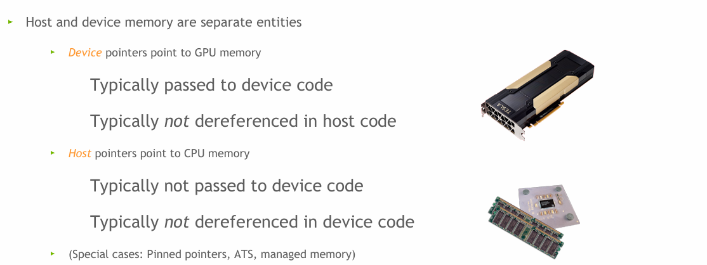

# 你好，未来的ai架构师

[课程](https://www.bilibili.com/video/BV1JJ4m1P7xW?vd_source=0f645f8562b98c379361eb83d3950ed9)

因为对这一块感兴趣就学了，事实上本人的笔记本电脑现在还没有独立显卡（）但是之前还没学CUDA的时候就用远程服务器跑过CUDA的代码，所以也能够克服，希望自己能够努力学完:)。

## 引言

CUDA编程是访问GPU进行**通用计算**或加速工作流程代码的一种方式。
CUDA具有多维能力。

[作业](https://github.com/date727/cuda-training-series)

## WHAT IS CUDA？（多层含义）

- Architecture（架构）：计算统一设备架构（compute unified device architecture）

1. 使用GPU的并行性进行通用计算
2. 提升/释放性能

- 编程环境：基于C++

1. 异构编程
2. 直观的API

- 别的语言也可以深入GPU编程，但是最早出现的语言绑定为C/C++，并且其他语言的绑定也是基于C/C++打造的架构、流水线之上。

## INTRODUCTION TO CUDA C++（课程内容）

- 基础语法
- vector addtion向量加法：学会并行处理
- 编写和启动CUDA内核
- 如何管理内存

## 专业术语

- 异构计算：在单一计算机架构中，拥有多种不同类型的处理器，分别处理工作负载或程序的不同部分（进行优化）

- 处理器：CPU、GPU
1. Host：CPU以及内存
2. Device：GPU以及内存


## PORTING TO CUDA

- GPU加速编程的核心理念：CPU与GPU协同工作，通过双向的高性能总线（**PCI Express or NVLink**）相互连接。

GPU的确运行着一种操作系统，但是不是Linux or Windows，该系统只用于管理GPU资源。

- GPU负责繁重任务：耗费绝大部分的执行时间，执行数学运算、科学研究任务

- 其他类型的GPU加速软件堆栈：TensorFlow，运行原理大致相同


- 处理流程：界限并不分明，但是先这么认为

1. 数据从CPU复制到GPU上；

为了让GPU能够访问、使用及更新CPU中的变量，必须在Device Memory中为这个变量创建一个副本。

2. 执行GPU中的计算任务；

3. 将结果从GPU复制到CPU内存中，进行进一步处理。


## 向量加法简述

- 线性代数

- 特性：尴尬并行（选择GPU执行的原因）

生成结果的过程设计多个步骤，这些步骤彼此独立。

## 语法讲解

### _global_关键字

- 作用：表明函数：
  1. 在GPU上运行（转移控制）
  2. 由host code调用（也可以被其他device code调用）
- 语法：

``` c++
_global_ void mykernel(void){

}
```

- 编译器（驱动）：NVCC

1. 在幕后调用多个编译器和其他工具，编译过程有多个步骤；

2. 将代码划分成host和device两个部分：

   - host code由host compiler执行

   - device code由NVIDIA compiler执行

### 函数调用：内核启动语法

启动device code、触发GPU执行

```c++
mykernerl<<<1,1>>>();
```

内核启动配置参数：1,1

### 内存管理

- 传入GPU的数据以及返回的结果都必须存储在GPU上的分配空间中

- 语法：运用指针，cudaMalloc()、cudaFree、cudaMemcopy

1. cudaMalloc((void\*\*)&目标指针，大小【字节】);

2. cudaMemcpy(目标指针，源指针，字节大小，数据传递方向)

   - 方向确定：

     （1）隐式确定：CUDA memcopy default内省确认

     （2）显式确定：cudaMemcpyHostToDevice、cudaMemcpyDeviceToHost

3. cudaFree(指针)；

- 原则：每个CUDA Runtime API都会返回一个错误代码【错误检查】（**作业中**）

- 注意使用范围

  

## 向量加法实践

- 大规模多线程编程架构
- 内核启动：

```c++
add<<<n,1>>>();
```

n：向量的长度，对应CUDA运行时处理n个实例、n个工作单元、n个“块（**block**）”

1：线程数量，即每个块包含一个线程

网格：线程与块的组合(**grid**)

内置向量blockIdx.x：区分工作者的活动

- 内核定义

```c++
_global_ void add(int *a,int *b,int *c){
	c[blockIdx.x] = a[blockIdx.x] + b[blockIdx.x];
}
```

blockIdx：结构体内置变量，**定义涵盖了变量的赋值过程**，包含x、y、z三个元素（多维的体现）

x：结构中的第一个元素

在第一个块执行代码时，索引变量blockIdx.x将有一个值，与第一个块一致，在本例中为0；在下一个块为1……启动n个块相当于重复运行n次这段代码，分别执行c[0]=a[0]+b[0]，c[1]=a[1]+b[1]……n个这样的表达式。

- 主程序实现

```c++
#define N 512
int main(void){
	int *a,*b,*c;  //host copies of a,b,c
	int *da,*db,*dc;  //device copies of a,b,c
	//为device copies分配空间
	cudaMalloc((void**)&da,size);
	cudaMalloc((void**)&db,size);
	cudaMalloc((void**)&dc,size);
	//为host copies分配空间
	a = (int *)malloc(size);
	b = (int *)malloc(size);
	c = (int *)malloc(size);
	//初始化向量
	random_ints(a,N);
	random_ints(b,N);
	//复制数据
	cudaMemery(da,a,size,cudaMemcpyHostToDevice);
    cudaMemery(db,b,size,cudaMemcpyHostToDevice); //提供额外的错误检查层级
    
    //内核启动
    add<<<N,1>>>(da,db,dc);
    
    //返回运算结果
    cudaMemery(c,dc,size,cudaMemcpyDeviceToHost);
    //clean up
    free(a);
    free(b);
    free(c);
    cudaFree(da);
    cudaFree(db);
    cudaFree(dc);
    return 0;
}
```

## 线程

- 层次结构中某一级别的执行单元

gird -> block -> thread

- 同样以并行方式执行

可以修改代码：

```c++
_global_ void add(int *a,int *b,int *c){
	c[threadIdx.x] = a[threadIdx.x] + b[threadIdx.x];
}
```

- 激发并行性的必要操作：修改内核启动的元素

```c++
add<<<1,n>>>(da,db,dc);
```

## 同时使用块与线程

- 希望在所有工作线程中拥有一个从o到n-1的**全局唯一索引**
->如何将threadIdx.x和blockIdx.x结合起来


- **int index = threadIdx.x + blockIdx.x * M**
M表示一个块中的线程数量

- 编程应用

1. 使用内置变量blockDim.x：x方向上块维度;
2. 在内核定义中定义。

```c++
_global_ void add(int *a,int *b,int *c){
	int index = threadIdx.x + blockIdx.x * blockDim.x;
	c[index] = a[index] + b[index];
}
```

- 主程序修改

```c++
#define N (2048*2048)
#define THREADS_PER_BLOCK 512
//N是总线程数/工作单元，一个向量中的元素总数
int main(void){
	int *a,*b,*c;  //host copies of a,b,c
	int *da,*db,*dc;  //device copies of a,b,c
	//为device copies分配空间
	cudaMalloc((void**)&da,size);
	cudaMalloc((void**)&db,size);
	cudaMalloc((void**)&dc,size);
	//为host copies分配空间
	a = (int *)malloc(size);
	b = (int *)malloc(size);
	c = (int *)malloc(size);
	//初始化向量
	random_ints(a,N);
	random_ints(b,N);
	//复制数据
	cudaMemery(da,a,size,cudaMemcpyHostToDevice);
    cudaMemery(db,b,size,cudaMemcpyHostToDevice); //提供额外的错误检查层级
    
    //内核启动
    add<<<N/THREADS_PER_BLOCK,THREADS_PER_BLOCK>>>(da,db,dc);
    
    //返回运算结果
    cudaMemery(c,dc,size,cudaMemcpyDeviceToHost);
    //clean up
    free(a);
    free(b);
    free(c);
    cudaFree(da);
    cudaFree(db);
    cudaFree(dc);
    return 0;
}
```

- 向量长度并不是每个块线程数的整数倍如何处理？

**线程检查**：确保只有需要的线程才执行工作

修改内核定义：

```c++
_global_ void add(int *a,int *b,int *c，int n){
	int index = threadIdx.x + blockIdx.x * blockDim.x;
	if(index < n)
		c[index] = a[index] + b[index];
}
```

修改内核启动：**向上取整**，确保有足够的线程。

```c++
add<<<(N + M - 1)/M,M>>>(da,db,dc,N);
```

## 为什么需要层次分解？

1. 同一块中的线程具备独特的功能；
2. 同一块中的线程具有相互通信和同步的能力；（尴尬并行中并不需要这个能力）

## 一些拓展学习资源

1. [CUDA的介绍](https://devblogs.nvidia.com/easy-introduction-cuda-c-and-c/)
2. [同样是CUDA的介绍](https://devblogs.nvidia.com/even-easier-introduction-cuda/)
3. [CUDA编程指导](https://docs.nvidia.com/cuda/cuda-c-programming-guide/index.html)
4. [CUDA文档](https://docs.nvidia.com/cuda/index.html)
5. [CUDA中的API](https://docs.nvidia.com/cuda/cuda-runtime-api/index.html)

