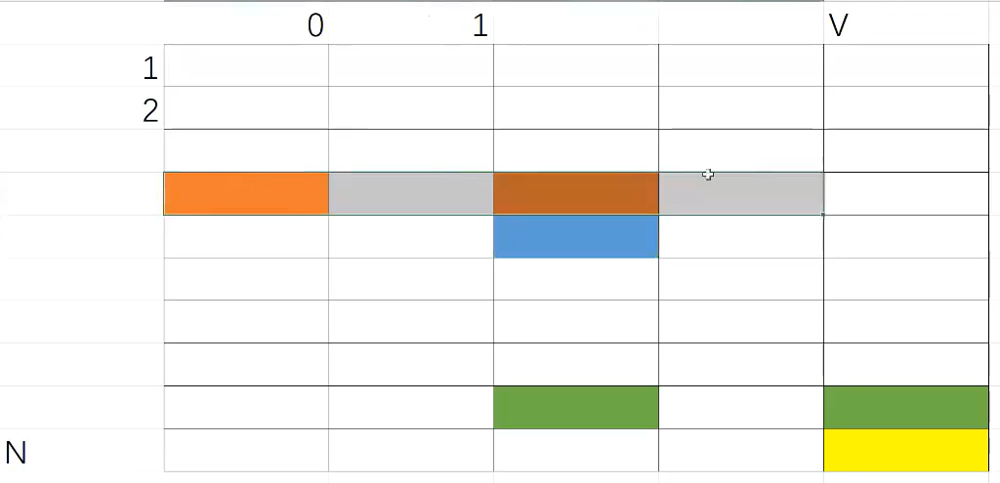
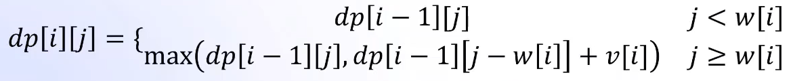

- [动态规划](#动态规划)
  - [例题分析2：最长不下降子序列](#例题分析2最长不下降子序列)
  - [背包DP](#背包dp)
    - [0-1背包](#0-1背包)
    - [完全背包](#完全背包)

# 动态规划
## 例题分析2：最长不下降子序列

- 给定一个长度为n的序列A（n<=5000），求出一个最长的A的子序列，满足该子序列的后一个元素不小于前一个元素。

- 分析

从正向考虑的话，直观感觉就是，无法定义出状态转移方程。对于一个字符，不确定后面是否有比它更小的。

假设字符串长度为n，从最后面的字符x考虑的话，就是找到其中一个位置i，定义开头到这个位置的最长不下降子序列的长度为dp[i]，字符串我们有：

1. dp[i]是dp[0]-dp[n-2]中最大的；
2. str[n-1] >= str[i]

- 初始化

最长不下降子序列至少包含自己，所以初始化为1

- 如何找到最长不下降子序列

先确定最长不下降子序列的长度，从后往前遍历，dp[i]=长度时，说明对应最后一个字符；再往前dp[i]=长度-1时，对应倒数第二个字符。以此类推。

- 编程实现

```python
import sys
def Increasingsequence(n):
	dp = [1] * (n+1)
	for i in range (1,n+1):
		for j in range(1,i):
			if a[i-1] >= a[j-1] and dp[j] + 1 > dp[i]:
				dp[i] = dp[j] + 1
	dns = max(dp)
	i = n
	str = ""
	while i>0:
		if dp[i] == dns:
			str += a[i - 1]
			dns-=1
		i-=1
	return str[::-1]

input = lambda:sys.stdin.readline().strip()
a = input()
n = len(a)
str = Increasingsequence(n)
print(str)
```

在[CSDN](https://blog.csdn.net/xiaoxi_hahaha/article/details/119602482)中我看到了介绍从后往前遍历的代码，很巧妙，不过我们假定的状态是第i号元素为**起点**的最长不下降子序列的长度，与前面有差异。这里写一下Python代码实现：

```python
import sys
def Increasingsequence(n):
    dp = [1] * (n+1)
    i = n
    while i > 0:
        for j in range(i+1,n+1):
            if a[i-1] <= a[j-1] and dp[j] + 1 > dp[i]:
                dp[i] = dp[j] + 1
        i-=1
    dns = max(dp)
    str = ""
    for i in range(1,n+1):
        if dp[i] == dns:
            str += a[i - 1]
            dns-=1
    return str

input = lambda:sys.stdin.readline().strip()
a = input()
n = len(a)
str = Increasingsequence(n)
print(str)
```

可以看到，对于同一个输入，两种方式输出的字符串可能是不一样的。这是由于字符串写入的顺序，一个是从后往前一个是从前往后。

另外，python的缩进今天终于恶心了我一下。我是在typora中先写代码然后放到pycharm里面去，稍微改动一下就报了很多错，但是语句本身没有任何问题:(。

之后就是注意学习DP中细化的知识！刚才浅浅翻了一下还有成吨的东西要学（）

## 背包DP

### 0-1背包

这一篇看了[蓝桥杯官网备赛](https://www.lanqiao.cn/courses/41585/learning/?id=3294893&compatibility=false)作为参考，这个老师我感觉就是那种我崇拜的类型（）很帅很强结果还很内敛（）

- 题意概要：有n个物品和一个容量为W的背包，每个物品有重量wi和价值vi两种属性，要求选若干物品放入背包使背包中物品的总价值最大且背包中物品的总重量不超过背包的容量.
  每个物体只有两种可能的状态（取与不取），对应二进制中的 0 和 1，这类问题便被称为**0-1 背包问题**

  > 暴力：用0、1表示物品是否拿了，时间复杂度O(2^N)，代价太大
  >
  > 贪心：选择性价比最高的，部分数据不能满足

- 状态定义：将所有物品排序，和输入是对应的

  dp(i,j)：前i件物品，体积为j的最大价值

- 状态转移方程：  

  对于第i件物品，只考虑两种情况：**自顶向下**

  1. 拿：dp(i,j) = dp(i-1,j-wi) + vi
  2. 不拿：dp(i,j) = dp(i-1,j)

- 递归实现：DFS搜索

```python
import sys
def dpproblem(i,j):
    if i==0 or j==0:
        return 0
    ans1 = 0
    ans2 = 0
    if w_list[i] <= j:
        ans1 = dpproblem(i - 1,j - w_list[i]) + v_list[i]
    ans2 = dpproblem(i - 1,j)
    return max(ans1,ans2)

input =lambda:sys.stdin.readline().strip()
N,V = map(int , input().split())
w_list = [0]*(N+1)
v_list = [0]*(N+1)
for i in range(1,N+1):
    w_list[i], v_list[i] = map(int, input().split())

print(dpproblem(N,V))
```

- 记忆化搜索

```python
import sys
def dpproblem(i,j):
    if i==0 or j==0:
        return 0
    if dp[i][j] != -1:
        return dp[i][j]
    ans1 = 0
    ans2 = 0
    if w_list[i] <= j:
        ans1 = dpproblem(i - 1,j - w_list[i]) + v_list[i]
    ans2 = dpproblem(i - 1,j)
    return max(ans1,ans2)


input = lambda:sys.stdin.readline().strip()
N,V = map(int , input().split())
w_list = [0]*(N+1)
v_list = [0]*(N+1)
for i in range(1,N+1):
    w_list[i],v_list[i] = map(int,input().split())
dp = [[-1] * (V+1) for _ in range(N+1)]   #判断是否有数值可以直接返回
print(dpproblem(N,V))
```

- 动态规划：从表格的角度考虑



1. 可以从左上角推出右下角，使用二重循环
2. 可以在进行存储的时候就直接开始处理
3. 不需要记录每一个物体的信息

细化状态转移方程：



编写代码如下：

```python
import sys
input = lambda:sys.stdin.readline().strip()
N,V = map(int , input().split())
dp = [[0] * (V+1) for _ in range(N+1)]   #初始化
for i in range(1,N+1):
    w,v= map(int,input().split())
    for j in range(1, V + 1):
        if w > j:
            dp[i][j] = dp[i - 1][j]
        else:
            dp[i][j] = max(dp[i - 1][j - w] + v, dp[i - 1][j])
print(dp[N][V])
```

- 运用滚动数组进行优化

  原理：使用两行不断改变的数值进行相互计算，最终算出一个结果

  切入点：第i行的数值只与第i-1行有关
  
  方法：取模，把index限定在0和1

  好处：降低空间复杂度
  
  修改代码如下：

```python
import sys
input = lambda:sys.stdin.readline().strip()
N,V = map(int , input().split())
dp = [[0] * (V+1) for _ in range(2)]   #滚动数组
for i in range(1,N+1):
    w,v = map(int,input().split())
    for j in range(1, V + 1):
        if w > j:
            dp[i%2][j] = dp[(i - 1)%2][j]   #只对数的标记%2，不需要对容量操作
        else:
            dp[i%2][j] = max(dp[(i - 1)%2][j - w] + v, dp[(i - 1)%2][j])
print(dp[N%2][V])
```

- 进一步优化滚动数组：一维数组实现

  第一感觉真是颠了，后面听着都有点想买他的课了（）

  原理：数的改变只与上方和左上方的数据有关，可以把同一列的数字限定在一个框里面，最终就只有一列了

  差异：

  1. 必须是从右往左更新，遍历范围是V到w[i]，体现在代码上是(V,w[i]-1,-1)
  2. 可以直接把状态方程中的一个删掉（j>=w[i]恒成立）

  代码实现：

```python
import sys
input = lambda:sys.stdin.readline().strip()
N,V = map(int , input().split())
dp = [0] * (V+1)
for i in range(1,N+1):   #更新顺序不变
    w,v = map(int,input().split())
    for j in range(V,w-1,-1):   #覆盖顺序改变
        dp[j] = max(dp[j - w] + v, dp[j])
print(dp[V])
```

### 完全背包

- 完全背包模型与 0-1 背包类似，与 0-1 背包的区别仅在于一个物品可以选取无限次，而非仅能选取一次。

- 状态定义：dp(i,j)：前i种物品，体积为j时的最大价值

- 状态转移方程：

  1. 拿k件：dp(i,j) = dp(i-1,j - k\*w[i]) + k\*v[i]  k<=(j/w[i])

  2. 不拿：dp(i,j) = dp(i-1,j)

     选择最大值，总共有(1+j/w[i])项，优化计算：
     
     原理：dp(i,j)与dp(i,j-w[i])各项之间的差大小恒定
     
     结论：**dp(i,j)=max( dp(i-1,j) , dp(i,j-w[i])+v[i])**
     
     与0-1背包的差异：
     
     ​	比较双方的一维下标不同
     
     编程实现：
     
     （1）二维数组
```python
import sys
input = lambda:sys.stdin.readline().strip()
N,V = map(int , input().split())
dp = [[0] * (V+1) for _ in range(N+1)]   #二维数组解决完全背包
for i in range(1,N+1):
    w,v= map(int,input().split())
    for j in range(1, V + 1):
        if w > j:
            dp[i][j] = dp[i - 1][j]
        else:
            dp[i][j] = max(dp[i][j - w] + v, dp[i - 1][j])
print(dp[N][V])
```

​		（2）一维数组：特别之处在于从左到右完全没有问题

```python
import sys
input = lambda:sys.stdin.readline().strip()
N,V = map(int , input().split())
dp = [0] * (V+1)
for i in range(1,N+1):   #更新顺序不变
    w,v = map(int,input().split())
    for j in range(w,V+1):   #覆盖顺序改变
        dp[j] = max(dp[j - w] + v, dp[j])
print(dp[V])
```

其他的问题背包之后再看吧，现在其实是1.29的1:02，看到这里的兄弟们，祝你新年快乐！