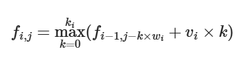

# 动态规划

## 背包DP

### 多重背包

- 多重背包也是0-1背包的一个变式。与 0-1 背包的区别在于每种物品是有限个，而非一个。分别用v、w、s代表体积、价值与数量。

- 状态定义：dp(i,j)：前i件物品，体积为j的最大价值

- 转换思路：

  1. （0-1背包）一种东西有k个，就可以当作k种状态，分别对应拿i个该东西，1<=i<=k，就把问题转换成一件的占用空间k\*vi ，价值为k\*wi的物品该不该拿。

     因此：状态转移方程为：

     

  2. 优化上面的思路（0-1背包+完全背包）：对于有的物品，占用体积为 v，共有 s 件，存在s\*v >=V时，说明这个物品还没有拿完，背包就已经装不下了，等价于完全背包。完全背包时间复杂度相对要小一些。
  
    因此实现代码如下：
  
```python
import sys
input = lambda:sys.stdin.readline().strip()
N,V = map(int,input().split())
dp = [0] * (V+1)
for i in range(1,N+1):
    v,w,s= map(int,input().split())
    if v*s >= V:
        #完全背包
        for j in range(v,V+1):
            dp[j] = max(dp[j],dp[j-v]+w)
    else:
        #0-1背包
        for j in range(V,v-1,-1):
            for k in range(0,s+1):
                if j >= k*v:
                    dp[j] = max(dp[j],dp[j-k*v]+k*w)
print(dp[V])
```

输入案例：

```python
4 5
1 2 3
2 4 1
3 4 3
4 5 2
```

得到输出：

```python
10
```

- 优化方案

1. 二进制优化：优化拆分方式

   这是针对同一种物品讨论的优化方法。

   由01代码可以表示所有的数字，我们想到，用多个等比的2的次方数去表示所有的k。如果有无法消干净的情况，就在后面单独地补一个数。这样拆分的数字，可以表示0~n。比方说：

   - 6 = 1 + 2 + 3：
   其中：1=1,2=2,3=3,4=1+3,5=2+3
   
   - 10 = 1 + 2 + 4 + 3
   
     其中：1=1,2=2,3=3,4=4,5=1+4,6=2+4,7=3+4,8=1+3+4,9=2+3+4
   
     (只要数字k不满足(k+1)是2的倍数，就要加上一个非2的倍数的数字)
   
   数字拆分的总数为：
   $$
   log_2(n+1)
   $$
   数字拆分之后，我们就把i一定的多个物品分成：1件价值为w体积为v的物品、1件价值为2w体积为2v的物品、一件价值为4w体积为4v的物品……最后还可能有系数不是2的指数的。
   
   按照这种方式拆分之后，再用这些物品表示所有的j的情况，用0-1背包的思路解决问题即可。
   
   由此，问题转换成如何把每个数字二进制化。用while循环解决即可。
   
   代码实现如下：
   
```python
import sys
input = lambda:sys.stdin.readline().strip()
N,V = map(int,input().split())
dp = [0] * (V+1)
for i in range(1,N+1):
    v,w,s = map(int,input().split())
    k=1
    v_list = []
    w_list = []
    while s>=k:
        s-=k
        v_list.append(k*v)
        w_list.append(k*w)
        k*=2
    if s > 0 :
        v_list.append(s*v)
        w_list.append(s*w)
    #对于同一种物品，使用01背包
    s = len(v_list)
    for k in range(0, s):
        for j in range(V, v_list[k]-1,-1):
            dp[j] = max(dp[j], dp[j - v_list[k]] + w_list[k])
print(dp[V])
```

2. 单调队列/单调栈优化

相比之下，单调队列优化的效果要更好。首先学习一下单调队列和单调栈是什么:)。

**单调队列**

一、定义

- 单调：元素的**规律**——递增或递减。

- 队列：元素只能从**队头**和**队尾**进行操作。（注意是都能操作）

到处找这个技巧的讲解都没有看懂，[csdn](https://blog.csdn.net/qq_53268869/article/details/122870945)上面的这篇勉强看懂了。下面一样用食堂吃饭排队的例子解释：

- 单调递减：高个子的人看到排队后仗势欺人

  规则：看见好欺负的就**赶走**，自己站着，直到干不过的就**停下**。

  例如数列：7 6 8 12 9 10 3

   1. 7入队：7
   2. 6入队：7 6
   3. 8入队：8
   4. 12入队：12
   5. 9入队：12 9
   6. 10入队：12 10
   7. 3入队：12 10 3

- 单调递增：尊老爱幼，年龄小的排在前面

  看见年纪大的的就**赶走**，自己站着，直到前面的比自己小就**停下**。
  

  例如数列：7 6 8 12 9 10 3

   1. 7入队：7
   2. 6入队：6
   3. 8入队：6 8
   4. 12入队：6 8 12
   5. 9入队：6 8 9
   6. 10入队：6 8 9 10
   7. 3入队：3

显然，最后单调队列的对头不是最大元素，就是最小的元素。显然，如果只是想找数列中的极值得话，完全没必要用一个队列让元素“进进出出”，**一个动态小区间**就足够。

二、应用：滑动窗口最大值

- 题目：给你一个整数数组 nums，有一个大小为 k 的滑动窗口从数组的最左侧移动到数组的最右侧。你只可以看到在滑动窗口内的 k 个数字。滑动窗口每次只向右移动一位。返回 滑动窗口中的最大值

- 输入案例：

```python
输入：nums = [1,3,-1,-3,5,3,6,7], k = 3
输出：[3,3,5,5,6,7]
解释：
滑动窗口的位置                  最大值
---------------               -----
[1  3  -1] -3  5  3  6  7       3
 1 [3  -1  -3] 5  3  6  7       3
 1  3 [-1  -3  5] 3  6  7       5
 1  3  -1 [-3  5  3] 6  7       5
 1  3  -1  -3 [5  3  6] 7       6
 1  3  -1  -3  5 [3  6  7]      7
```

- 题目分析：

（1）**优先级队列**

本人事先也不懂，但是有一句说**单调队列实际上是优先级队列的一种优化**，所以这种方法也很重要。优先队列我是在这个[博客](https://blog.csdn.net/l_ppp/article/details/107549160)中理解的。

顾名思义，优先级队列就是在队列的基础上给每个元素加上了先后顺序。所以可能后进的元素也可以排在前面，这就导致了优先级队列**没有先进先出的规则**。

对这道题，用优先级队列的操作步骤如下：

  1. 初始时把前面k个数放入队列中；
  2. 滑动窗口时，新的数据放入优先队列中；
  3. 看堆顶元素是否在滑动窗口中，如果不在，就移除堆顶。重复此操作，直到堆顶元素在滑动窗口中，此时堆顶就是最大值。

我们用优先级队列分析输入案例：

```python
输入：nums = [1,3,-1,-3,5,3,6,7], k = 3
输出：[3,3,5,5,6,7]
滑动窗口的位置                  优先级序列
---------------               -----
[1  3  -1] -3  5  3  6  7     [3  1 -1]
 1 [3  -1  -3] 5  3  6  7     [3  1 -1  -3]
 1  3 [-1  -3  5] 3  6  7     [5  3  1  -1  -3]
 1  3  -1 [-3  5  3] 6  7     [5  3  3   1  -1  -3]
 1  3  -1  -3 [5  3  6] 7     [6  5  3  3   1  -1  -3]
 1  3  -1  -3  5 [3  6  7]    [7  6  5  3  3   1  -1  -3]
```

这个没有移除堆顶的操作。我们再看一个：

```python
输入：nums = [1,9,9,-3,5,3,6,7],k=3
输出：[9,9,9,5,6,7]
滑动窗口的位置                  优先级序列
---------------               -----
[1  9  9] -3  5  3  6  7     [9  9  1]
 1 [9  9  -3] 5  3  6  7     [9  9  1  -3]
 1  9 [9  -3  5] 3  6  7     [9  9  5  1  -3] 
 1  9  9 [-3  5  3] 6  7     [5  3  1  -3]  #移除了2个9
 1  9  9  -3 [5  3  6] 7     [6  5  3  1  -3]
 1  9  9  -3  5 [3  6  7]    [7  6  5  3  1  -3]
```

说到代码实现的时候就不得不学习python中的数据结构了。虽然我一开始开这个博客的时候万万没想到要学这么多东西。但是“吃一堑长一智”吧。相关的笔记在另一篇博客中。

案例输入：

```python
#输入的数字总数和滑动窗口的长度
8 3
1 3 -1 -3 5 3 6 7
```

代码实现：

```python
import queue
import sys
input = lambda: sys.stdin.readline().strip()
n,m = map(int, input().split())
queue = queue.PriorityQueue()
ans = []
numbers = list(map(int, input().split()))
#因为数字越小优先级越高，所以必须要取反
for i in range(m):
    queue.put((0 - numbers[i],i))
x = queue.get()
ans.append(0 - x[0])
#查看就记得”还回去“
queue.put(x)
k = m
while k <= n-1:
    queue.put((0 - numbers[k],k))
    while True:
        x = queue.get()
        if 0 - x[0] in numbers[k-m+1:k+1]:
            ans.append(0 - x[0])
            queue.put(x)
            break
    k+=1
for i in ans:
    print(i,end=' ')
```

案例输出：

```python
3 3 5 5 6 7
```

本人也不知道会不会超时，但是学习技术并不是坏事。

（2）单调队列

我们从优先级队列的输出结果也可以感觉到：实际上，队列没有必要维护窗口中的所有元素。只需要维护**有可能成为窗口中最大值的元素**即可，同时保持其单调递减性。

具体不需要优化的类型：

```python
num[i] < num[j] and i < j
```

如果j在滑动窗口中，不论i是否在队列中，一定有max >= num[j]>num[i]，因此num[i]就不可能是最大值，可以把num[i]去除掉。而单调队列就可以实现这种效果。

操作规则如下：

1. 不断地将新的元素与**队尾的元素**相比较，如果前者大于等于后者，那么**移除**队尾。重复操作，直到队列为空或者新的元素小于队尾的元素，放在队尾后面。
  2. 与优先级队列一样，要保证堆顶在滑动窗口中。

分析案例输入：

```python
输入：nums = [1,3,-1,-3,5,3,6,7], k = 3
输出：[3,3,5,5,6,7]
滑动窗口的位置                  优先级序列
---------------               -----
[1  3  -1] -3  5  3  6  7     [3  -1]
 1 [3  -1  -3] 5  3  6  7     [3  -1  -3]
 1  3 [-1  -3  5] 3  6  7     [5]
 1  3  -1 [-3  5  3] 6  7     [5  3]
 1  3  -1  -3 [5  3  6] 7     [6]
 1  3  -1  -3  5 [3  6  7]    [7]
```

单调队列的实现依赖于deque的队列两端输入输出的特质，相关知识点也在博客中。

案例输入：

```python
8 3
1 3 -1 -3 5 3 6 7
```

代码实现：

```python
from collections import deque
import sys
input = lambda: sys.stdin.readline().strip()
n,m = map(int, input().split())
numbers = list(map(int, input().split()))
ans=[]
d = deque()
for i in range(m):
    #判断队列是否为空
    while d:
        x = d.pop()
        if x > numbers[i]:
            d.append(x)
            d.append(numbers[i])
            break
    if not d:
        d.append(numbers[i])
ans.append(d[0])
k = m
while k < n:
    while d:
        x = d.pop()
        if x >= numbers[k]:
            d.append(x)
            d.append(numbers[k])
            break
    if not d:
        d.append(numbers[k])
    while True:
        x = d.popleft()
        if x in numbers[k-m+1:k+1]:
            d.appendleft(x)
            ans.append(d[0])
            break
    k+=1
for i in ans:
    print(i,end=' ')
```

案例输出：

```python
3 3 5 5 6 7 
```

事实上单调队列一般记录的是下标值，方便记录走过的长度。

好了言归正传，看看怎么用单调队列做多重背包问题。

首先，我们回到状态转移方程：


观察j下标，可以发现，j-v，j-2v，j-3v…模v的余数是相同的。因此可以把容积分为v类，按照取模的结果分(0!~v-1)。我们列出同余类如下：

| 0      | 1        | 2        | …    | v-2      | v-1      |
| ------ | -------- | -------- | ---- | -------- | -------- |
| dp[0]  | dp[1]    | dp[2]    |      | dp[v-2]  | dp[v-1]  |
| dp[v]  | dp[v+1]  | dp[v+2]  |      | dp[2v-2] | dp[2v-1] |
| dp[2v] | dp[2v+1] | dp[2v+2] |      | dp[3v-2] | dp[3v-1] |
| …      |          |          |      |          |          |
| dp[kv] | dp[kv+1] | dp[kv+2] |      | dp[kv-2] | dp[kv-1] |
| …      |          |          |      |          |          |

dp[j]是什么？是简化了dp(i,j)后的结果，表示容积为j的情况下的最大价值。

假设一种物品的体积为v，价值为w，数量为s，那么每一种物品，j一定，对第(j%v)列，从下到上遍历一整列。而j要遍历V~v，对应不同列。

假设我们对dp[kv-1]与dp[(k-1)v-1]进行更新：

```python
dp[kv-1] = max(dp[kv-1] , dp[(k-1)v-1]+w , dp[(k-2)v-1]+2w , dp[(k-3)v-1]+3w,…)
dp[(k-1)v-1] = max(dp[(k-1)v-1] , dp[(k-2)v-1]+w , dp[(k-3)v-1]+2w,…)
```

可以发现中间的有些元素大小关系的比较结果是一致，但是我们没法用之前的结论，所以重新进行了遍历。`为什么`？因为**dp[(k-1)v-1]**相比于**dp[kv-1]**的更新剔除了一个dp[kv-1]，但是你不确定dp[kv-1]是不是就是最大值。如果是，那么dp[(k-1)v-1更新列表的最大值我们无法确认。

而本质原因在于，我们是从后往前更新。如果我们是从前往后更新，记录之前的最大值，那么我们只要用最大值与新值进行比较，就减少了时间复杂度。

具体方法：摒弃之前“从大到小枚举压缩空间”的思想，选择**从小到大枚举**；利用一种数据结构来模拟这个**变大的集合**，并且在此基础上做一些限制条件实现物品个数的限制（为什么需要限制？多重背包有限！）。这个数据结构有单调递增性，自然是单调队列。

以一列为例，设置一个滑动窗口，窗口大小设置为该（**物品的个数+1**），并在窗口内部维护一个单调队列。窗口大小设置的考虑：dp[j]，dp[j-v]，dp[j-2v]…，dp[j-sv]。只要保证下标为正都可能在单调队列中，保守起见。

具体代码实现如下：

```python
import sys
from collections import deque

input = lambda:sys.stdin.readline().strip()
N,V = map(int,input().split())
dp = [0] * (V+1)
for i in range(1,N+1):
    v,w,s = map(int,input().split())
    x = V % v
    d = deque(maxlen=s+1)
    while(x<=V):
        while d:
            d = deque([x + w for x in d],maxlen=s+1)
            #d[-1]是队列的最后一个学到了
            if d[-1] <= dp[x]:
                d.pop()
            else:
                d.append(dp[x])
                break
        if not d:
            d.append(dp[x])
        dp[x] = d[0]
        x += v
print(dp[V])
```

代码是根据我自己的理解写的。要注意的就是，区别于优先级队列不能使用下标，这里就可以不用pop之后又append。案例输出没有问题，但是不知道其他的用起来怎么样。豆包也写了一个：

```python
import sys
from collections import deque

input = lambda: sys.stdin.readline().strip()
N, V = map(int, input().split())
dp = [0] * (V + 1)

for i in range(N):
    v, w, s = map(int, input().split())
    for r in range(v):
        d = deque(maxlen=s + 1)
        for k in range((V - r) // v + 1):
            val = dp[k * v + r] - k * w
            while d and d[-1][1] <= val:
                d.pop()
            d.append((k, val))
            if d[0][0] < k - s:
                d.popleft()
            dp[k * v + r] = d[0][1] + k * w

print(dp[V])
```

这个代码就能够体现出来存储下标的好处，但是我个人觉得检查最大值的范围有点多余，毕竟已经限定了maxlen。可能之后会对这个问题有更多的思考。

这篇博客确实从1-29学到2-7，今天是我跟老婆的一周年纪念日。她已经睡着了，我很想她。

