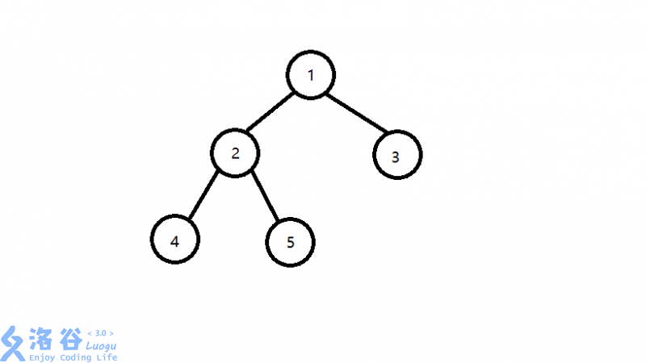
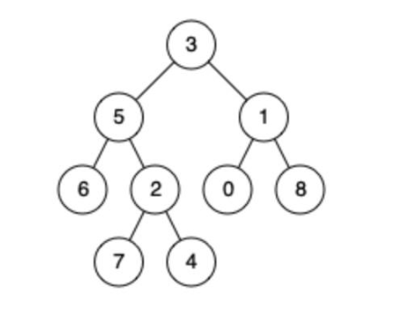

已经有点想哭了，这是图论的内容，为了做前缀树的题目来特意学一下，也不知道有没有用。图论一大堆，数据结构一大堆，搜索也不会，基础算法也说不上都熟悉。算了起步晚的抽象人是这样的。

# 最近公共祖先LCA

## 定义

两个节点的最近公共祖先，同时，这个节点也是公共祖先中距离根节点最远的那个。注意最近公共祖先也有可能是两个节点中的一个。如图：

>4和5的最近公共祖先是2，5和3的最近公共祖先是1，2和1的最近公共祖先是1。　

## 我认为比较重要的性质

1. 如果u不为v的祖先并且v不为u的祖先，那么u,v分别处于LCA(u,v)的两棵不同子树；
2. 两点的最近公共祖先必定处在树上两点间的最短路上；
3. d(u,v)=h(u)+h(v)-2h(LCA(u,v))，其中 d 是树上两点间的距离，h 代表某点到**树根**的距离。

## 模板题目

### 题目描述
给定一棵有根多叉树，请求出**指定两个点**直接最近的公共祖先。

### 给定输入

第一行包含三个正整数 N,M,S 分别表示树的结点个数、询问的个数和树根结点的序号（**有的题目也会令序号1的点为根节点**）。

接下来 N-1 行每行包含两个正整数x, y表示 x 结点和 y 结点之间有一条直接连接的边（**数据保证可以构成树，回顾离散数学中树的定义**）。

接下来M行每行包含两个正整数 a, b 表示询问 a 结点和 b 结点的最近公共祖先。

### 输出格式

M行，每行是询问的结果。

很难想象一个连树都不知道怎么构造的老女孩要直接上手做这种题目，但这就是我们唐人。

## 多种方法

### 朴素算法（暴力）

**思路**

**深度**概念是针对根节点而言的。

从深度的角度看：先向上调整深度较大的点，令他们**深度相同**，然后再共同向上跳转，最终相遇。

由于需要处理深度，预处理时需要**dfs**整棵树，在存储的时候，需要存储每个节点的深度，同时要存储每个节点的父节点。

时间复杂度为O(n)，简单暴力，同样也耗时。

### 倍增算法：最常用的在线算法

倍增的含义是，按照**2的倍数**增大。我们在动态规划中也学过，**任一自然数可以拆成若干2的幂之和**，这个原理我们叫做**二进制拆分**。因此，我们可以用二进制拆分优化朴素算法，也就是用2的倍数来增长。为了不出现“悔棋”的情况（5!=1+2+4，5=1+4），我们采取从大到小的顺序，如果大的跳过了，再跳小的。以此类推。我们用这个图来说明。求4、6的最近公共祖先，会出现以下两个步骤：

4->5（一次跳2）

6->5（一次跳1）

可以看出向上跳的次数大大减小。