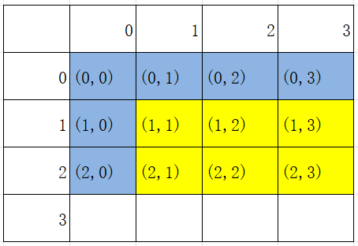

[TOC]

# 前缀和算法！启动！

有一阵子荒废了，昨天发烧+感冒确实是遭老罪，除了浑身没力气，消化功能也变差了很多很多。明天早上还是要喝点粥过渡一下，不要不吃早饭了。

今天开始写博客之前用打算用Haroopad打开md文件，结果等了很久都没打开，莫名其妙的，又不想再下载其他软件了，以后都直接用vscode的插件。所以程序员的尽头就是vscode()。

## 二维前缀和

### 二维前缀和的定义

sum(x,y)：从下标(0,0)到(x, y)子矩阵内元素的和【默认从(0,0)开始】。例如：sum(2,3)图示：



为什么图中有一部分是标记为蓝色呢？要注意回顾，之前一维前缀和我们代码中有一句：

```python
#前缀和列表,注意这里有个添加0的处理
s = list(chain([0],list(accumulate(ls))))
```

在二维中也是一样，我们的数值是从(1,1)开始有定义的，(x,0)与(0,x)都默认为0。

### 二维前缀和递推公式

之前一维的递推公式：

```python
sum[i] = sum[i-1] + num[i]
```

结合经验，我们考虑x、y两个维度上面都减一，发现有面积重叠的部分，如图所示：


因此我们也得到了最终的递推结论：

```python
sum[x][y] = sum[x-1][y] + sum[x][y-1] + num[x][y] - sum[x-1][y-1]
```

### 子矩阵求法

在前缀和的基础之上的一个应用，就是“开始点”不是(0,0)的时候可以怎么做。我们依旧用图像来理解：


类似地，用两块长条减去重叠的部分，得到的结果再与前缀和相减就行。注意图示是一种特殊情况（正好重叠部分只有(0,0)一个点）

我们可以得到公式：要求出(x1,y1)到(x2,y2)之间的数的和(x1 < x2 , y1 < y2):

```python
sum = sum[x2][y2] - (sum[x1][y2] + sum[x2][y1] - sum[x1][y1])
=sum[x2][y2] + sum[x1][y1] - sum[x1][y2] - sum[x2][y1]
```

### 例题：[P1387 最大正方形](https://www.luogu.com.cn/problem/P1387)

这道题tag居然有dp，但是稍微一想确实有点像，但是这个题目与传统的dp直接输出dp\[n\][m]也并不相同。没错，本人就是在这个死胡同上栽了跟头。

我们用dp\[i\][j]定义的是**每个位置为右下角的最大正方形的边长**。递推的本质是你要去拓展，如果你在(x,y)点想要拓展正方形的边长，那你就得要求，首先它本身是1，其次它的左上三个点的位置的dp足够长。如果它本身就是0，那么就不可能构成正方形。有以下状态转移方程：

```python
if num[i][j] == 1:
    dp[i][j] = min(dp[i−1][j],dp[i][j−1],dp[i−1][j−1])+1
else:
    dp[i][j] = 0
```

所以说前缀和其实也算是动态规划常用到的工具，学习的顺序还是反了啊（冒汗）。

以下是编程实现：

```python
import sys
input = lambda: sys.stdin.readline().rstrip()
#数列表是从0开始的，dp列表是从(1,1)开始的
n,m = map(int, input().split())
a = []
for i in range(n):
    a.append(list(map(int, input().split())))

dp = [[0] * (m+1) for _ in range(n+1)]
ans = 0
for i in range(n):
    for j in range(m):
        if a[i][j] == 0:
            dp[i+1][j+1] = 0
        else:
            dp[i+1][j+1] = min(dp[i][j+1], dp[i+1][j], dp[i][j])+1
            ans = max(ans, dp[i+1][j+1])
print(ans)
```

在洛谷上发现一开始下标并没有设置好，结果全AC了，在题解里面也看到说这道题用搜索、二分、暴力都行。emmm仁者见仁智者见智吧。

## 后缀和

后缀和的定义基本上就是和前缀和颠倒过来，只是在处理时，首先要将数列表倒置，acculate一下，然后再把求和也导致，处理起来才比较方便。可以用于做下面的经典例题：

### [寻找数组的中心下标](https://leetcode.cn/problems/find-pivot-index/description/)

但是本人并不刷力扣（好吧是因为涉及到面向对象本人不会），所以就用一下案例检验，不提交检查了。

案例输入如下：

```python
#表示输入数字的个数
6
1 7 3 6 5 6
```

输出如下：

```python
3
```

解释：

```python
左侧数之和 sum = nums[0] + nums[1] + nums[2] = 1 + 7 + 3 = 11 ，
右侧数之和 sum = nums[4] + nums[5] = 5 + 6 = 11 ，二者相等。
```

代码如下：
```python
from itertools import *
import sys
input = lambda: sys.stdin.readline().rstrip()
n = int(input())
ls = list(map(int, input().split()))
#前缀和
acc = list(accumulate(ls))
sum1 = list(chain([0],acc))
#后缀和
ls.reverse()  #没有返回值
acc = list(accumulate(ls))
sum2 = list(chain([0],acc))
sum2.reverse() #貌似这样做下标处理更方便
f=0
for i in range(n):
    if sum1[i]== sum2[i+1]:
        f=1
        print(i)
        break
if f==0:
    print(-1)
```
## 树上前缀和（前缀树/字典树）

参考资料：

1. [数据结构（Python实现）------前缀树](https://blog.csdn.net/Avery123123/article/details/103833660)
2. [oi.wiki](https://oi-wiki.org/basic/prefix-sum/#%E6%A0%91%E4%B8%8A%E5%89%8D%E7%BC%80%E5%92%8C)

### 前缀树的定义


如图所示，通常来说，一个前缀树是用来存储字符串的。前缀树的每一个节点由通往该节点的路径上的字符组成。

前缀树的一个重要的特性是，节点所有的后代都与该节点相关的字符串有着共同的前缀。这就是前缀树名称的由来。

### 前缀树基本操作

**插入操作/构建操作**

构建前缀树实际上就是初始化根节点+多次调用插入函数，所以这里就讲一下插入函数的思路。

具体地说，如果我们在前缀树中插入一个字符串S，遍历字符串的每一个字符，从根节点开始，看是否存在该字符，来决定**选择**一个子节点或**添加**一个新的子节点，然后移动遍历的对象。

**搜索操作**

- 搜索前缀

从前缀和的定义，我们可以衍生出一种题型：**搜索以特定前缀开头的任何单词**。

思路与之前一致，沿着树往下搜索就行，如果在前缀未完成搜索之前就已经没有字节点了，说明就没有以该前缀开头的单词。

- 搜索单词

类似于前缀，先把它当作一个前缀进行搜索，如果搜索成功，还需要对它是否只是一个前缀进行判断，树的结构上面需要一些调整。

### 前缀树的Python实现

很痛苦啊但是B组就有这个要求，但是我没学好类啊啊啊……学吧孩子们。博客上面的我没有看懂，就直接用[leetcode](https://leetcode.cn/problems/implement-trie-prefix-tree/solutions/717239/shi-xian-trie-qian-zhui-shu-by-leetcode-ti500/)上面模板题的题解来进行理解好了。但是这也给我提供了一个很好的学习平台的思路啊leetcode，我确实对你开发太少了。

```python
class Trie:
    def __init__(self):
        #说实话是对数据结构要求最低的一种方法了，用列表模拟的
        self.children = [None] * 26  #至多只能有26个字节点，需要提前开辟空间，注意中间的None
        self.isEnd = False  #是不是本身单独也是一个单词
    
    def searchPrefix(self, prefix: str) -> "Trie":
        node = self  #从根节点开始
        for ch in prefix:
            ch = ord(ch) - ord("a")
            if not node.children[ch]:
                return None  #前缀无法遍历完，直接返回None
            node = node.children[ch]
        return node  #前缀能够遍历完

    def insert(self, word: str) -> None:
        node = self  #从根节点开始
        for ch in word:
            #将一个小写字母字符转换为其在字母表中的相对位置索引（从0开始）
            ch = ord(ch) - ord("a")
            if not node.children[ch]:
                node.children[ch] = Trie()
            node = node.children[ch]  #指向下一个字符对应的子节点
        node.isEnd = True  #标记为可以组成一个单词

    #查找单词是否存在
    def search(self, word: str) -> bool:
        node = self.searchPrefix(word)
        return node is not None and node.isEnd #前缀能够遍历完并且node是一个单独的单词才返回True

    #查找前缀是否存在
    def startsWith(self, prefix: str) -> bool:
        return self.searchPrefix(prefix) is not None
```

理解了以上模板之后，我们解决一下问题

### [单词的压缩编码](https://leetcode.cn/problems/short-encoding-of-words/description/)

这个题目我们重点要理解一下第一个输出示例：

```python
输入：words = ["time", "me", "bell"]
输出：10
解释：一组有效编码为 s = "time#bell#" 和 indices = [0, 2, 5] 。
words[0] = "time"，s 开始于 indices[0] = 0 到下一个 '#' 结束的子字符串；
words[1] = "me"，s 开始于 indices[1] = 2 到下一个 '#' 结束的子字符串；
words[2] = "bell" ，s 开始于 indices[2] = 5 到下一个 '#' 结束的子字符串。
```

对于me，可以看到它的前缀是没有“#”来标记的，这种就叫作**后缀单词**。在该题中，后缀单词是否存在是不影响最终结果的。比方说我们再加一个单词'ime'，最终编码依旧是"time#bell#"。要保证后缀单词对结果没有影响，我们必须要求后缀单词在**完整单词**的后面。因此一开始我们就要对单词列表按照字符串长度进行排序。在这路我们用到sort()函数：

```python
list.sort(cmp=None, key=None, reverse=False)
```

对于其中的参数：

|参数|功能|
| --|-- |
|cmp|可选参数，用于排序的方法|
|key|可选参数，用来进行比较的元素，指定可迭代对象中的一个元素来进行排序|
|reverse|排序规则，True降序，False升序，默认升序|

对于后缀的处理，我们可以跟之前一样，整体构造一个**后缀树**，此时后缀单词就变成了**前缀**，对模板的修改就减少了很多。

我们对这个题目做一点改变（改成oi的模样）:

输入：

```python
3
time
me
bell
```

输出：

```python
time#bell#
```

编程实现：

```python
import sys
class Trie:
    def __init__(self):
        self.children = [None] * 26
        self.isEnd = False  # 是不是本身单独也是一个单词

    def searchPrefix(self, prefix: str) -> "Trie":
        node = self  # 从根节点开始
        for ch in prefix:
            ch = ord(ch) - ord("a")
            if not node.children[ch]:
                return None  # 前缀无法遍历完，直接返回None
            node = node.children[ch]
        return node  # 前缀能够遍历完

    def insert(self, word: str) -> None:
        node = self  # 从根节点开始
        for ch in word:
            # 将一个小写字母字符转换为其在字母表中的相对位置索引（从0开始）
            ch = ord(ch) - ord("a")
            if not node.children[ch]:
                node.children[ch] = Trie()
            node = node.children[ch]  # 指向下一个字符对应的子节点
        node.isEnd = True  # 标记为可以组成一个单词

    # 查找前缀是否存在
    def startsWith(self, prefix: str) -> bool:
        return self.searchPrefix(prefix) is not None

input = lambda: sys.stdin.readline().strip()
n = int(input())
words = []
line = ""
for i in range(n):
    #把单词逆序
    x=input()
    x=x[::-1]
    words.append(x)
words.sort(key=len, reverse=True)
trie = Trie()
for word in words:
    if trie.startsWith(word) == False:
        trie.insert(word)
        #记得把单词转回来
        word = word[::-1]
        line += (word+'#')
print(line)
```

运行起来是有点子不快的……但是很难得做出来了，感觉是没有什么特别复杂的地方，处理起来为啥太慢了我也要想想……这一篇先到这里吧，差分后面再说。