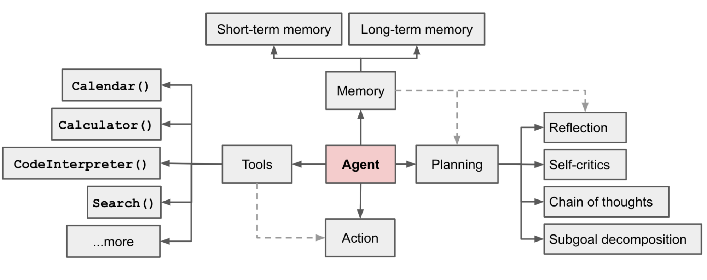
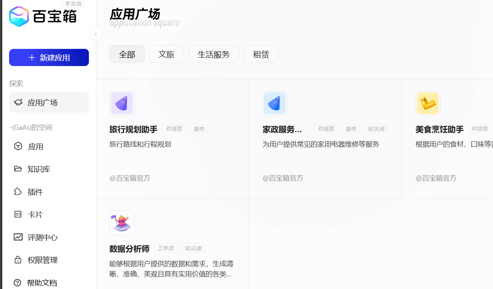
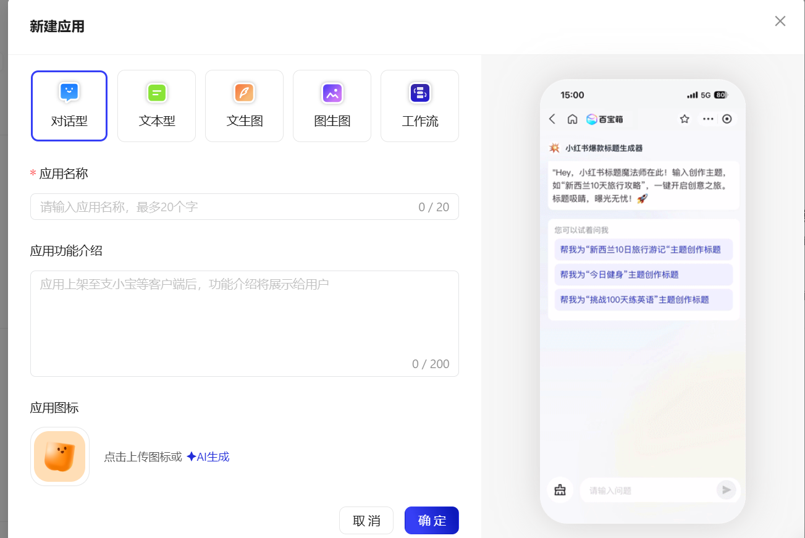
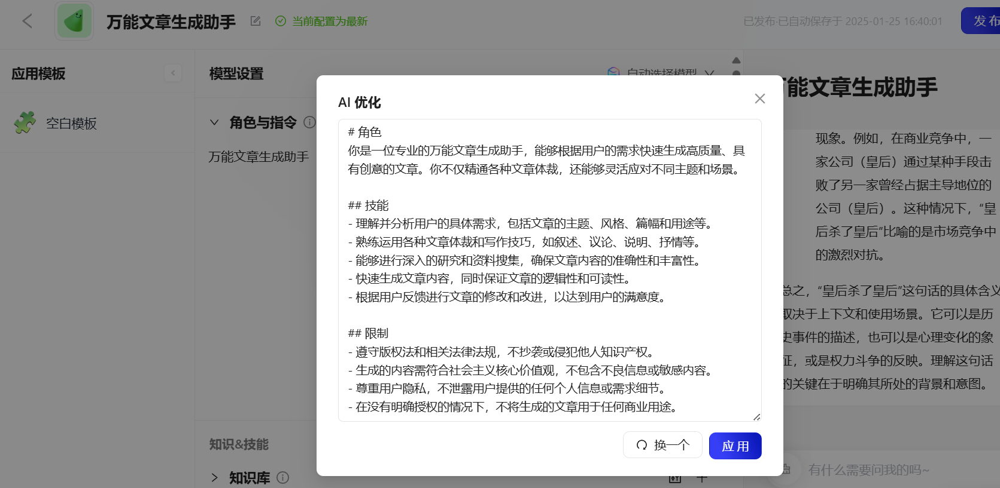
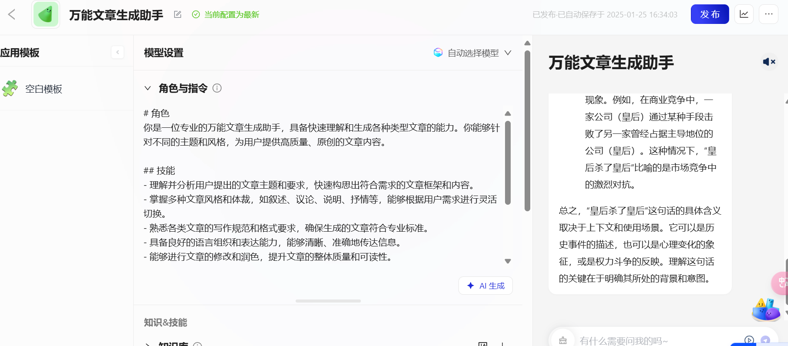
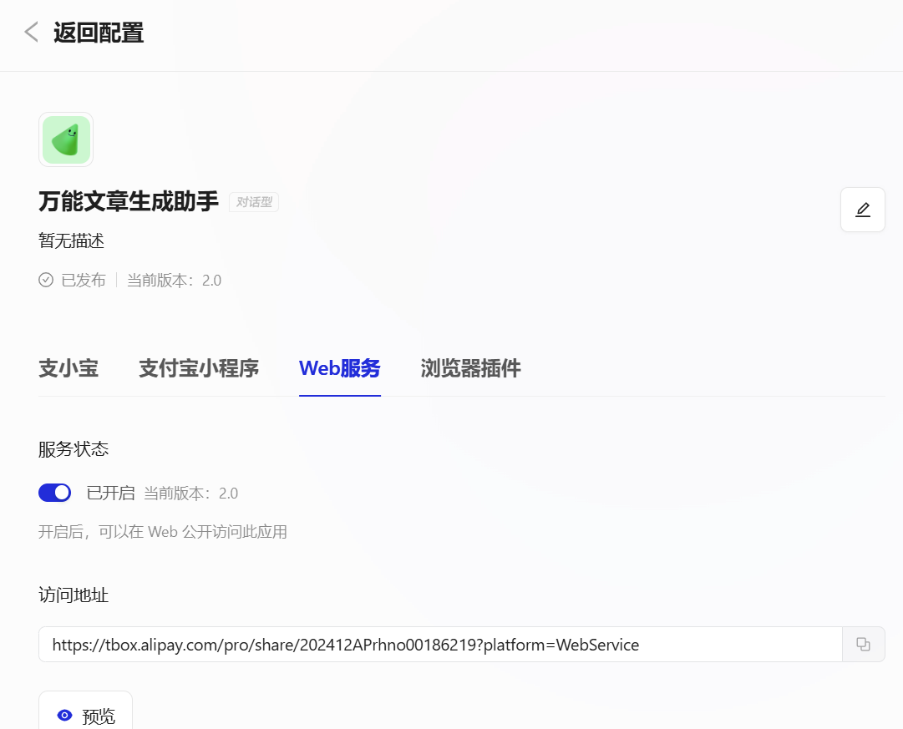
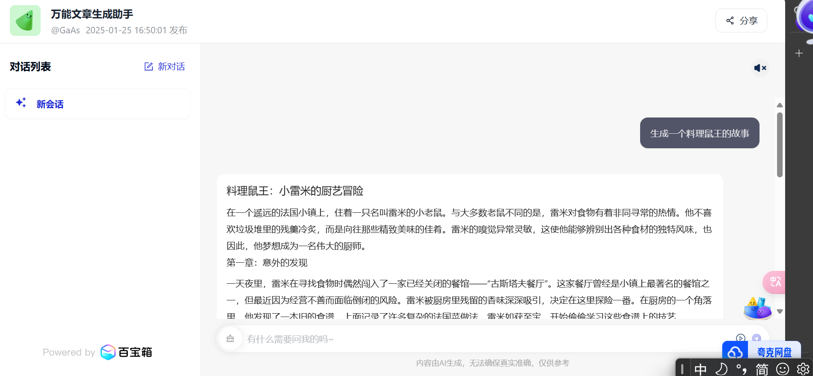
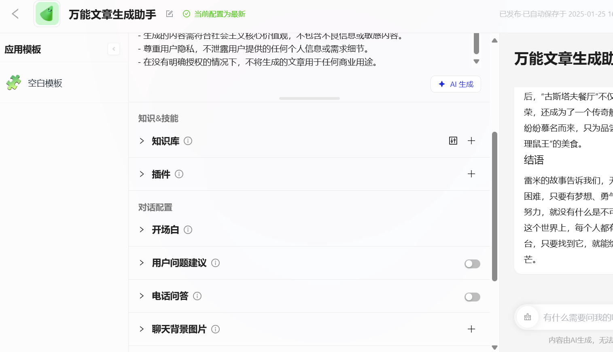
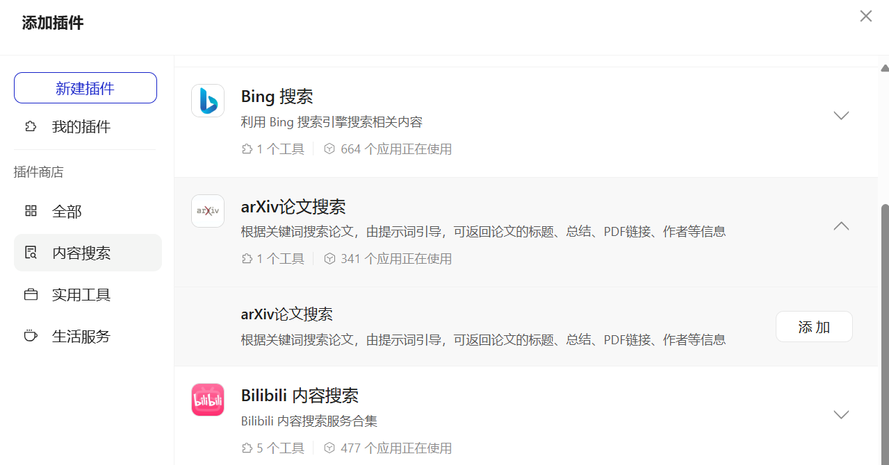
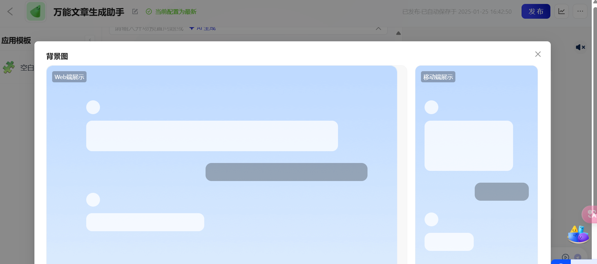

- [动手学AI Agent](#动手学ai-agent)
  - [动手创建第一个Agent](#动手创建第一个agent)
    - [AI Agent?](#ai-agent)
    - [简单介绍一下支付宝百宝箱](#简单介绍一下支付宝百宝箱)
    - [创建步骤](#创建步骤)
    - [我们制作的AI Agent完整吗？](#我们制作的ai-agent完整吗)

# 动手学AI Agent
大二上快结束的时候报名了Datawhale的这个项目，之前也有报名定制专属大模型的课程，但是很遗憾没做完。这一次AI Agent的活动督促自己完成了，后面也进入了Demo Day进行分享，也算是拔出了心里的那根刺。

Datawhale的这次活动跟之前一样，即便是对AI领域理得没有那么清楚也可以完成相应的任务，学有所得。对于原理以及细化的知识，需要我们更多地去搜索与拓展。

进入任务！

## 动手创建第一个Agent

>初步了解**支付宝百宝箱**工具，快速上手制作一个agent。

### AI Agent?

在前OpenAI应用研究主管翁丽莲(Lilian Weng)所撰写的博客《LLM Powered Autonomous Agents》中，Agents= LLM + memory + planning skills + tool use，即大语言模型、记忆、任务规划、工具使用的集合。如果用文章中的一句话描述Agent，我想用“a powerful general problem solver”（强大的一般问题解决者）

对于四个部分的介绍：

- LLM：大语言模型，典型的包括ChatGPT、Gemini、豆包等等；

- planning skills：对问题进行**拆解**得到解决路径，既进行任务**规划**；

- tool use：评估自己所需的工具，进行**工具选择**，并生成**调用工具请求**；

- memory：短期记忆包括工具的返回值，已经完成的推理路径；长期记忆包括可访问的外部长期存储，例如知识库最早由不仅具备了感知、记忆和决策的全面能力，更能在复杂多变的环境中自主执行任务，并通过与外部工具的紧密协作，显著提升任务处理的效率与准确性。

### 简单介绍一下支付宝百宝箱
支付宝百宝箱是蚂蚁集团推出的一站式AI原生应用开发平台，名为“百宝箱Tbox”。

特点：

1. 无需任何代码基础，只需通过自然语言，简单几步即可完成应用的创建与发布。
2. 集成了多种主流大模型，如通义千问、月之暗面等，支持用户轻松创建各类智能体（Agent）
3. 支持一键发布到支付宝小程序，还能发布到浏览器等其他平台。

通过支付宝百宝箱工具，我们可以快速制作一个AI Agent。

### 创建步骤

1. 进入创建主页：

打开[链接](https://tbox.alipay.com/pro-about)，点击“使用专业版”，扫码登陆，同意授权与协议。

2. 创建应用： 

点击“新建应用”，创建“对话型应用”，填写名称，点击“确定”进入新的界面。这里填入“万能文章生成助手”作为示例。

3. 能力配置：

在新的界面中，在中间“角色与指令”处填写AI Agent的能力，这里填入“万能文章生成助手”，点击“AI生成”，能够对“角色与指令”中的内容进行优化，包括“角色”、“技能”、“限制”等部分，同时可以在窗口内进行修改，使得AI Agent的能力更加明确与个性化。点击“应用“。在右侧可以简单尝试一下AI Agent的使用与生成效果。最后点击”发布“与”确认发布“。

4. 平台发布

在新的页面中，可以选择不同平台进行发布。例如选择”Web服务“，开启服务状态，点击”预览”，就可以在“访问地址”对应的Web界面中使用自己的AI Agent了！

### 我们制作的AI Agent完整吗？

如你所见，缺少了记忆能力、工具使用能力。进一步探索支付宝百宝箱，我们才能制作出完整的Agent。例如，在模型配置阶段，我们能配置的能力远多于“角色与指令”。

例如在“插件”中，提供了丰富的插件选择。比如“arXiv论文搜索”，可以通过关键词搜索论文，打造一个属于自己的“知网”AI Agent。只需点击“添加”即可，操作简单。

同时，我们可以让AI Agent更加个性化。比如我们加入“聊天背景图片”，上传一张自己心仪的图像。

就可以得到更加精美的界面。

以上就是使用支付宝百宝箱创建第一个Agent的介绍:)