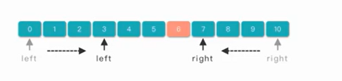
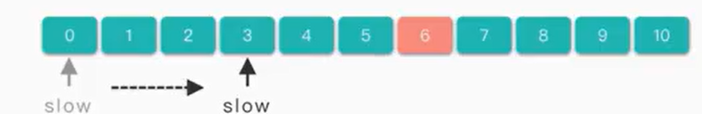
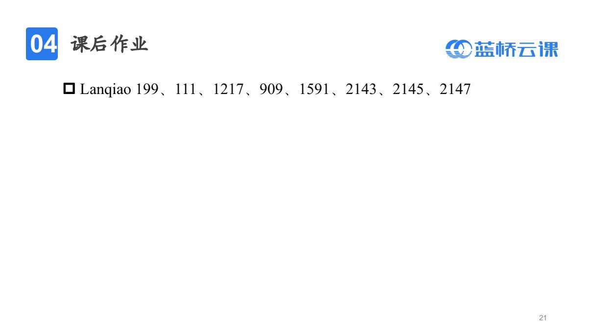

- [枚举](#枚举)
  - [是什么？](#是什么)
  - [具体步骤](#具体步骤)
  - [例题：百钱买百鸡](#例题百钱买百鸡)
  - [例题：字符计数](#例题字符计数)
  - [例题：反倍数](#例题反倍数)
- [模拟](#模拟)
  - [含义](#含义)
  - [注意事项](#注意事项)
  - [例题：饮料换购](#例题饮料换购)
  - [例题：图像模糊](#例题图像模糊)
  - [例题：螺旋矩阵](#例题螺旋矩阵)
    - [模拟行进过程](#模拟行进过程)
    - [拓展：横折的方式](#拓展横折的方式)
- [递归](#递归)
  - [是什么？](#是什么-1)
  - [注意事项](#注意事项-1)
  - [快速排序](#快速排序)
- [进制转换](#进制转换)
  - [enumerate()函数](#enumerate函数)
- [前缀和](#前缀和)
  - [例题：区间次方和](#例题区间次方和)
  - [例题：小郑的蓝桥平衡串](#例题小郑的蓝桥平衡串)
  - [例题：统计子矩阵](#例题统计子矩阵)
- [差分](#差分)
  - [是什么？](#是什么-2)
  - [应用：区间加法](#应用区间加法)
  - [注意事项](#注意事项-2)
  - [例题：区间更新](#例题区间更新)
  - [二维差分数组定义](#二维差分数组定义)
  - [二维应用：给一个矩阵的数字都加上x](#二维应用给一个矩阵的数字都加上x)
- [离散化](#离散化)
  - [定义](#定义)
  - [步骤](#步骤)
- [贪心](#贪心)
  - [定义](#定义-1)
  - [如何判断](#如何判断)
  - [具体问题](#具体问题)
  - [经典问题](#经典问题)
    - [例题：石子合并问题](#例题石子合并问题)
    - [例题：分组问题](#例题分组问题)
    - [例题：翻硬币问题](#例题翻硬币问题)
    - [例题：数组乘积问题](#例题数组乘积问题)
- [双指针](#双指针)
  - [是什么？](#是什么-3)
  - [类型](#类型)
  - [例题：美丽的区间](#例题美丽的区间)
  - [例题：挑选子串](#例题挑选子串)
- [二分](#二分)
  - [是什么？](#是什么-4)
  - [前提/核心](#前提核心)
  - [例题：手算根号2](#例题手算根号2)
  - [步骤](#步骤-1)
  - [用途](#用途)
    - [二分答案步骤](#二分答案步骤)
  - [例题：分巧克力](#例题分巧克力)
  - [例题：跳石头](#例题跳石头)
  - [例题：肖恩的乘法表](#例题肖恩的乘法表)
- [哈希](#哈希)
  - [例题：两数之和](#例题两数之和)
- [倍增](#倍增)
- [位运算](#位运算)

# 枚举

## 是什么？

- 逐个尝试所有可能的**值或组合**来解决问题
- 问题空间必须是**离散**的

## 具体步骤

1. 确定解空间：一维？二维？；
2. 确定空间边界：最值、步长；
3. 估算**时间复杂度**，优化。

## 例题：百钱买百鸡


- 思路一：枚举三种鸡的数量

公鸡上限：100 // 5 = 20

母鸡上限：100 // 3 = 33

小鸡上限：100 * 3 = 300 > 100，可以限定上线为100

时间复杂度：20\*33\*100

- 思路二：枚举两个变量

假设枚举公鸡为x只，母鸡为y只

小鸡用的钱：(100 - 5x - 3y)

小鸡的数量：3(100 - 5x - 3y)

时间复杂度：20\*33

- 思路三：枚举一个变量，后面两个变量通过二元一次方程组求解

时间复杂度：20

## 例题：[字符计数](https://www.lanqiao.cn/problems/160/learning/?page=1&first_category_id=1&tag_relation=union&name=%E5%AD%97%E7%AC%A6%E8%AE%A1%E6%95%B0)

没有什么特别能说的，主要就是记得，判断字符是否在字符串中可以直接用if c in 字符串，不用把字符串转成列表。

## 例题：[反倍数](https://www.lanqiao.cn/problems/152/learning/?page=1&first_category_id=1&tag_relation=union&name=%E5%8F%8D%E5%80%8D%E6%95%B0)

记录一个课上的笔记：**容斥原理**

1. [1,n]中a的倍数个数：n // a;
2. [1,n]中b的倍数个数：n // b;
3. [1,n]中ab的倍数个数：n // ab;
4. [1,n]中a的倍数或者b的倍数个数：n // a + n // b - n // ab;

# 模拟

## 含义

直接按照题目含义模拟

## 注意事项

1. 读懂题目；
2. 步骤与代码一一对应；
3. 提取重复部分，写成对应函数；
4. 分块调试。

## 例题：[饮料换购](https://www.lanqiao.cn/problems/143/learning/?page=1&first_category_id=1&tags=%E6%9E%9A%E4%B8%BE,%E6%A8%A1%E6%8B%9F,%E5%89%8D%E7%BC%80%E5%92%8C,%E5%B7%AE%E5%88%86,%E4%BA%8C%E5%88%86,%E8%BF%9B%E5%88%B6%E8%BD%AC%E6%8D%A2,%E8%B4%AA%E5%BF%83,%E4%BD%8D%E8%BF%90%E7%AE%97,%E5%8F%8C%E6%8C%87%E9%92%88&tag_relation=union&name=%E9%A5%AE%E6%96%99%E6%8D%A2%E8%B4%AD)

编程实现：

```python
import sys
input = lambda:sys.stdin.readline().strip()
n = int(input())
sum = n
f = 0
while n != 0:
    f+=1
    n-=1
    if f==3:
        f=0
        n+=1
        sum+=1
print(sum)
```

老师讲的减少循环的方法：

```python
#n：瓶盖数
#ans：饮料
n = int(input())
ans = n 
while True:
    if n>=3:
        #把三个瓶盖换成一瓶饮料
        n-=3
        #统计饮料
        ans += 1
        #更新瓶盖
        n += 1
    else:
        break
print(ans)
```

优化：

```python
#n：瓶盖数
#ans：饮料
n = int(input())
ans = n 
while True:
    if n>=3:
        #n个瓶盖可以换n//3个饮料，剩余n%3
        #统计饮料
        ans += n // 3
        #更新瓶盖
        n = n%3 + n//3
    else:
        break
print(ans)
```

## 例题：[图像模糊](https://www.lanqiao.cn/problems/550/learning/?page=1&first_category_id=1&tags=%E6%9E%9A%E4%B8%BE,%E6%A8%A1%E6%8B%9F,%E5%89%8D%E7%BC%80%E5%92%8C,%E5%B7%AE%E5%88%86,%E4%BA%8C%E5%88%86,%E8%BF%9B%E5%88%B6%E8%BD%AC%E6%8D%A2,%E8%B4%AA%E5%BF%83,%E4%BD%8D%E8%BF%90%E7%AE%97,%E5%8F%8C%E6%8C%87%E9%92%88&tag_relation=union&name=%E5%9B%BE%E5%83%8F)

可以用之前扫雷一样的，用dir记录偏移值。也可以用一个双重循环，跟遍历dir的循环次数是一样的。

一个比较不好的习惯就是变量重复定义，导致很难找的错误。

编程实现：

```python
import sys
input = lambda:sys.stdin.readline().strip()
n,m = map(int , input().split())
num = []
for i in range(n):
    ls = list(map(int , input().split()))
    num.append(ls)
    #ls为二维数组
ans = [[0] * m for _ in range(n)]
#dir = [(-1,-1),(-1,0),(-1,1),(0,-1),(0,0),(0,1),(1,-1),(1,0),(1,1)]
for i in range(n):
    for j in range(m):
        sum = 0
        count = 0
        #遍历每个位置求结果
        for dx in [-1,0,1]:
            for dy in [-1,0,1]:
                #和dir一样的效果
                x = i + dx
                y = j + dy
                if 0 <= x < n and 0 <= y < m:
                    sum+=num[x][y]
                    count += 1
        ans[i][j] = sum // count
for a in ans:
    print(" ".join(map(str,a)))
```

## 例题：[螺旋矩阵]()

### 模拟行进过程

```python
# 第一步
x,y=0,0
value = 1
num[x][y] = value
while value < n * m:
    #不断向右走，保证下一个点不越界、没数字
    while y+1 < m and num[x][y+1] == 0:
        value += 1
        y += 1
        num[x][y] = value
    #不断向下走，保证下一个点不越界、没数字
    while x+1 < n and num[x+1][y] == 0:
        value += 1
        x += 1
        num[x][y] = value
    #不断向左走，保证下一个点不越界、没数字
    while y - 1 >= 0  and num[x][y-1] == 0:
        value += 1
        y -= 1
        num[x][y] = value
    #不断向上走，保证下一个点不越界、没数字
    while x - 1 >= 0  and num[x-1][y] == 0:
        value += 1
        x -= 1
        num[x][y] = value
```

### 拓展：横折的方式

```
1 2 6 7 
3 5 8 13 
4 9 12 14
10 11 15 16

```

# 递归

## 是什么？

通过自己调用自己来解决问题的函数。通常把**大型复杂**问题层层转化为一个**与原问题相似的、规模较小**的问题求解。

## 注意事项

1. 递归出口
2. 如何化成子问题

同时可以作为函数的书写顺序。

## 快速排序

采用递归实现，时间复杂度为O(n)。

```python
# 快速选择算法，找第k小的数字,假设可能存在数字相同
# 例如：3，2，1，5，6，4。k=2
#（1）3为基准，变成【1,2】,【3】,【5,6,4】
# len(left)=2，len(middle)=1，k<=len(left)，在左边的子列表中
#（2）1为基准，变成【1】，【2】
# len(left)=0，len(middle)=1，k>len(left) and k>len(left)+len(right)，说明在右边的子列表中
#（3）右列表中只有一个元素，返回这个元素

# 例如：3，2，1，5，6，4。k=3
#（1）3为基准，变成【1,2】,【3】,【5,6,4】
# len(left)=2，len(middle)=1，k>len(left) and k<=len(left)+len(middle)，说明在中间的子列表中
# 要注意，中间列表所有的数字都是一样的，所以直接返回基准值就行

# 例如：3，2，1，5，6，4。k=4
#（1）3为基准，变成【1,2】,【3】,【5,6,4】
# len(left)=2，len(middle)=1，k>len(left) and k<=len(left)+len(middle)，说明在右边的子列表中
#（2）5为基准，变成【4】,【5】,【6】
# 此时k要更新为k - len(left) - len(middle)，在递归之前更新，即k=4-1-2=1
# len(left)=1，len(middle)=1，k<=len(left)，说明在左边的子列表中 
#（3）左列表中只有一个元素，返回这个元素
import sys
input = lambda:sys.stdin.readline().strip()

def QuickSearch(ls,k):
    #递归终点：所在的区间只有一个元素
    if len(ls) == 1:
        return ls[0]
    num = ls[0]
    #划分列表
    left = [x for x in ls if x < num]
    middle = [x for x in ls if x == num]
    right = [x for x in ls if x > num]
    left_count = len(left)
    middle_count = len(middle)
    if k <= left_count:
        return QuickSearch(left,k)
    elif k<=left_count+middle_count:
        return num
    else:
        return QuickSearch(right,k-left_count-middle_count)

k = int(input())
ls = list(map(int , input().split()))
print(QuickSearch(ls,k))

```

# 进制转换

感觉学一下这个列表和字典的使用比较有用。从中必须学习到一个函数enumerate().

## enumerate()函数

用于将一个可遍历的数据对象(如列表、元组或字符串)组合为一个索引序列，同时列出数据和数据下标.

语法如下：start表示起始下标

```python
enumerate(sequence,[start=0])
```

直观地看一下效果：

```python
ls = ['jvm','jre','javase']
print(list(enumerate(ls))) #注意转换成list类型
```

得到输出结果：

```python
[(0, 'jvm'), (1, 'jre'), (2, 'javase')]
```

具体在for循环中使用的时候，可以直接用两个变量去对应达到序号和对应值。不需要加上list。

```python
int_to_char = '0123456789ABCDEF'
char_to_int={}
for idx , chr in enumerate(int_to_char):
    char_to_int[chr] = idx
```

# 前缀和

这一部分自己学过了，主要是做一下课上的题目，同时复习一下迭代器的使用。要注意的点：

1. 如果提前对所有数字进行取模，相减的时候下标大的数字可能比下标小的要小，记得加个MOD；
2. 如何处理每个数字的不同次方？

## 例题：[区间次方和](https://www.lanqiao.cn/problems/3382/learning/?page=1&first_category_id=1&tags=%E6%9E%9A%E4%B8%BE,%E6%A8%A1%E6%8B%9F,%E5%89%8D%E7%BC%80%E5%92%8C,%E5%B7%AE%E5%88%86,%E4%BA%8C%E5%88%86,%E8%BF%9B%E5%88%B6%E8%BD%AC%E6%8D%A2,%E8%B4%AA%E5%BF%83,%E4%BD%8D%E8%BF%90%E7%AE%97,%E5%8F%8C%E6%8C%87%E9%92%88&tag_relation=union&name=%E5%8C%BA%E9%97%B4)

```python
import sys
from itertools import *
MOD = 1000000007
input = lambda:sys.stdin.readline().strip()
n,m = map(int , input().split())
#注意extend的使用方法
a = [0]
a.extend(list(map(int , input().split())))
#提前准备不同次方的前缀和，注意到题干中k在[1,5]之间的范围
sum_ls =[[]]
for i in range(1,6):
    tmp = [x ** i for x in a]
    tmp_sum = list(accumulate(tmp))
    tmp_sum = [x % MOD for x in tmp_sum]
    sum_ls.append(tmp_sum)
    
for i in range(m):
    l,r,k= map(int , input().split())
    print((sum_ls[k][r] - sum_ls[k][l-1] + MOD) % MOD)    

```

## 例题：[小郑的蓝桥平衡串](https://www.lanqiao.cn/problems/3419/learning/?page=1&first_category_id=1&tags=%E6%9E%9A%E4%B8%BE,%E6%A8%A1%E6%8B%9F,%E5%89%8D%E7%BC%80%E5%92%8C,%E5%B7%AE%E5%88%86,%E4%BA%8C%E5%88%86,%E8%BF%9B%E5%88%B6%E8%BD%AC%E6%8D%A2,%E8%B4%AA%E5%BF%83,%E4%BD%8D%E8%BF%90%E7%AE%97,%E5%8F%8C%E6%8C%87%E9%92%88&tag_relation=union&name=%E5%B0%8F%E9%83%91)

这个看起来不错哈，有点那味了，不说我真看不出来是前缀和。我的初步设想是，用两个列表分别存储L和Q从下标0到改下标的数量。因为求最长平衡串，所以从整个字符串的长度开始，使用两个“指针”，每次长度减一进行遍历，遇到符合平衡就是最长的。

与老师讲的区别：
1. 优化一下空间：L标注为1，Q标注为-1，相加为0就说明抵消了；
2. 不要用两个指针的方式，直接枚举，时间复杂度能过。自己误写的两个指针的代码完全是错的。

代码实现如下：

```python
import sys
from itertools import *
input = lambda:sys.stdin.readline().strip()
line = input()
a = [0]
for c in line:
    if c=='L':
        a.append(1)
    else:
        a.append(-1)
num = list(accumulate(a))
length = len(line)
ans = 0
for i in range(length):
    for j in range(length,i,-1):
        if num[j] - num[i] == 0:
            ans = max(ans,j-i)
print(ans)

```

写的时候就要时刻注意，在开头要不要加0，加了0之后会有什么效果，注意print模拟一下保过。


## 例题：[统计子矩阵](https://www.lanqiao.cn/problems/2109/learning/?page=1&first_category_id=1&tags=%E6%9E%9A%E4%B8%BE,%E6%A8%A1%E6%8B%9F,%E5%89%8D%E7%BC%80%E5%92%8C,%E5%B7%AE%E5%88%86,%E4%BA%8C%E5%88%86,%E8%BF%9B%E5%88%B6%E8%BD%AC%E6%8D%A2,%E8%B4%AA%E5%BF%83,%E4%BD%8D%E8%BF%90%E7%AE%97,%E5%8F%8C%E6%8C%87%E9%92%88&tag_relation=union&name=%E5%AD%90%E7%9F%A9%E9%98%B5)

```python
import sys
input = lambda:sys.stdin.readline().strip()
n,m,k = map(int,input().split())
#注意下标从1开始
num = [[0] * (m+1) for i in range(n+1)]
sum= [[0] * (m+1) for i in range(n+1)]
t = 0
for i in range(1,n+1):
    #num[i]表示一行数组
    num[i] = [0] + list(map(int,input().split()))
#预处理从行或者从列开始都行，习惯上按行处理
for i in range(1,n+1):
    for j in range(1,m+1):
        sum[i][j] = num[i][j] + sum[i-1][j] + sum[i][j-1] - sum[i-1][j-1]
'''检验
for i in range(1,1+n):
    print(" ".join(map(str,sum[i][1::])))
'''
#遍历所有的子矩阵，四重循环
for x1 in range(1,n+1):
    for y1 in range(1,m+1):
        for x2 in range(x1,n+1):
            for y2 in range(y1,m+1):
                #注意公式
                ans = sum[x2][y2] - sum[x2][y1 - 1] - sum[x1 - 1][y2] + sum[x1 - 1][y1 - 1]
                if ans <= k:
                    t+=1

print(t)
```

狗屎的时间限制，但是无所谓了。你比赛你搞一个试试呢。不过按照老师的经验+资料显示，PyPy3的性能是更好的，考试中要是用到这个那真是。

# 差分

终于要学差分了。前缀和开了坑之后一直想学一直没学。感谢！

## 是什么？

相邻两个元素求差。对差分**做前缀和**可以得到**原数组**。


## 应用：区间加法

某个区间加上x，对于差分数组而言：

1. 左端点加上x；
2. 右端点+1 减去x。


实现O(1)的区间加法。

## 注意事项

1. 无法边修改边查询；
2. diff[i]+x：从i【包括i在内】往后的所有数字+x；
3. diff[i]-x：从i+1【包括i+1在内】往后的所有数字-x；

## 例题：[区间更新](https://www.lanqiao.cn/problems/3291/learning/?page=1&first_category_id=1&tags=%E6%9E%9A%E4%B8%BE,%E6%A8%A1%E6%8B%9F,%E5%89%8D%E7%BC%80%E5%92%8C,%E5%B7%AE%E5%88%86,%E4%BA%8C%E5%88%86,%E8%BF%9B%E5%88%B6%E8%BD%AC%E6%8D%A2,%E8%B4%AA%E5%BF%83,%E4%BD%8D%E8%BF%90%E7%AE%97,%E5%8F%8C%E6%8C%87%E9%92%88&tag_relation=union&name=%E5%8C%BA%E9%97%B4%E6%9B%B4%E6%96%B0)

```python
import sys
from itertools import *
input = lambda:sys.stdin.readline().strip()
n,m = map(int,input().split())
ls =[0]
ls.extend(list(map(int,input().split())))
#差分预处理
diff = [0]
for i in range(1,n+1):
    diff.append(ls[i] - ls[i-1])
for i in range(m):
    x,y,z = map(int,input().split())
    diff[x]+=z
    #这里注意要判断
    if y+1 <= n:
        diff[y+1]-=z
ls = list(accumulate(diff))
print(" ".join(map(str,ls[1::])))
```

## 二维差分数组定义

由二维差分数组的前缀和就是原数组可以得到：

```python
diff[i][j] = a[i][j] - a[i-1][j] - a[i][j-1] +  a[i-1][j-1]
```
得到模板如下：

```python
import sys
input = lambda:sys.stdin.readline().strip()
n,m= map(int,input().split())
#注意下标从1开始
num = [[0] * (m+1) for i in range(n+1)]
diff= [[0] * (m+1) for i in range(n+1)]
t = 0
for i in range(1,n+1):
    #num[i]表示一行数组
    num[i] = [0] + list(map(int,input().split()))
#预处理从行或者从列开始都行，习惯上按行处理
for i in range(1,n+1):
    for j in range(1,m+1):
        diff[i][j] = num[i][j] - num[i-1][j] - num[i][j-1] + num[i-1][j-1]
for i in range(1,1+n):
    print(" ".join(map(str,diff[i][1::])))
```

案例输入：

```python
4 4
1 2 3 4
5 6 7 8
9 10 11 12
13 14 15 16
```

输出：

```python
1 1 1 1
4 0 0 0
4 0 0 0
4 0 0 0
```

## 二维应用：给一个矩阵的数字都加上x

**正对角线加，副对角线减**


公式如下：

```python
diff[x1][y1] +=x
diff[x2+1][y2+1] +=x
diff[x1][y2+1] -=x
diff[x2+1][y1] -=x
```

根据之前的案例写一下：

```python
import sys
input = lambda:sys.stdin.readline().strip()
n,m= map(int,input().split())
#注意下标从1开始
num = [[0] * (m+1) for i in range(n+1)]
diff= [[0] * (m+1) for i in range(n+1)]
ans= [[0] * (m+1) for i in range(n+1)]
t = 0
for i in range(1,n+1):
    #num[i]表示一行数组
    num[i] = [0] + list(map(int,input().split()))
#预处理从行或者从列开始都行，习惯上按行处理
for i in range(1,n+1):
    for j in range(1,m+1):
        diff[i][j] = num[i][j] - num[i-1][j] - num[i][j-1] + num[i-1][j-1]
#做一次+3
diff[2][2] +=3
diff[3+1][3+1] +=3
diff[2][3+1] -=3
diff[3+1][2] -=3
#还原
for i in range(1, n + 1):
    for j in range(1, m + 1):
        ans[i][j] = ans[i - 1][j] + ans[i][j - 1] - ans[i - 1][j - 1] + diff[i][j]
for i in range(1,1+n):
    print(" ".join(map(str,ans[i][1::])))
```

得到输出：

```python
1 2 3 4
5 9 10 8
9 13 14 12
13 14 15 16
```

# 离散化

## 定义

不关心数字本身，只关心大小关系（**排名**），本质上是一种**哈希**

eg.[100,200,300,400,500]，离散化为[1,2,3,4,5]

凡是只关心**排序关系**的题目，均可以离散化。

## 步骤

1. 数组拷贝；
2. 副本排序并去重；
3. 将原数组的元素设置为副本的下标【用到**二分查找**】。

学到了：**二分查找的库**

导入库：

```python
from bisect import *
```

具体函数使用：

|函数|功能|
|--|--|
|bisect_left(a, x, [lo=0, hi=len(a)])|在序列 a 中二分查找适合元素 x 插入的位置，即返回第一个**大于等于**x的位置|
|bisect_right(a, x, [lo=0, hi=len(a)])|在序列 a 中二分查找适合元素 x 插入的位置，即返回第一个**大于**x的位置|

编程感受：

```python
from bisect import *
a = [5, 6, 7, 8, 9]
print(bisect_left(a,4))
print(bisect_left(a,5))
print(bisect_left(a,10))
print(bisect_right(a,4))
print(bisect_right(a,5))
print(bisect_right(a,10))
```

输出如下：

```python
0
0
5
0
1
5
```
模板如下：

```python
from bisect import *
def Discreate(a):
    #拷贝，集合用于去重
    b = list(set(a))
    #排序
    b.sort()
    #转换
    ans = []
    for i in a:
        ans.append(bisect_left(b,i))
    return ans

ls = [200,0,100,300,400,100,300]
print(Discreate(ls))
```

可以得到：

```python
[2, 0, 1, 3, 4, 1, 3]
```

除了使用二分查找，我们还可以用字典：

```python
#字典
def Discreate(a):
    #拷贝，集合用于去重
    b = list(set(a))
    #排序
    b.sort()
    #b中的数字与下标捆绑
    dic = dict(zip(b,range(len(b))))
    #转换
    ans = []
    for i in a:
        ans.append(dic[i])
    return ans

ls = [200,0,100,300,400,100,300]
print(Discreate(ls))
```

结果一致。实际离散化可能从1开始。

# 贪心

## 定义

局部最优就是整体最优

eg.最少硬币支付问题

1. 1，2，5可以，因为5>2+1；
2. 1，2，4，5，6不可以，没有上述的性质。

## 如何判断

1. 找到最优子结构：问题的最优解包含子问题的最优解，也就是大问题分解成子问题；
2. 性质选择。

## 具体问题

1. 经典贪心问题
2. 举反例

## 经典问题

### 例题：[石子合并问题](https://www.lanqiao.cn/problems/545/learning/?page=1&first_category_id=1&tags=%E6%9E%9A%E4%B8%BE,%E6%A8%A1%E6%8B%9F,%E5%89%8D%E7%BC%80%E5%92%8C,%E5%B7%AE%E5%88%86,%E4%BA%8C%E5%88%86,%E8%BF%9B%E5%88%B6%E8%BD%AC%E6%8D%A2,%E8%B4%AA%E5%BF%83,%E4%BD%8D%E8%BF%90%E7%AE%97,%E5%8F%8C%E6%8C%87%E9%92%88&tag_relation=union&name=%E8%B0%88%E5%88%A4)

**当下最少的策略**

选择两个最小的进行合并

**数据结构选择**

最小堆heapq，每次获取最小的元素，这里就来学一下这个结构吧（老亡羊补牢人了）

堆：分为大根堆与小根堆，使用数组表示的二叉树。在heapq库中，heapq使用的数据类型是Python的基本数据类型**list**。


用到的函数如下：其中的heap都是列表类型

|函数|功能|
|--|--|
|heappush(heap,item)|往堆中添加新值，自动建立小根堆，一般在空列表上好用|
|heapify(heap)|以线性时间将一个列表转化为小根堆|
|heappop(heap)|返回堆中的最小值|
|nlargest(num, heap)|从堆中取出num个数据，从最大的数据开始取，返回结果是一个列表|
|nsmallest(num, heap)|从堆中取出num个数据，从最小的数据开始取，返回结果是一个列表|
|merge(sorted(array_a), sorted(array_b))|将两个有序的列表合并成一个新的有序列表，返回结果是一个**迭代器**|
|heappushpop(heap, num)|先将num添加到堆中，然后将堆顶的数据出堆|
|heapreplace(heap, num)|先将堆顶的数据出堆，然后将num添加到堆中|

进而实现这道题目：

```python
import sys
import heapq
input = lambda:sys.stdin.readline().strip()
n = int(input())
a = list(map(int ,input().split()))
#转换成堆
heapq.heapify(a)
ans = 0
while len(a) >= 2:
    x = heapq.heappop(a)
    y = heapq.heappop(a)
    heapq.heappush(a,x+y)
    ans += x+y
print(ans)
```

### 例题：[分组问题](https://www.lanqiao.cn/problems/532/learning/?page=1&first_category_id=1&tags=%E6%9E%9A%E4%B8%BE,%E6%A8%A1%E6%8B%9F,%E5%89%8D%E7%BC%80%E5%92%8C,%E5%B7%AE%E5%88%86,%E4%BA%8C%E5%88%86,%E8%BF%9B%E5%88%B6%E8%BD%AC%E6%8D%A2,%E8%B4%AA%E5%BF%83,%E4%BD%8D%E8%BF%90%E7%AE%97,%E5%8F%8C%E6%8C%87%E9%92%88&tag_relation=union&name=%E7%BA%AA%E5%BF%B5%E5%93%81%E5%88%86%E7%BB%84)

类似：上船，船能够承载的质量一定

**思路**

从大的开始往前看，如果能找到合适的凑在一起，那么就凑，不能就单独为一组。

为什么可以这样遍历【为什么可以这样贪心】？如果小的不和最大最合适的配合，那么跟别的搭配，浪费的空间一定是最大的

### 例题：[翻硬币问题](https://www.lanqiao.cn/problems/209/learning/?page=1&first_category_id=1&tag_relation=union&name=%E7%BF%BB%E7%A1%AC%E5%B8%81)

**思路**

为了保证最终能够翻出来，从左往右翻就行。

### 例题：数组乘积问题


**思路**

a从小到大，b从大到小，两两配对。这个可以用数学的方法证明

# 双指针

## 是什么？

进行区间操作时，利用两个下标同时遍历。

## 类型

1. 反向扫描：相遇或者满足某些条件的时候停止扫描

有序数组、字符串



eg.分箱问题、回文字符串

```python
s = input()
```

2. 同向扫描：也叫做滑动窗口，维护一个[left,right]的区间



    - 左端点向右移动表示删除元素
    - 右端点向右移动表示增加元素

在尾部或者满足特殊条件时停止

## 例题：[美丽的区间](https://www.lanqiao.cn/problems/1372/learning/?page=1&first_category_id=1&tags=%E6%9E%9A%E4%B8%BE,%E6%A8%A1%E6%8B%9F,%E5%89%8D%E7%BC%80%E5%92%8C,%E5%B7%AE%E5%88%86,%E4%BA%8C%E5%88%86,%E8%BF%9B%E5%88%B6%E8%BD%AC%E6%8D%A2,%E8%B4%AA%E5%BF%83,%E4%BD%8D%E8%BF%90%E7%AE%97,%E5%8F%8C%E6%8C%87%E9%92%88&tag_relation=union&name=%E7%BE%8E%E4%B8%BD%E7%9A%84%E5%8C%BA%E9%97%B4)

用前缀和时间会爆掉，所以用双指针进行优化。

**思路**

遍历每一个左端点，右端点**不断向右移动**，恰好满足大于等于S的时候就是每个左端点最“美丽”的情况。

这道题能用双指针的原因就在于**所有数字都是正数**，有点递增的味道。

```python
import sys
input = lambda:sys.stdin.readline().strip()
n,s = map(int,input().split())
ls = list(map(int,input().split()))
l,r = 0,0
tot = 0
length = n
#滑动窗口[l,r]，r不包含在区间中，用于表示下一个要加入的数字
while l < n:
    #不断扩展右端点，直至区间之和大于等于s
    while r<n and tot < s:
        tot += ls[r]
        r+=1
    #更新最美丽区间的长度，注意判断条件
    if tot >= s:
        length = min(length,r - l)
    #更新左端点
    tot -= ls[l]
    l += 1
if length == n:
    length = 0
print(length)
```

## 例题：[挑选子串](https://www.lanqiao.cn/problems/1621/learning/?page=1&first_category_id=1&tags=%E6%9E%9A%E4%B8%BE,%E6%A8%A1%E6%8B%9F,%E5%89%8D%E7%BC%80%E5%92%8C,%E5%B7%AE%E5%88%86,%E4%BA%8C%E5%88%86,%E8%BF%9B%E5%88%B6%E8%BD%AC%E6%8D%A2,%E8%B4%AA%E5%BF%83,%E4%BD%8D%E8%BF%90%E7%AE%97,%E5%8F%8C%E6%8C%87%E9%92%88&tag_relation=union&name=%E6%8C%91%E9%80%89%E5%AD%90%E4%B8%B2)

1. 根据条件把数组变成01数组，用数字的和代表几个数满足。但是这种会增加时间消耗，也啥必要直接判断就行；
2. 对于每个l，找到最小的r，r+1，r+2……n均为合法区间。

编程实践如下：

```python
import sys
input = lambda:sys.stdin.readline().strip()
n,m,k = map(int , input().split())
ls = list(map(int , input().split()))
ans = 0
l,r = 0,0
tot = 0
while l < n:
    while r < n and tot < k:
        if ls[r] >= m:
            tot += 1
        r += 1
    if tot >= k:
        #注意这里r不包含在区间内
        ans += n - r + 1
    if ls[l] >= m:
        tot -= 1
    l += 1
print(ans)
```

# 二分

## 是什么？

每次将搜索范围缩小一半，在O(logn)时间内找到正确答案

## 前提/核心

单调性

## 例题：手算根号2

1. 在[1,2]，计算1.5**2 = 2.25>2；
2. 在[1,1.5]，计算1.25**2 < 2；
……

编写代码如下：

```python
l,r = 1,2
#假设要求是精确到小数点后3位，说明区间长度小于等于1e-4，或者自己限定循环次数
while r - l >= 1e-4:
    mid = (l + r) / 2
    #根据中点调整区间
    if mid ** 2 > 2:
        #调整为[l,mid]
        r = mid
    else:
        #调整为[mid,r]
        l = mid
#保留小数输出位数
print("{:.3f}".format(l))
```
## 步骤

1. 候选区间[l,r]；
2. 计算中点mid = (l+r) /2
3. 判断中点是否合法，对应调整范围，循环直到区间满足特定条件。

## 用途

1. 查找**有序列表**中元素x的下标；
2. 浮点二分：计算根号2；
3. 二分答案：求解的问题具有单调性

### 二分答案步骤

题目具有单调性质，采用猜答案+二分

1. 确定范围[l,r]，考虑最极端的情况就行；
2. l <= r时：
   - mid
   - check(mid)
   - mid合法：更新ans
   - 根据合法调整区间：l = mid+1 or r = mid-1

## 例题：[分巧克力](https://www.lanqiao.cn/problems/99/learning/?page=1&first_category_id=1&tags=%E6%9E%9A%E4%B8%BE,%E6%A8%A1%E6%8B%9F,%E5%89%8D%E7%BC%80%E5%92%8C,%E5%B7%AE%E5%88%86,%E4%BA%8C%E5%88%86,%E8%BF%9B%E5%88%B6%E8%BD%AC%E6%8D%A2,%E8%B4%AA%E5%BF%83,%E4%BD%8D%E8%BF%90%E7%AE%97,%E5%8F%8C%E6%8C%87%E9%92%88&tag_relation=union&name=%E5%88%86%E5%B7%A7%E5%85%8B%E5%8A%9B)

这里的单调性在于，巧克力的边长越长，得到的数量越少

```python
n,k = map(int,input().split())
#保存每块巧克力的信息
a = []
#这里写成1e5会导致ans变成小数
max_num = 100000
for i in range(n):
    x,y = map(int,input().split())
    a.append((x,y))

#合法：边长为x，能够切出k块
def check(x):
    tot = 0
    for i in range(n):
        #这里记得加括号
        tot += (a[i][0] // x) * (a[i][1] // x)
    if tot >= k :
        return True
    else:
        return False

l,r = 1,max_num
ans = 0
while l <= r:
    mid = (l+r) // 2
    if check(mid):
        #可以：求是不是有更大的
        ans = mid
        l = mid+1
    else:
        #不可以：缩小边长
        r = mid -1
print(ans)
```

## 例题：[跳石头](https://www.lanqiao.cn/problems/364/learning/?page=1&first_category_id=1&tags=%E6%9E%9A%E4%B8%BE,%E6%A8%A1%E6%8B%9F,%E5%89%8D%E7%BC%80%E5%92%8C,%E5%B7%AE%E5%88%86,%E4%BA%8C%E5%88%86,%E8%BF%9B%E5%88%B6%E8%BD%AC%E6%8D%A2,%E8%B4%AA%E5%BF%83,%E4%BD%8D%E8%BF%90%E7%AE%97,%E5%8F%8C%E6%8C%87%E9%92%88&tag_relation=union&name=%E8%B7%B3%E7%9F%B3%E5%A4%B4)

特殊的标签：**最大值最小化**，**最小值最大化**，一般都是二分答案

**至多**移走M块岩石，又可知，移除的石头越多，最短跳跃距离越大，具有单调性。

因此我们对**最短跳跃距离**进行二分，思路是：猜最短跳跃距离为x，统计在这种情况下需要移走多少岩石。没有超过M块，就是合法的。

```python
import sys
input = lambda:sys.stdin.readline().strip()
l,n,m = map(int ,input().split())
a = []
for i in range(n):
    a.append(int(input()))

#猜最短跳跃距离为x，统计在这种情况下需要移走多少岩石。没有超过M块，就是合法的。
def check(x):
    #移除的数量
    tnt = 0
    #last_p用于计算距离
    last_p = 0
    for i in range(n):
        #如果这块石头跟上一块的距离小于x，移除这块石头
        if a[i] - last_p < x:
            tnt+=1
        else:
            last_p = a[i]
    #终点石头特判，如果不符合就说明x不行
    if l - last_p < x:
        #注意这里老师讲的不对，如果最后这个不满足，直接加1，把倒数第二块石头移开就行了，因为倒数第二和倒数第三之间的距离满足大于等于x，所以不用再做别的验证
        tnt+=1
    #确保移除的数量小于等于m
    if tnt <= m:
        return True
    return False
    

left,right = 1,l
ans = 0
while left<=right:
    mid = (left+right) // 2
    if check(mid):
        ans = mid
        left = mid+1
    else:
        right = mid-1 
print(ans)
```

## 例题：[肖恩的乘法表](https://www.lanqiao.cn/problems/3404/learning/?page=1&first_category_id=1&tags=%E6%9E%9A%E4%B8%BE,%E6%A8%A1%E6%8B%9F,%E5%89%8D%E7%BC%80%E5%92%8C,%E5%B7%AE%E5%88%86,%E4%BA%8C%E5%88%86,%E8%BF%9B%E5%88%B6%E8%BD%AC%E6%8D%A2,%E8%B4%AA%E5%BF%83,%E4%BD%8D%E8%BF%90%E7%AE%97,%E5%8F%8C%E6%8C%87%E9%92%88&tag_relation=union&name=%E8%82%96%E6%81%A9%E7%9A%84%E4%B9%98%E6%B3%95%E8%A1%A8)

通读完题目之后，感觉用暴力实现是很简单的。

```python
import sys
input = lambda:sys.stdin.readline().strip()
n,m,k = map(int , input().split())
ls = []
for i in range(1,n+1):
    for j in range(1,m+1):
        ls.append(i*j)
ls.sort()
print(ls[k-1])
```
然后就时间没问题，但是全部**超过内存限制**了。内存在270000+kb，恰好超了内存一点点。

我们尝试一下减小内存：

```python
import sys
input = lambda:sys.stdin.readline().strip()
n,m,k = map(int , input().split())
ls = []
for i in range(1,n+1):
    for j in range(1,m+1):
        ls.append(i*j)
        ls.sort()
        if len(ls)>k:
            ls = ls[:k]
print(ls[k-1])
```

妈的测评系统总是突然之间就尼玛炸了……但是我从测评结果进去，这么做时间又炸了……

用二分的思路，我们就是要**猜第k小的数字是多少**，然后看比这个数小的数字有多少个。

```python
import sys
input = lambda:sys.stdin.readline().strip()
n,m,k = map(int , input().split())

def check(x):
    cnt = 0
    #第i行的数字为i,2i,3i,4i…mi
    #因为i*j<=x，所以j<=x//i
    for i in range(1,n+1):
        #考虑m很小的情况
        cnt += min(m,x//i)
    return cnt

left , right=1,n*m
while left <= right:
    mid = (left + right)//2
    if check(mid) >= k:
        #大了
        #等于在哪，ans的更新就在哪
        #这里更新ans是与check函数有关的，check函数统计的是小于等于该数的总数，数字有重复
        ans = mid
        right = mid - 1
    else:
        left = mid + 1
print(ans)
```

二分答案的习题：还得练



 刚才打开倍增的视频，发现居然是C++的……算了几块钱的课能看多少是多少吧。

 # 哈希

主要就是要复习**字典**的使用。字典在判断一个数字是否在字典中的时间复杂度为O(1)级别。

## 例题：[两数之和](https://leetcode.cn/problems/two-sum/)

```python
#最终返回的是一个列表
class Solution:
    def twoSum(self, nums: List[int], target: int) -> List[int]:
        dic = {}
        n = len(nums)
        #判断在该数之前有没有凑起来正好是target的数字
        for i,x in enumerate(nums):
            if dic.get(target-x) is not None:
                return [i,dic[target-x]]
            dic[x] = i       
```

# 倍增

# 位运算

还要自己找一下资源，先放个坑在这里