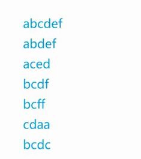
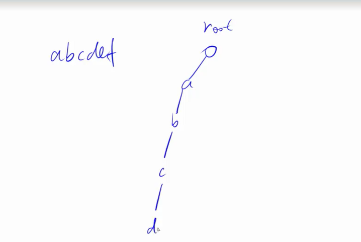
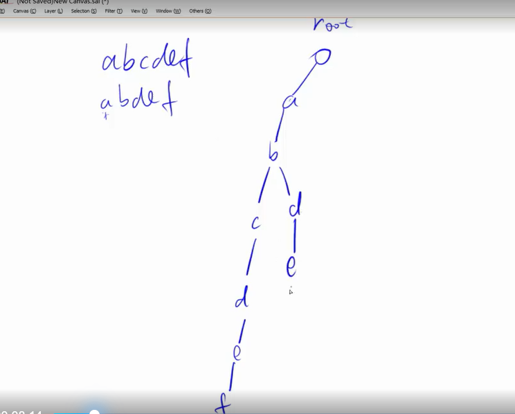
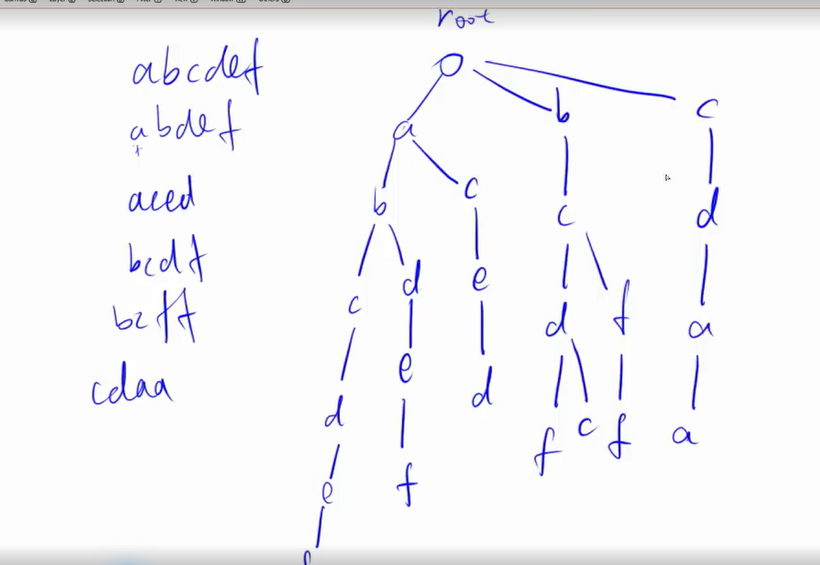
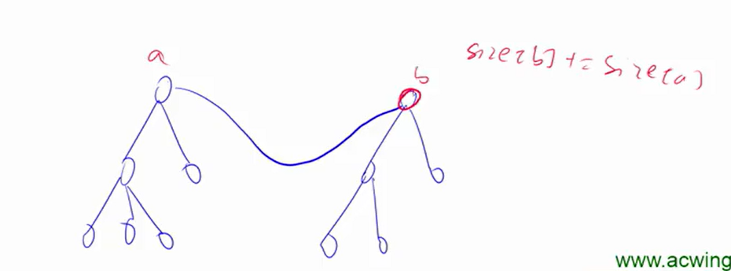

- [Trie](#trie)
  - [如何存储](#如何存储)
  - [数组模拟](#数组模拟)
  - [代码实现](#代码实现)
  - [例题：P8306 【模板】字典树](#例题p8306-模板字典树)
  - [练习：P10471 最大异或对 The XOR Largest Pair](#练习p10471-最大异或对-the-xor-largest-pair)
- [并查集](#并查集)
  - [用途](#用途)
  - [数组模拟](#数组模拟-1)
  - [如何判断树根](#如何判断树根)
  - [如何求x的集合编号：](#如何求x的集合编号)
  - [如何合并两个集合](#如何合并两个集合)
  - [优化-\>O(1)：路径压缩](#优化-o1路径压缩)
  - [代码实现](#代码实现-1)
  - [例题：P3367 【模板】并查集](#例题p3367-模板并查集)
  - [信息维护](#信息维护)
    - [集合元素个数](#集合元素个数)
    - [每个点到根节点的距离](#每个点到根节点的距离)
- [堆](#堆)
  - [功能实现](#功能实现)
  - [存储方式](#存储方式)
  - [具体操作](#具体操作)
    - [节点下移：最小堆中某一个值变大了](#节点下移最小堆中某一个值变大了)
    - [节点上移：最小堆中某一个值变小了](#节点上移最小堆中某一个值变小了)
  - [功能实现](#功能实现-1)
    - [建立堆](#建立堆)
    - [插入一个数](#插入一个数)
    - [求集合中的最小值](#求集合中的最小值)
    - [删除最小值](#删除最小值)
    - [删除任意一个元素](#删除任意一个元素)
    - [修改任意一个元素](#修改任意一个元素)
    - [删除第k个插入的数](#删除第k个插入的数)
    - [修改第k个插入的数](#修改第k个插入的数)
  - [例题1：P3378 【模板】堆](#例题1p3378-模板堆)
  - [例题2：U551959 模拟堆](#例题2u551959-模拟堆)

上一节课花了很久才看完，zsj你个懒虫。。这节课要快些落实！

# Trie

- 用途：用于快速存储和查找字符串集合的数据结构。字符串组成的元素一般只有一种类型

## 如何存储

举例存储以下单词：



从root节点开始。从前往后遍历每一个字符。对于第一个单词，往后一直到f



对于后面的单词，重复使用节点：



最终形态：



往往会在单词结尾**打上标记**。

## 数组模拟

下标为0的点，既是根节点，也是空节点

1. 连线：son[N][26]（26个小写或者大写）
2. 结尾标记：cnt[N]
3. 下标：idx

## 代码实现

```python
# 插入单词
def insert(l):
    p = 0 # 从根节点开始遍历，p永远代表遍历点的父节点
    for i in range(len(l)):
        # 字符映射到数字，这里以小写为例
        u = ord(l[i]) - ord('a')
        if son[p][u] == 0:
            idx += 1
            son[p][u] = idx #idx是用于标记具体的点的，背后包含了点与父节点的连接，会不断累加
        p = son[p][u]
    cnt[p] += 1 # 以这个点为结尾的单词+1

# 查找单词出现的次数，不存在就return 0
def query(l):
    p = 0
    for i in range(len(l)):
        u = ord(l[i]) - ord('a')
        # 不存在任意位置上的字符，就说明这个单词没有统计过
        if son[p][u] == 0: return 0
        p = son[p][u]
    return cnt[p]
```

## 例题：[P8306 【模板】字典树](https://www.luogu.com.cn/problem/P8306)

要注意的是这里统计的是前缀，注意更新cnt[p]的地方。同时根据实践检验，py在创建列表的时候实在是太慢了，因此字典树只用cpp来做，真的快的飞起。猪婆真的要考虑转cpp了

看到有人用py写出来是对的，看上去多少有点科技的感觉

```python
# 注意这里是前缀就行
# 认命吧字典树只能用cpp来写
import sys
input = lambda:sys.stdin.readline()
t = int(input())
N = 3*10**6
son = [[0] * 62 for _ in range(N)]
cnt = [0] * N
idx = 0
oa = ord('a')
o0 = ord('0') - 52
oA = ord('A') - 26
for _ in range(t):
	n,q = map(int,input().split())
	# 0-25：小写
	# 26-51：大写
	# 52-61：数字
	# 重置数组
	for i in range(1,idx+1):
		cnt[i] = 0
		for j in range(62):
			son[i][j] = 0
	idx = 0
	for i in range(n):
		l = input().rstrip()
		le = len(l)
		p = 0
		for j in range(le):
			u = ord(l[j])
			if u in range(48,58): u -= o0
			elif u in range(65,91): u -= oA 
			else: u -= oa
			if son[p][u] == 0:
				idx += 1
				son[p][u] = idx
			p = son[p][u]
			cnt[p] += 1
	for i in range(q):
		l = input().rstrip()
		le = len(l)
		p = 0
		f = 0
		for j in range(le):
			u = ord(l[j])
			if u in range(48,58): u -= o0
			elif u in range(65,91): u -= oA 
			else: u -= oa
			if son[p][u] == 0: 
				print(0)
				f = 1
				break
			p = son[p][u]
		if f == 0: print(cnt[p])
```

```cpp
#include <iostream>
#include <string>
using namespace std;

const int N = 3e6 + 10;
int son[N][62];
int cnt[N]; 
int idx; 
int char_to_idx(char c) {
    if (c >= '0' && c <= '9') {
        return c - '0' + 52;  // 数字映射到52-61
    } else if (c >= 'A' && c <= 'Z') {
        return c - 'A' + 26;  // 大写字母映射到26-51
    } else {
        return c - 'a';       // 小写字母映射到0-25
    }
}

int main() {
    ios::sync_with_stdio(false);
    cin.tie(0);
    int t;
    cin >> t;
    while (t--) {
        int n, q;
        cin >> n >> q;
        // 重置上一轮使用的节点
        for (int i = 0; i <= idx; ++i) {
            cnt[i] = 0;
            for (int j = 0; j < 62; ++j) {
                son[i][j] = 0;
            }
        }
        idx = 0;
        for (int i = 0; i < n; ++i) {
            string l;
            cin >> l;
            int p = 0;
            
            for (char c : l) {
                int u = char_to_idx(c);
                if (son[p][u] == 0) {
                    son[p][u] = ++idx;
                } 
                p = son[p][u];
                cnt[p]++;
            }
        }
        for (int i = 0; i < q; ++i) {
            string l;
            cin >> l;
            int p = 0;
            bool found = true;      
            for (char c : l) {
                int u = char_to_idx(c);
                if (son[p][u] == 0) {
                    found = false;
                    break;
                }
                p = son[p][u];
            }
            cout << (found ? cnt[p] : 0) << '\n';
        }
    }
    return 0;
}
```

别人的py：

```python
"""
思路：
离线，然后反向建树。细节有点多
"""

import sys
input = lambda : sys.stdin.readline().rstrip()
from collections import defaultdict

def insert(trie,s):
    for i in s:
        if i not in trie:trie[i] = {}
        trie = trie[i]
    end.add(id(trie))

def find(trie,s):
    word = ''
    for i in s:
        word += i
        if i not in trie:return
        trie = trie[i]
        if id(trie) in end:
            ans[word] += 1
def solve():
    global end;global ans
    trie = {}
    end = set()
    ans = defaultdict(int)
    n,m = map(int,input().split())
    a = []
    b = []
    for i in range(n):a.append(input())
    for i in range(m):b.append(input())
    # 对于每一个查询ti，反向建立字典树后，再用被查询的字符串si跑trie。显然只有当遇到单词结尾的时候，ti贡献 + 1。遇到重复的字符串就开哈希表记录。最后跑一遍离线的查询输出答案即可
    for i in range(len(b)):insert(trie,b[i])
    for i in a:find(trie,i)
    for i in b:print(ans[i])

for i in range(int(input())):solve()
```

```python
import sys
import threading

def main():
    data = sys.stdin.read().split()
    it = iter(data)
    q = int(next(it))
    for _ in range(q):
        n = int(next(it))
        m = int(next(it))
        chi = [{}]
        cnt = [0]
        for _ in range(n):
            u = 0
            string = next(it).strip()
            for s in string:
                nu = chi[u].get(s)
                if nu is None:
                    nu = len(chi)
                    chi.append({})
                    chi[u][s] = nu
                    cnt.append(0)
                u = nu
                cnt[u] += 1
        for _ in range(m):
            string = next(it)
            u = 0
            tmp = True
            for s in string:
                if chi[u].get(s) is None:
                    tmp = False
                    break
                u = chi[u][s]
            if tmp:
                print(cnt[u])
            else:
                print(0)

if __name__ == "__main__":
    threading.Thread(target=main).start()
```

之后能看懂的时候研究一下

## 练习：[P10471 最大异或对 The XOR Largest Pair](https://www.luogu.com.cn/problem/P10471)


# 并查集

## 用途

1. 将两个集合合并
2. 询问两个元素是否在一个集合当中

## 数组模拟

**原理**：每个集合用一棵树来表示。树根的编号就是整个集合的编号。

父节点：p[x]

## 如何判断树根

```python
p[x] == x
```

## 如何求x的集合编号：

```python
while p[x] != x: x = p[x]
```

## 如何合并两个集合

加一条边即可，p[px] = py，注意这里的px和py是集合编号

## 优化->O(1)：路径压缩

一次遍历找到根节点之后，将路径上的所有节点都指向根节点。

还有一种是按秩合并，优化作用不明显。

## 代码实现

只有一个关键的函数

```python
# 返回x所在集合编号（路径压缩）
def find(x):
    # 注意这里是左右都是p[x]！
    if p[x]!=x: p[x] = find(p[x])
    return p[x]
```

## 例题：[P3367 【模板】并查集](https://www.luogu.com.cn/problem/P3367)

1合并2查询

```python
import sys
input = lambda:sys.stdin.readline()

def find(x):
	if p[x]!=x: p[x] = find(p[x])
	return p[x]

n,m = map(int,input().split())
p = [i for i in range(n+1)]
for _ in range(m):
	z,x,y = map(int,input().split())
	if z == 1: p[find(x)] = find(y)
	else:
		if find(x) == find(y):
			print("Y")
		else:
			print("N")
```

## 信息维护

### 集合元素个数

增加一个新的数组size，用于记录每个集合中点的数量，初始条件下全部赋成1。约定只有根节点的size是有意义的。合并时更新。



**例题**：[U514565 连通块中点的数量](https://www.luogu.com.cn/problem/U514565)

```python
import sys
input = lambda:sys.stdin.readline()

def find(x):
	if p[x]!=x: p[x] = find(p[x])
	return p[x]

n,m = map(int,input().split())
p = [i for i in range(n+1)]
size = [1] * (n+1)
for _ in range(m):
	od = list(input().split())
	if od[0] == "C":
		x = int(od[1])
		y = int(od[2])
		# 特判不能在同一个集合中
		if find(x)!=find(y):
			size[find(y)] += size[find(x)]
			p[find(x)] = find(y)
	elif od[0] == "Q1":
		print("Yes" if find(int(od[1])) == find(int(od[2])) else "No")
	else:
		print(size[find(int(od[1]))])
```

### 每个点到根节点的距离

种类并查集，看别人的视频懂了，等后面acwing讲了再更新一下。

**例题**：[P2024 [NOI2001] 食物链](https://www.luogu.com.cn/problem/P2024)

```python
# 对于动物 x 和 y，我们可能有:x吃y，x与y同类，x被y吃。
import sys
input = lambda:sys.stdin.readline()

# 同时要更新d
def find(x):
	if p[x] != x:
		t = p[x] #保留直接上级
		p[x] = find(p[x])
		d[x] = (d[x]+d[t])%3
	return p[x]

n,k = map(int,input().split())
ans = 0
# 用向量的方法解决
# d[]：表示和根节点的关系
# 0同类，1吃根节点，2被根节点吃
p = [i for i in range(n+1)]
d = [0] * (n+1)
for i in range(k):
	op,x,y = map(int,input().split())
	# x或y比n大
	if x>n or y>n:
		ans += 1
		continue
	px = find(x)
	py = find(y)
	# 相同的/有经过处理的
	if px == py:
		# x 吃 x
		if x == y:
			if op == 2: 
				ans += 1
				continue
		else:
			# 与前面所说的不相同
			# a->c = a->pa + pa->c
			if (d[x]+3-d[y])%3 != op-1:
				ans += 1
				continue
	# 说的话是真的，合并
	else:
		p[px] = py
		# pa->pb = pa->a + a->b + b->pb
		d[px] = (2-d[x] + op + d[y])%3
print(ans)
```

# 堆

完全二叉树，除了最后一层的节点，上面的节点都是满的

**小根堆**：每个点都小于等于左右子节点。根节点就是最小值

**大根堆**：每个点都大于等于左右子节点。根节点就是最大值

## 功能实现

1. 插入一个数
2. 求集合中的最小值
3. 删除最小值
【STL实现不了的】
4. 删除任意一个元素
5. 修改任意一个元素

## 存储方式

采用**一维数组**的形式：h[N],size

1. 1号为根节点
2. 对于下标x，左儿子为2x，右儿子为2x+1

## 具体操作

### 节点下移：最小堆中某一个值变大了

移动步骤：逐步与子节点的最小值交换，直到满足小于两个子节点

还是要修改成递推的形式。递归还是会TLE。

```python
def down(x):
	while True:
		t = x
		if x*2 <= size and h[x*2]<h[t]: t = x*2
		if x*2+1 <= size and h[x*2+1]<h[t]: t=x*2+1
		if t!=x:
			h[t],h[x] = h[x],h[t]
			x = t
		else:
			break
```

### 节点上移：最小堆中某一个值变小了

移动步骤：逐步与根节点交换，直到满足根节点小于等于子节点

```python
def up(x):
    while x//2 and h[x//2] > h[x]: 
        h[x],h[x//2] = h[x//2],h[x]
        x //= 2
```

## 功能实现

### 建立堆

```python
# 按顺序依次插入一维数组之后
for i in range(n//2,0.-1):
    down(i)
```

### 插入一个数

最后插入，考虑上移

```python
heap[++size] = x
up(size)
```

### 求集合中的最小值

```python
heap[1]
```

### 删除最小值

最后一个元素覆盖堆顶，考虑下移

```python
heap[1] = heap[size--]
down(1)
```

**STL实现不了的**

### 删除任意一个元素

```python
heap[k] = heap[size--]
down(k)
up(k) #两个只会执行一个
```

### 修改任意一个元素

```python
heap[k] = x
down(k)
up(k) 
```

如果遇到修改/删除第k个插入的数，需要**记录**并**维护**第k个插入数字的下标

- ph[k]：第k个插入点的下标。位置**交换**时，这个也要交换
- hp[k]：堆中的点是第几个插入的。在位置交换之前，得到ph**锁定位置**时所需要的下标。

形象来说：ph[k] = j,hp[j] = k。由此来完善一下

### 删除第k个插入的数

```python
idx = ph[k]
heap[idx] = heap[size--]
down(idx)
up(idx) #两个只会执行一个
```

对应的down和up:

```python
def down(x):
	while True:
		t = x
		if x*2 <= size and h[x*2]<h[t]: t = x*2
		if x*2+1 <= size and h[x*2+1]<h[t]: t=x*2+1
		if t!=x:
			h[t],h[x] = h[x],h[t]
			ph[hp[x]],ph[hp[t]] = ph[hp[t]],ph[hp[x]]
			hp[x],hp[t] = hp[t],hp[x]
			x = t
		else:
			break
```

```python
def up(x):
	while x//2 and h[x//2] > h[x]:
		h[x//2],h[x] = h[x],h[x//2]
		ph[hp[x]],ph[hp[x//2]] = ph[hp[x//2]],ph[hp[x]]
		hp[x],hp[x//2] = hp[x//2],hp[x]
		x //= 2
```

### 修改第k个插入的数

```python
idx = ph[k]
heap[k] = x
down(k)
up(k) 
```

## 例题1：[P3378 【模板】堆](https://www.luogu.com.cn/problem/P3378)

```python
import sys
input = lambda:sys.stdin.readline()
n = int(input())
h = [0] * (n+1)
size = 0

def up(x):
	while x//2 and h[x//2] > h[x]:
		h[x//2],h[x] = h[x],h[x//2]
		x //= 2

def down(x):
	while True:
		t = x
		if x*2 <= size and h[x*2]<h[t]: t = x*2
		if x*2+1 <= size and h[x*2+1]<h[t]: t=x*2+1
		if t!=x:
			h[t],h[x] = h[x],h[t]
			x = t
		else:
			break

for _ in range(n):
	od = list(map(int,input().split()))
	if od[0] == 1:
		size += 1
		h[size] = od[1]
		up(size)
	elif od[0] == 2:
		print(h[1])
	else:
		h[1] = h[size]
		size -= 1
		down(1)
```

## 例题2：[U551959 模拟堆](https://www.luogu.com.cn/problem/U551959)

```python
import sys
input = lambda:sys.stdin.readline()
n = int(input())
h = [0] * (n+1)
hp = [0] * (n+1) #堆中的点是第几个插入的
ph = [0] * (n+1) #第k个插入点的下标
size = 0
cnt = 0

def down(x):
	while True:
		t = x
		if x*2 <= size and h[x*2]<h[t]: t = x*2
		if x*2+1 <= size and h[x*2+1]<h[t]: t=x*2+1
		if t!=x:
			h[t],h[x] = h[x],h[t]
			ph[hp[x]],ph[hp[t]] = ph[hp[t]],ph[hp[x]]
			hp[x],hp[t] = hp[t],hp[x]
			x = t
		else:
			break

def up(x):
	while x//2 and h[x//2] > h[x]:
		h[x//2],h[x] = h[x],h[x//2]
		ph[hp[x]],ph[hp[x//2]] = ph[hp[x//2]],ph[hp[x]]
		hp[x],hp[x//2] = hp[x//2],hp[x]
		x //= 2

for _ in range(n):
	od = list(input().split())
	if od[0] == 'I':
		size += 1
		cnt += 1
		h[size] = int(od[1])
		hp[size] = cnt
		ph[cnt] = size
		up(size)
	elif od[0] == "PM":
		print(h[1])
	elif od[0] == "DM":
		h[1] = h[size]
		hp[1] = hp[size]
		ph[hp[1]] = 1
		size -= 1
		down(1)
	elif od[0] == "D":
		idx = ph[int(od[1])]
		h[idx] = h[size]
		hp[idx] = hp[size]
		ph[hp[size]] = idx 
		size -= 1
		down(idx)
		up(idx)
	else:
		idx = ph[int(od[1])]
		h[idx] = int(od[2])
		down(idx)
		up(idx)
```

完结撒花！下一章学STL！