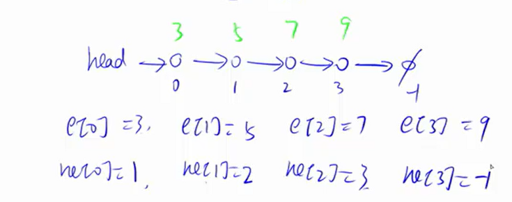
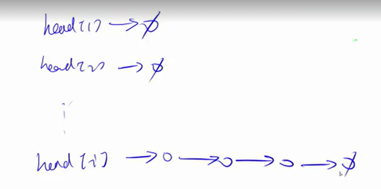
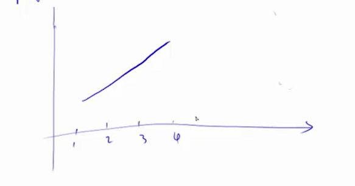
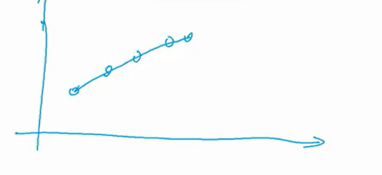
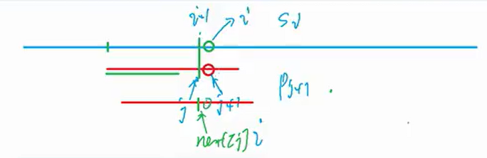

这个暑假也是好好开始刷算法题了，跟着acwing的课程先学数据结构！顺便也是把stl学了，做好ALL的准备👀

# 链表

## 分类

- 单链表：邻接表，用于存储树和图
- 双链表：用于优化某些题目

## 单链表

### 数组模拟

要包含两个方面的东西，用下标来关联：

1. value:e[N]（值）
2. next:ne[N]（下标）



### 代码模板

```python
# head
# e:value
# ne:next
# idx:当前用到的地址

# 初始化
def init():
    head = -1
    idx = 0 # 可以从0开始分配

# x值插入头节点
def add_to_head(x):
    e[idx] = x
    ne[idx] = head
    head = idx
    idx += 1

# 将x值插入下标为k的值的后面
def add(x,k):
    e[x] = idx
    ne[x] = ne[k]
    ne[k] = idx
    idx += 1

# 将k下标之后的一个点删掉
# 有一点容易写错
def remove(k):
    ne[k] = ne[ne[k+1]]
```

### 例题：[B3631 单向链表](https://www.luogu.com.cn/problem/B3631)

但是这道题的实现跟acwing讲的还是不一样。题干的要求是在对应的元素后面添加、查询、删除数字，如果用acwing的做法还需要去遍历找到那个位置。这里的优化是直接用下标代替数值，只需要一个ne数组就可以实现。

```python
# 改进：用下表代替数值，直接在O(1)时间内完成
import sys
input = lambda:sys.stdin.readline()
N = 10**6+1
ne = [-1] * N
head = 1
q = int(input())
for _ in range(q):
	ii = list(map(int,input().split()))
	if ii[0] == 1:
		ne[ii[2]] = ne[ii[1]]
		ne[ii[1]] = ii[2]
	elif ii[0] == 2:
		print(ne[ii[1]] if ne[ii[1]] != -1 else 0)
	else:
		ne[ii[1]] = ne[ne[ii[1]]]
```

洛谷上的一个pypy3满分解法是用字典，跟我用数值直接对应下标的原理是相同的。

还有直接用列表的函数的。用数组确实会快很多。

```python
n = int(input())

l = [1, 0]

for i in range(n):
    k = [int(x) for x in input().split()]
    if k[0] == 1:
        (x, y) = k[1:3]
        l.insert(l.index(x) + 1, y)
    elif k[0] == 2:
        print(l[l.index(k[1]) + 1])
    else:
        del(l[l.index(k[1]) + 1])
```

## 双链表

### 数组模拟

相比于单链表：一个指向前，一个指向后

1. value:e[N]（值）
2. left:l[N]（下标）
3. rigth:r[N]（下标）

同时，对于节点下标，0表示最左侧，1表示最右侧

### 代码模板

```python
# e:value
# l:left
# r:right
# idx:当前用到的地址
# 0表示最左侧，1表示最右侧

# 初始化
def init():
    r[0] = 1
    l[1] = 0
    idx = 2 # 0和1已经被占用了

# 在k节点的右边插入一个点
def add(k,x):
    e[idx] = x
    # 先处理新的点，r[k]最后才能改变
    l[idx] = k
    r[idx] = r[k]
    l[r[k]] = idx
    r[k] = idx

# 在k节点的左边插入一个点等价于在k左边节点的右边插入一个点
def add_left(k,x):
    add(l[k],x)

# 删除第k个点
def remove(k):
    r[l[k]] = r[k]
    l[r[k]] = l[k]
```

### 例题：[B4324 【模板】双向链表](https://www.luogu.com.cn/problem/B4324)

为了判断链表是否为空，在1和N前后都添加了0和N+1。看了几个基本上都是用的r[head] == n+1判断的，应该还不错！

```python
import sys
input = lambda:sys.stdin.readline()
n,m = map(int,input().split())
l = [(i-1) for i in range(n+2)]
r = [(i+1) for i in range(n+2)]
head = 0
for _ in range(m):
	od = list(map(int,input().split()))
	if od[0] == 1 and od[1] != od[2]:
		# 删除xs
		r[l[od[1]]] = r[od[1]]
		l[r[od[1]]] = l[od[1]]
		# 插入到y左边
		r[l[od[2]]] = od[1]
		l[od[1]] = l[od[2]]
		r[od[1]] = od[2]
		l[od[2]] = od[1]
	elif od[0] == 2 and od[1] != od[2]:
		# 删除x
		r[l[od[1]]] = r[od[1]]
		l[r[od[1]]] = l[od[1]]
		# 插入到y右边
		r[od[1]] = r[od[2]]
		l[r[od[2]]] = od[1]
		r[od[2]] = od[1]
		l[od[1]] = od[2]
	else:
		r[l[od[1]]] = r[od[1]]
		l[r[od[1]]] = l[od[1]]
if r[head] == n+1:
	print("Empty!")
	exit()
while r[head] != n+1:
	print(r[head],end = ' ')
	head = r[head]
```

## 邻接表

相当于开了n个单链表，后面图论具体学习



# 栈和队列

## 区别

1. 栈：先进后出
2. 队列：先进先出

## 栈

## 数组模拟

1. value:stk[N]
2. 栈顶:tt

### 代码模板
```python
# value:stk[N]
# 栈顶

# 初始
tt = 0

# 插入
stk[++tt] = x

# 栈顶元素
stk[tt]

# 弹出
tt -= 1

# 判断栈是否为空
if tt > 0: not empty
else:empty
```

## 队列

### 数组模拟

1. value:q[N]
2. 头:hh
3. 尾:tt
### 代码模板

```python
# value:q[N]
# 头:hh
# 尾:tt

# 初始化
tt = -1
hh = 0

# 拆入元素
q[++tt] = x

# 弹出
hh += 1

# 判断是否为空
if hh <= tt： not empty
else:empty

# 取出队头或者队尾元素
q[hh]
q[tt]
```

# 单调栈和单调队列

用的情况很少

## 单调栈

- 应用场景：求某一个节点，左边比它小的、最近的节点

**考虑**：如果有a<sub>3</sub> > a<sub>5</sub>，那么a<ub>i</sub>(i>=6)的答案一定不是a<sub>3</sub>

**一般化**：a<sub>x</sub> <= a<sub>y</sub> （x<=y），那么a<sub>x</sub>就可以删掉

**结果**：维护一个单调上升的栈



- stk[tt] > a[i]：栈点就可以删掉。直到找到stk[tt] < a[i]

## 例题模板：[P5788 【模板】单调栈](https://www.luogu.com.cn/problem/P5788)

不幸的是会MEL。好在现在所有题目都是1025MB。128MB真是疯

```python
import sys
input = lambda:sys.stdin.readline()
n = int(input())
a = [0] + list(map(int,input().split()))
N = 3*10**6
stk = [0] * (n+1)
tt = 0
ans = [0] * n
for i in range(n,0,-1):
	while tt!=0 and a[stk[tt]]<= a[i]: tt-=1
	ans[i-1] = stk[tt]
	tt += 1
	stk[tt] = i
print(*ans)
```

## 单调队列

- 应用场景：求解**滑动窗口**中的最小值

**考虑**：[-3,-1,3]，-3和-1一定不会当成最小值输出

**一般化**：存在a<sub>i</sub> > a<sub>i+1</sub>，就可以把a<sub>i</sub> 删掉，最终变成一个严格单调上升的队列。



因此最小值就是队列的头（q[hh]）

## 例题模板：[滑动窗口](https://www.acwing.com/problem/content/156/)

```python
```

# KMP

- 用途：字符串匹配：在一个主字符串中查找某个子字符串出现的**所有*位置

**思想**：预处理出来每一个点为终点的后缀与前缀相等的最大长度

也就是说：

```python
# next[i] = j
p[1,j] = p[i-j+1,i]
```

模拟匹配过程理解next[i]=j的含义：



如果在p[i]的位置发现不匹配，就可以把p[j]移动到p[i]的位置，前面理论上是不用检验一定可以匹配成功的。

重复上述操作。

