- [来制作属于自己的第一个2D像素游戏！](#来制作属于自己的第一个2d像素游戏)
  - [2025.2.27](#2025227)
  - [2025.3.1](#202531)
  - [2025.3.2](#202532)
  - [2025.4.6](#202546)
    - [编辑器设置](#编辑器设置)
    - [拓展Tilemap](#拓展tilemap)
    - [Camera2D](#camera2d)
    - [TileMap](#tilemap)

# 来制作属于自己的第一个2D像素游戏！

很久没有更新博客了，最近一直在忙程序设计课的东西，所以也没有做什么别的学习，跟着大部队一起AI编程（）。这学期第一周周末的时候在B站上看到了一个Steam上的小游戏《雨天》，突然就爆发了做游戏的想法。稍微多了解了一点，构想了一下游戏的主题什么的，觉得是一件需要长期努力的事情。

第一个游戏打算从简单的2D像素开始，用**Godot**引擎做（Unity只能说伤了很多人的心吧）。开始记录每一天！

## 2025.2.27

昨天在京东上买的高漫M6数位板，特意买的明日达，今天就拿到了:)。稍微玩了一下，感觉自己上手还算快，没有特别不适应，感觉要特别学一下Ps的快捷键啥的。用B站看了一点点像素画的教程，感觉自己画的就是一坨啊（）。

教程放个[链接](https://www.bilibili.com/video/BV1DT411o7Tw?vd_source=0f645f8562b98c379361eb83d3950ed9)

老师的：

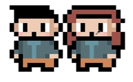

本人的：（只画了男生，但是还是掩盖不住的丑陋）

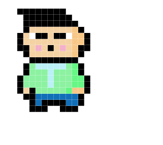

像素画比我想的难好多，要从最基础的部件开始一步一步做，连老师都说，心浮气躁的时候就画不好，希望自己，每天做一点点就好，能够一直坚持下去！

等基础打好了就会把故事完善，画素材同步开发进行吧，加油！

## 2025.3.1

昨天下午来同济校区找女朋友了，在图书馆里面刷了一下蓝桥杯的题目就没做什么事情了。晚上开了个大创的会议，今天约会。现在在等老婆回来吃午饭，学了一些游戏的东西。

感觉自己对生命中的很多体验都淡化了。中午给女朋友点好午饭之后，自己想点个牛排的外卖。但是所有的商家都是套餐，没有纯粹的牛排，就不想吃午饭了。好像自己在学校里面也是，每天到了下课突然开始想中午吃什么，但是最后就是吃以前吃过无数次的东西，不会去探索什么新的，就想着早点把胃填满，要不然睡不了觉。学习上也是一样。学院安排的课程都不喜欢，可能这个学期的数字电路跟我自己的大创有一点联系稍微想学一点。其他课又不想学，又不想看到自己很差的成绩，每天劝自己去接受。为了学好课内，课外人工智能、算法、操作系统等等我觉得很有意思的网课我又没时间上。可能游戏是我想摆脱这种困境的一种方式吧，但是我能够坚持下来吗，我也不知道。

因为一直在想我的游戏里面的关卡类型应该怎么设置，一直觉得的原因是我不是资深的游戏玩家，根本没玩过多少，我只是想通过游戏去表达/记录什么。中午就搜了关键词“游戏基础知识”。第一个视频给了我一个新的观点，就是独立开发者不应该一开始就上手做自己的游戏，而是应该先跟着教程做出来一个基础的游戏，熟悉一下流程，之后再好好做自己的游戏。我确实应该思考一下自己学习的路线，之后好好看看那个视频。

今天比较重点的是[游戏类型](https://www.bilibili.com/video/BV1uq4y1f7VZ?vd_source=0f645f8562b98c379361eb83d3950ed9)的学习。

分为以下几类：

1. RPG：角色扮演游戏

   广义上是全部游戏的基础。你在游戏中扮演一个角色，有属于自己的剧情。判定标准是**角色信息是否数字化**（属性，等级提升等等）。其分支有：
   - JRPG：日式，战斗方式采用**回合制**（洛克王国…？），下达指令就行，特别说了宝可梦是怪物捕获类型游戏；
   - ARPG：动作作为战斗方式；
   - SRPG：策略，主要靠战略部署进行战斗，“下棋”。

2. SLG：战略模拟类游戏
   
   跟之前的SRPG有点像，但是没有等级的变化，而是单纯靠战略部署。有一个常见的人为分支SIM，生活模拟类游戏。更加生活化，例如《模拟人生》。
   
3. ACT：动作冒险类游戏

   超级马里奥！以动作操作为主，3D将横板动作扩展，注意与ARPG区别。
   
4. ROGUELIKE：肉鸽游戏

   角色永久死亡、随机性（没有正经的保存点）。《死亡细胞》！
   
5. AVG：冒险游戏

   有无大量的解谜元素。动作AVG（《旷野之息》）与文字AVG（《逆转裁判》）。
   
6. 沙盒游戏

   有一定的开放性，有助于发挥玩家想象力；有**建造系统**。《我的世界》
   
7. FTG：格斗类型游戏

   特指1v1单挑，《拳皇》
   
8. FPS：第一人称射击游戏，《CS》

9. TPS：第三人称射击游戏

10. MUG：音乐类型游戏

11. RTS：即时战略游戏

12. SPG：体育类型游戏

13. RAC：赛车竞速游戏

14. PUZ：益智类游戏

## 2025.3.2

今天一整天在弄大创申报书吧（刚才突然想了一下发现自己不记得今天做了什么了）。就是很奇怪，今天蓝桥杯官网突然打不开了，弄得白天就没刷题。晚上看了一下2D游戏动画制作的[视频](https://www.bilibili.com/video/BV1fikLYQExW?vd_source=0f645f8562b98c379361eb83d3950ed9)，学到了一种新的制作方式。之前我学的（好吧了解的，我并没有上手做过）就是那种把动作一帧一帧画出来的，对于像素画已经表现得很好了。今天学习一种基于骨架得2D动画设计。

（一）画面实现

1. 将想要移动的部位画在不同的图层上面；

2. 在每个图层下面新建一个图层，用于给这个图层上色，完成后同时选中并合并。上层的东西会显示在下层的东西的前面，注意调整位置；

3. 准备导入Unity进行绑定和动画制作（Godot我没有背叛你我先学再说）：新建一个photoshop文件，把每个部位导进去，裁剪白边并关闭背景图层。

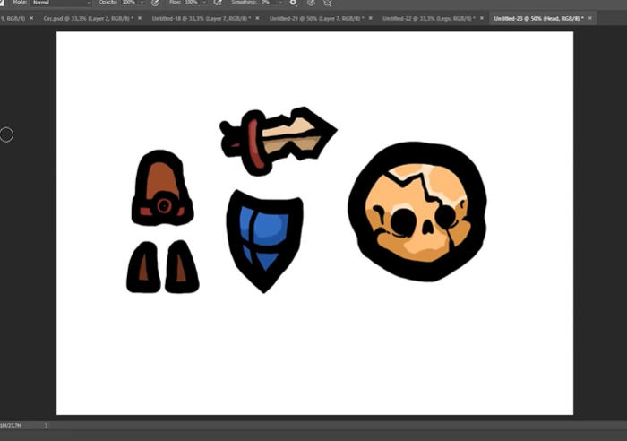

（二）导入组件并拼接

1. 在Uinty中，sprite mode设置为多个，保存更改，进入sprite Editer；

2. Slice进行切片，点击应用，关闭sprite Editer；

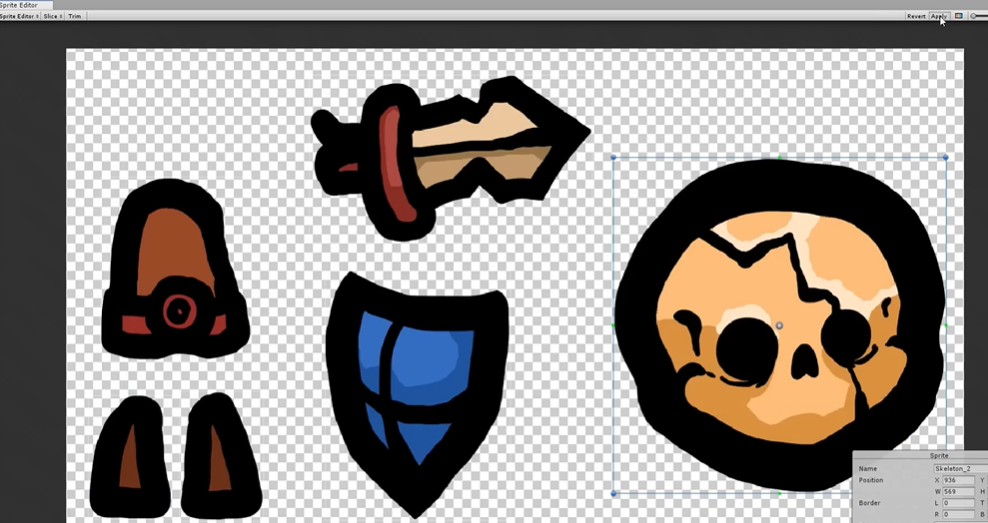

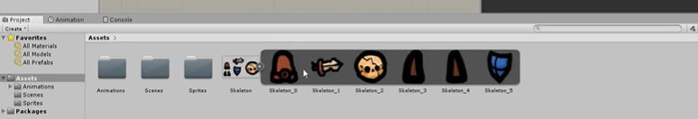

3. 拖动组件进行拼接，调整顺序与图层，越高越前面。

（三）动画效果准备

1. 回到sprite Editer，手动调整**轴心点**（小蓝点），可以围绕轴心点做旋转移动与缩放；

2. 再次退出sprite Editer，拼接组件。

3. 注意给每个组件命名；

4. 希望建立层级结构，一个东西动另一个东西也跟着动，并在此基础上创建**根骨骼角色对象**，可以一次移动、旋转与缩放整个角色：创建character的空游戏对象，位置放在正中间，将组件放在空游戏对象内部，这就是一个层级建立的过程。其他组件之间的层级也可以这么建立。

（四）动画实现

1. 窗口——动画——动画，产生动画时间轴，选择角色根部并点击创建，保存文件；

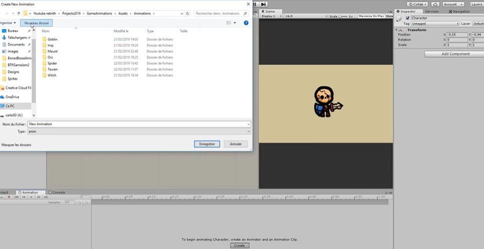

2. 添加组件的关键帧，点击时间节点并修改形态，就会自动生成动画。

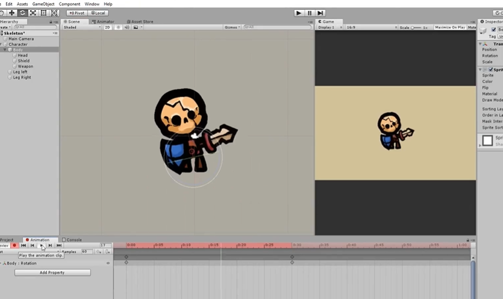

3. 频率改变可以通过拖动关键帧进行实现。

## 2025.4.6

没想到下一篇就已经来到了这个时候（）这段时间时间主要花在玩游戏上了（）但是迟迟无法起步的原因还是没有想法吧，其实有在怀疑自己是不是真的喜欢游戏，也尝试玩了很多的游戏，最终在Godot交流群里面找到了一个[比较完整的视频](https://www.bilibili.com/video/BV1SP411m7aj?vd_source=0f645f8562b98c379361eb83d3950ed9)，在昨天晚上的时候把序列为0的视频部分做完了。虽然版本有点过时，比如Tilemap已经被禁用了，自己探索了一会儿TilemapLayer的使用方法，但是整体上这个教程是很完整的，自己昨天做出来的时候也很开心，所以决定克服困难跟下去！

昨天的进度如下：

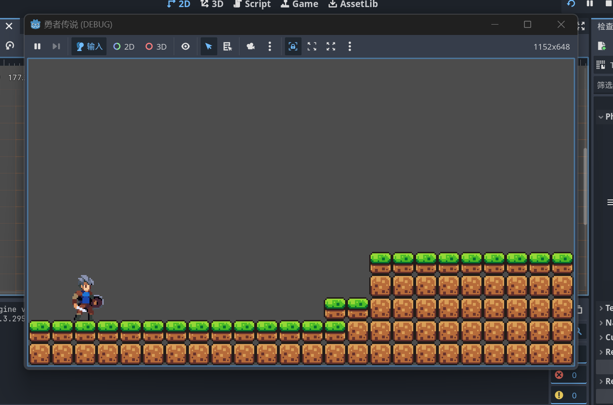

可以左右移动和跳跃。因为觉得视频中的素材太丑了所以用了brackeys一小时入门的素材。

下一节课是讲Camera2D的使用！Camera2D的作用是**让玩家能够拓展到更多的界面**。

### 编辑器设置

编辑器->编辑器设置->补全->添加类型提示，对开发过程很友好。其实是我没听懂具体是怎么好的。巧的是，4.4版本是默认开启的。

### 拓展Tilemap

跟之前的步骤没区别

### Camera2D

在player节点下添加一个Camera2D节点。按住ctrl键，有助于对齐到已有的节点。调试可以发现，画面始终以玩家为中心。但是这样子其实观感和游戏体验感不好，背景一直在乱动。

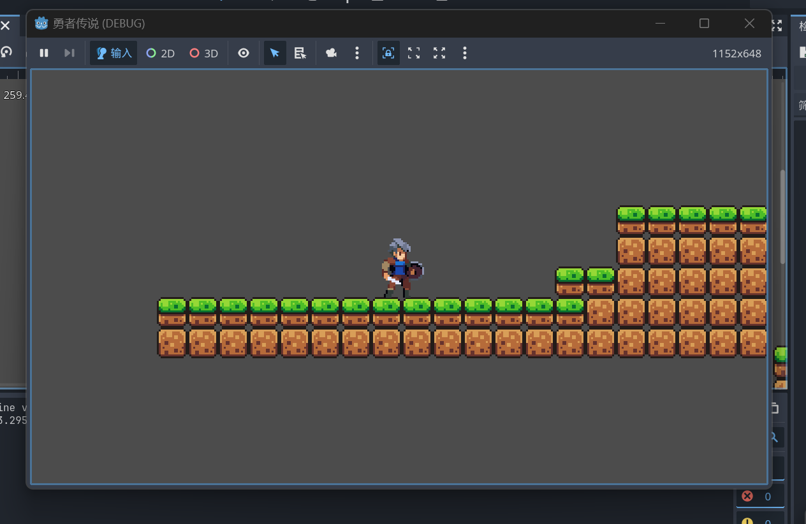

我们可以选择勾选Camera2D节点的Drag属性下的两个功能。这样玩家的小幅度移动不会导致Camera的移动。

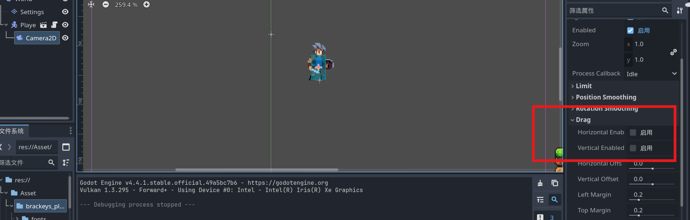

要可视化这个范围，可以在Editor里面勾选属性。

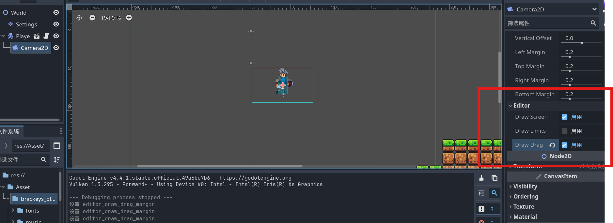

如果要修改这个边框的大小，可以在Drag中修改对应数值，数值范围在0-1之间即可。

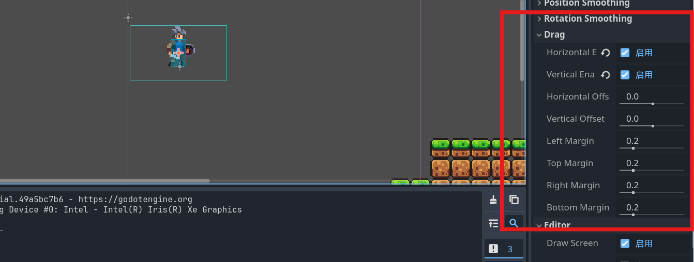

让镜头移动变得更加平滑，启动Position Smoothing。

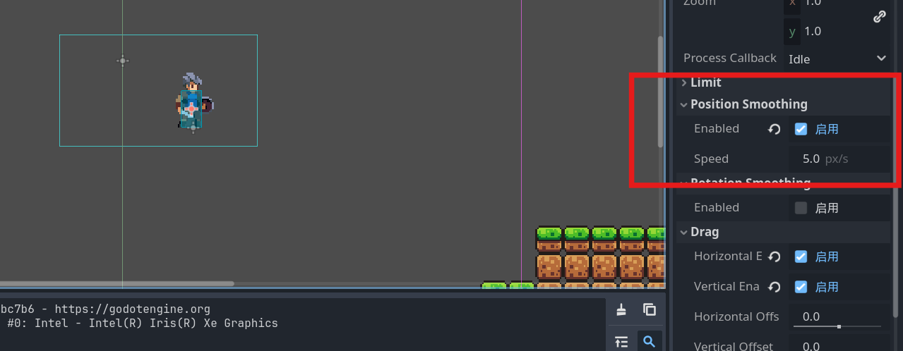

之后就是解决视觉上的问题：相机会拍到空的地方。我们需要先用标尺测量底部的位置，我量出来是216px，对应设置limit属性。相应地也可以设置左边的边界，我是举一反三地天才嘿嘿嘿(bushi)。勾选一下Smoothed，跳到边界的时候就会舒服一些。我试了一下感觉不是很有必要，而且会露出来左边界，就不要了。

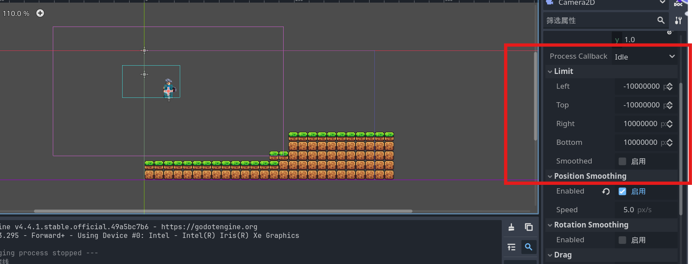

卧槽迅速地被打脸了。边界计算可以用脚本实现。步骤我写在代码中了。

```GDScript
extends Node2D
@onready var settings: TileMapLayer = $Settings
@onready var camera_2d: Camera2D = $Player/Camera2D

func _ready() -> void:
	#得到一个矩形框，x、y以图块为单位，矩形框有以下两个属性
	#position：左上角的坐标
	#end：右下角的坐标
	var used_area := settings.get_used_rect()
	#将图块大小转化为像素大小
	var tile_size := settings.tile_set.tile_size
	#计算极限
   #因为我要防止玩家从左边掉下去，所以在左边堆了个墙，左边的极限我是自己测量填进去的
	camera_2d.limit_top = used_area.position.y * tile_size.y
	camera_2d.limit_bottom = used_area.end.y * tile_size.y
	camera_2d.limit_right = used_area.end.x * tile_size.x
   #如果下落的位置会导致有一个初始的镜头移动，用下面这行代码取消掉
   camera_2d.reset_smoothing()
```

整体的功能就实现好了！还挺喜欢的嘻嘻，坚持！

### TileMap

在新版本里面已经变成了TileMapLayer，所以这里就变成了探索TileMapLayer相对应的功能。