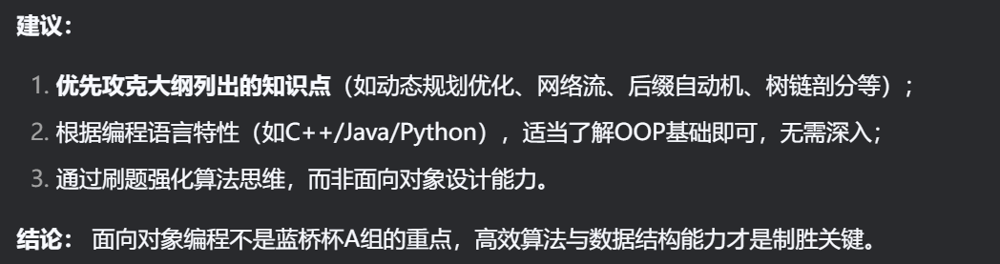

# 蓝桥杯要刷题啊啊啊啊啊！

不知道自己考试前能不能够学完了，确实荒废了太久了，寒假学算法的时候就觉得，共情初中的时候学不会的自己吧嗯。今天总感觉自己基本的写python的能力都没有了，结果一看真是的。因为是python算法选手，还是用蓝桥杯官网的练习比较好。

## 2025/2/27

- [摆玩具](https://www.lanqiao.cn/problems/5888/learning/?page=1&first_category_id=1&tags=%E6%9E%9A%E4%B8%BE,%E6%A8%A1%E6%8B%9F,%E5%89%8D%E7%BC%80%E5%92%8C,%E5%B7%AE%E5%88%86,%E4%BA%8C%E5%88%86,%E8%BF%9B%E5%88%B6%E8%BD%AC%E6%8D%A2,%E8%B4%AA%E5%BF%83,%E4%BD%8D%E8%BF%90%E7%AE%97,%E5%8F%8C%E6%8C%87%E9%92%88&tag_relation=union&sort=difficulty&asc=1)

我还是挑的简单的，一上来就怀疑自己没有思路。有了思路之后搓代码，有想法又忘记了怎么写，真的废物一个啊，还不练习你真的找死啊。

### tag

贪心，极差，分段

### 思路

从极差的计算方式联想到了**数轴**，数字可以对应数轴上的点，两点之**差**可以用两点之间的**距离**来呈现。所以如果分段要求为1（也就是不分段），那么就是最大最小两个点之间的距离。分成n段，也就是拿掉(n-1)（**注意是n-1**）个两点间线段，最终的结果就是【最大最小两个点之间的距离-（n-1）个小分段的长度】。

由于问的是最小值，那么就要求小分段尽可能大。我采用的是**优先级队列**。在逐一读取数字时，计算数字之间的“距离”并插入优先级队列。注意优先级队列get是从序号小的开始，所以存入的“距离”应当是非正数。为什么说是非正数呢？注意题干中有个案例说明：

> {2}∣{5,7,10,13}，极差和为 0+8=8。

所以要考虑把第一个数字分成一段的情况，存入0。

以下是代码实践：
```python
import os
import sys
import queue
input = lambda:sys.stdin.readline().strip()
n,k = map(int , input().split())
q = queue.PriorityQueue()
numlist = list(map(int , input().split()))
p = numlist[0]
sum = numlist[n-1] - numlist[0]
for i in numlist:
  x = p - i
  q.put((x,i))
  p = i
for i in range(0,k-1):
  x = q.get()
  sum += x[0]
print(sum)
```

因为我电脑上的Python是anaconda自带的，自己把IDLE删掉了，所以代码也是在官网上敲好的，缩进就没有那么美观。测试是通过了，但是敲代码的能力是心知肚明的。唉，继续努力吧。

## 2025/2/28

- [枯燥的计算](https://www.lanqiao.cn/problems/4370/learning/?page=1&first_category_id=1&tags=%E5%89%8D%E7%BC%80%E5%92%8C&tag_relation=union&sort=difficulty&asc=1)

这个我挑选的跟前缀和相关的，但是我真没看出来怎么就相关了，貌似真的就不相关，就是用数学的思想。用暴力做，通过三个，美美超时（）。

### tag

数学，余数

### 思路

问题就出在，题目引导你思考的方向不对：

>说明：
>（1mod1 + 1mod2 + 1mod3 + 2mod1 + 2mod2 + 2mod3 + 3mod1 + 3mod2 + 3mod3） = 0+1+1+0+0+2+0+1+0=5

对于式子**x mod y**，如果我们横向地看（x不变），(0,1,1)，(0,0,2)…… 我们确实看不出来什么规律。但是如果我们纵向地看（y不变），那么就变成了(0,0,0)，(1,0,1),(1,2,0)。结合数学知识，假设除数为n，那么余数的情况有n种，为[0,n-1]区间的所有整数。因此，从上到下，就是一个很清晰的循环。

在y一定时，x的个数是一定的（1~n）我们分成两个部分：

1.可以构成循环，循环个数为n/x，一个循环的内容有0~x-1,用等差数列的公式计算；
2.无法构成循环，个数为n%x，求和内容为1+2+…+n%x，也可以用公式。

btw，C语言学多了忘记了：在 Python 中，有两种除法运算符：

- /：真除法，无论操作数是整数还是浮点数，结果都会返回一个浮点数。
- //：整除，返回商的整数部分，结果为整数类型。

通过程序如下：

```python
import os
import sys
input = lambda:sys.stdin.readline().strip()
n,p = map(int , input().split())
sum = 0
#i=1时全是0，直接忽略
for i in range(2,n+1):
  sum += (n//i) * ((i-1) * i//2) + ((1 + n%i) * (n%i))//2
print(sum%p)
```

## 2025/3/1

- [单身贵族游戏](https://www.lanqiao.cn/problems/3841/learning/?page=1&first_category_id=1&tags=%E6%9E%9A%E4%B8%BE,%E6%A8%A1%E6%8B%9F,%E5%89%8D%E7%BC%80%E5%92%8C,%E5%B7%AE%E5%88%86,%E4%BA%8C%E5%88%86,%E8%BF%9B%E5%88%B6%E8%BD%AC%E6%8D%A2,%E8%B4%AA%E5%BF%83,%E4%BD%8D%E8%BF%90%E7%AE%97,%E5%8F%8C%E6%8C%87%E9%92%88&tag_relation=union&sort=difficulty&asc=1)

因为我不是单身贵族我就不做了哈哈哈哈哈哈（bushi）。这个题目脑袋里有个暴力的思路，因为行数是一定的所以觉得应该也不会超时，所以就没做了。看了题解，思路是没问题的，但是也有可以学习的地方。

### tag

模拟

### 题目思路

简单来说跳棋就是保证没有上下左右相邻的棋子。对样例输入稍作修改，我们分析：

```python
  000
  001
0000001
0000000
0000101
  000
  000
```

可以看到确实没有相邻的可以跳。所以输出yes。

因此我们自然而然想到用7\*7的二维数组进行存储，没有棋子是0，有棋子是1。对于第1、2和6、7行而言，1、2与6、7列也可以填补0。主要是学习题解中的初始化方式：

```python
#通过列表append列表构建二维数组
b=[]
for i in range(7):
  a=list(map(int,list(input())))
  #补充0
  if len(a) < 4:
    b.append([0,0]+a+[0,0])
  else:
    b.append(a)
```

这个题目就到这里吧！

- [苛刻的装修要求](https://www.lanqiao.cn/problems/4355/learning/?page=1&first_category_id=1&tags=%E6%9E%9A%E4%B8%BE,%E6%A8%A1%E6%8B%9F,%E5%89%8D%E7%BC%80%E5%92%8C,%E5%B7%AE%E5%88%86,%E4%BA%8C%E5%88%86,%E8%BF%9B%E5%88%B6%E8%BD%AC%E6%8D%A2,%E8%B4%AA%E5%BF%83,%E4%BD%8D%E8%BF%90%E7%AE%97,%E5%8F%8C%E6%8C%87%E9%92%88&tag_relation=union&sort=difficulty&asc=1)

读了好几遍才看懂这个题目，看到tag觉得自己不会贪心和二分，看懂之后也第一时间没有思路，确实难哈，也确实学到了很多。

### tag

贪心，二分，枚举

### 题目解读

关键信息是“从所有装饰品中任意挑选编号不相同的**任意个数**的装饰品”，进行的操作是“Aij = (Aij+1) mod m”，目标是“所有装饰品按自左向右的顺序能够实现长度非降序排列”。

题目的样例输入：

```python
5 7
0 6 1 3 2
```

样例输出：

```python
1
```

应该是选择6和2，6—>0，2->3，序列变成0 0 1 3 3，符合题意。

让豆包生成了思路，但是我又看不懂了。（后面证实豆包确实没读懂题目）感觉题目就是给的样例输入太特殊了，也不利于思考。

首先要想到的是，如果次数是多次，某一个位置的数字在哪几次被调整，顺序并无所谓。并且根据同余的性质，最后的调整我们可以转换为一次Aij = (Aij+x) mod m。那么，你可能会想到，用什么办法去推测最后的数字序列应该是什么。但是这么想就会陷入死胡同，反正本人是想不出来。

我们需要熟练另一种由已知信息将范围由大到小的思路，我称之为枚举，但是又没有真的完全用枚举那么蠢，我们根据推断的信息用了二分进行优化。我们需要知道，如果所有的数字都是0，这种情况是可以的。由于一次可以操作多个数字，所以这种情况下的操作数就是除0之外最小的那个数x对应的(m-x)。并且，最少的改进操作次数，一定小于等于这个数。我们就可以用二分的方式进行查找。

```python
mid满足题意，从[left,mid-1]接着找；
mid不满足题意，从[mid+1,right]接着找。
```

left初始为0，right初始化为(m-x)。但是图方便，我们初始化为m-1就行（0不用动）。如何验证是否符合题意呢？这里就是贪心算法的体现。因为我们知道所有的数字都是0可以，在满足不降序的情况下，我们全部调整为0是极好的。所以假设我们验证调整x次可以，那么我就验证：

1. 第一个数字可不可以调整为0，如果可以就调整为0，如果不可以就**不动它**！因为在不可以的情况下动它只会让不降序变得更加困难！
2. 第一个数字之外的数字，它的考量主要是和前一个数字的对比：如果原本就比前一个数字大，那么就考虑能不能通过取模调整为与前一个数相同，不能够调整的话就不动它；如果原本就比前一个数字小，那么就考虑加上调整次数后能不能比前一个数字大，如果可以就调整，如果不行就说明**调整x次不行**（注意重点理解这里）。

基于以上的想法我们用代码实现：

```python
import os
import sys

def check(a, n, m, x):
    arr = a.copy()
    for i in range(n):
        if i != 0 and arr[i] != arr[i - 1]:
            if arr[i - 1] < arr[i]:
                if ((arr[i] + x) % m) >= arr[i - 1] and (arr[i]+x) >= m:
                    arr[i] = arr[i - 1]
            else:
                if (arr[i] + x) >= arr[i - 1]:
                    arr[i] = arr[i - 1]
                else:
                    return False
        elif arr[i] == arr[i - 1]:
            continue
        elif i == 0:
            if arr[i] + x >= m:
                arr[i] = 0
    return True

input = lambda: sys.stdin.readline().rstrip()
n, m = map(int, input().split())
a = list(map(int, input().split()))
left = 0
right = m - 1
ans = 0
while left <= right:
    mid = (left + right) // 2
    if check(a, n, m, mid) == True:
        ans = mid
        right = mid - 1
    else:
        left = mid + 1

print(ans)
```

做这个题目更加强调了做题前把思路想清楚的重要性。本人在做题目的时候并没有想明白什么情况下调整x次一定不行，一边敲一边调错一边想了出来，还是浪费了很多时间。但是这个题目本身还是很不错的。努力学习！

## 2025/3/2

- [回文字符串](https://www.lanqiao.cn/problems/19718/learning/?page=1&first_category_id=1&tags=%E6%9E%9A%E4%B8%BE,%E6%A8%A1%E6%8B%9F,%E5%89%8D%E7%BC%80%E5%92%8C,%E5%B7%AE%E5%88%86,%E4%BA%8C%E5%88%86,%E8%BF%9B%E5%88%B6%E8%BD%AC%E6%8D%A2,%E8%B4%AA%E5%BF%83,%E4%BD%8D%E8%BF%90%E7%AE%97,%E5%8F%8C%E6%8C%87%E9%92%88&tag_relation=union&sort=difficulty&asc=1)

我真的服了到底是谁在说这个题目简单。算了可能是我真的菜吧。Python罕见地把时间要求定在10s了，所以说哪里简单了我就想问。

### tag

模拟，字符串

### 题目思路

我初步想的就是，从后面往前开始找到跟第一个相同的，保证里面是回文，外面是可以用l、q、b“弥补”的。但是，如何保证里面是回文？判断回文需要一定的时间，如果不是回文，再移动后面的指针又挺麻烦的，感觉代码不好实现也不好过样例。

看到了一个非常妙可以“一步搞定”的，如果你看了上面那段你就会明白为什么我说一步搞定：

1. 从末尾开始，**删掉**l、q、b，直到第一个不是l、q、b或者字符串没了；
2. 公式化判断是否是回文。

哇真的是妙极了。这个思路是写的C++代码，我就用Python想一下实现。涉及到删减，可以用字符串的切片功能。（我第一时间想的是转换为列表去做，突然想到切片发现转换成列表并没有必要）

然后按照这么写过了60%，我也是想到了有处理错误的情况，比方说“lxll”，后面的l删掉之后，只剩下“lx”，会输出“No”，但是我们看这个都知道应该是要输出“Yes”的。所以要修改的思路在于，**删掉一个字符后，就判断是不是回文**，而不是全部删掉后才开始判断。这就是这个题目时间给的很松的原因吧。通过的代码如下：

```python
import os
import sys
#判断回文函数
def judge(ls,length):
  for i in range(length // 2):
    if ls[i] != ls[length - 1 - i]:
      return 1
  else:
    return 0

input = lambda:sys.stdin.readline().strip()
t = int(input())
for i in range(t):
  ls = input()
  length = len(ls)
  #先判断一次，对应题目中的aaa
  f = judge(ls,length)
  if f== 0:
    print(f"Yes")
  else:
    while length > 0:
      #用切片删掉字符
      if ls[length-1] in ['l','q','b']:
        ls = ls[:length-1]
        length -= 1
        if judge(ls,length) == 0:
          f = 0
          break
        else:
          f = 1
      else:
        break
    if f==0:
      print(f"Yes")
    else:
      print(f"No")
```

2025/3/3

- [最优操作](https://www.lanqiao.cn/problems/3850/learning/?page=1&first_category_id=1&tags=%E6%9E%9A%E4%B8%BE,%E6%A8%A1%E6%8B%9F,%E5%89%8D%E7%BC%80%E5%92%8C,%E5%B7%AE%E5%88%86,%E4%BA%8C%E5%88%86,%E8%BF%9B%E5%88%B6%E8%BD%AC%E6%8D%A2,%E8%B4%AA%E5%BF%83,%E4%BD%8D%E8%BF%90%E7%AE%97,%E5%8F%8C%E6%8C%87%E9%92%88&tag_relation=union&sort=difficulty&asc=1)

这个貌似是很典型的一个优先队列的题目，我第一次敲完提交之后，5个样例超时了。

### tag

贪心，优先队列

### 题目思路

因为觉得时间应该是都花在了put和get上面，就想到用什么办法限制put和get的使用。综合来看贪心的使用就是，最小的数字如果比要加入的y小，那么就可以换，之前的做法是无论如何都可以放进去，这样时间花得多也正常。题干中的样例，第一个操作其实换掉中间的1是没问题的，这可能也是一个误导的点。

编程实现如下：

```python
import os
import sys
import queue
input = lambda:sys.stdin.readline().strip()
n,m = map(int , input().split())
ls = list(map(int , input().split()))
pq= queue.PriorityQueue()
for i in ls:
  pq.put((i,i))
for i in range(m):
  flag = 0
  x,y = map(int , input().split())
  for j in range(x):
    couple = pq.get()
    if couple[0] >= y:
      pq.put(couple)
      break
    else:
      flag += 1
  for i in range(flag):
    pq.put((y,i))
sum = 0
for i in range(n):
  x = pq.get()
  sum += x[0]
print(sum)
```

## 2025/3/4

好吧这个也是3.5补的，但是3.3怎么没刷题……不管了。3.4写了洛谷的最大正方形，记下来是3.5

## 2025/3/5

- [大衣的异或回文对](https://www.lanqiao.cn/problems/3845/learning/?page=1&first_category_id=1&tags=%E6%9E%9A%E4%B8%BE,%E6%A8%A1%E6%8B%9F,%E5%89%8D%E7%BC%80%E5%92%8C,%E5%B7%AE%E5%88%86,%E4%BA%8C%E5%88%86,%E8%BF%9B%E5%88%B6%E8%BD%AC%E6%8D%A2,%E8%B4%AA%E5%BF%83,%E4%BD%8D%E8%BF%90%E7%AE%97,%E5%8F%8C%E6%8C%87%E9%92%88&tag_relation=union&sort=difficulty&asc=1)

因为一直没做过Python的位运算，所以现在来看一下。今天学的前缀树，思考着面向对象是不是还是要学一下。遇事不决问deepseek（）：



好的好的（）。

初看题目，如果是纯粹的暴力的话，那就是：

1. 用组合思想，从数列里选两个；
2. 直接用位运算的计算出来结果；
3. 结果转换为字符串，看看是不是回文。

### tag

位运算，暴力

### 题目分析

根据题目信息，数字至多有2e4，所以组合的个数大致为2e8。对于Python，1s能执行e6数量级次循环，所以应该是会超时的。然后我看了C的题解，发现居然是真的暴力，用Python提交，哦豁超时了（）

我能说什么呢……Python没有题解我更无语了。看了Python的评论区说是时间限制应该有问题，算了让它过去吧。复习一下位运算也是好的。

我的代码：

```python
import sys
input = lambda:sys.stdin.readline().strip()
n = int(input())
ls = list(map(int, input().split()))
sum = 0
for i in range(n):
    for j in range(i, n):
        f = 0
        num = ls[i] ^ ls[j]
        judge = str(num)
        length = len(judge)
        for k in range(length//2):
            if judge[k] != judge[length-1-k]:
                f = 1
                break
        if f==0:
            sum += 1
print(sum)
```

今天也是翻了一下其他的题目，有趣的还是挺多的。

（2025/3/6更新）上毛概的时候突然想到可以用itertools里面的组合的函数试一试！所以今天就试试看！

代码如下：

```python
import sys
from itertools import *
input = lambda:sys.stdin.readline().strip()
n = int(input())
ls = list(map(int, input().split()))
sum = 0
for i in combinations_with_replacement(ls,2):
    f = 0
    num = i[0] ^ i[1]
    judge = str(num)
    length = len(judge)
    for k in range(length // 2):
        if judge[k] != judge[length - 1 - k]:
            f = 1
            break
    if f == 0:
        sum += 1
print(sum)
```

还是超时了。我下了官方给的测试样例，一上来就是20000个数字，确实输出不来一点。这个世界对Python真的太不友好了。

- [最小的或运算](https://www.lanqiao.cn/problems/4900/learning/?page=1&first_category_id=1&tags=%E4%BD%8D%E8%BF%90%E7%AE%97&tag_relation=union&sort=difficulty&asc=1)

### tag

位运算，思维

### 题目分析

重点自然是**x|a==x|b**这条信息，我们先用样例输入分析:

```python
4 5
```

4的二进制为**100**，5的二进制为**101**，要使或运算结果相同，并且最小：

1. 考虑的二进制位数一定要是相同的（a、b、x），并且是两个数中间最大的那个。4、5比较巧合正好，所以x我们也要考虑3位；
2. 如果a，b对应位置是相同的（1或0），对应x的位置就是0；如果不同，x的位置必须是1，使得x|a与x|b对应的位置都是1。

其实结合第二点，我们就可以发现，符合**异或**的性质，进一步能够发现异或符合**最小**的性质。所以最终的结果就很显然了。

```python
import sys
input = lambda:sys.stdin.readline().strip()
a,b = map()
```

## 2025/3/6

- [「BJOI2018」求和](https://loj.ac/p/2491)

用oi.wiki上的习题给自己选了一道树上前缀和的题目，作为练手吧。看了提交记录，Python最高就是60分，也是给自己降低预期了。

### tag

前缀树

### 题目分析

“希望多次询问这棵树”，很常见的标志。但是我读完了感觉，这跟前缀树有什么关系吗……我还是不够老练嘛……看了一下标签，确实涉及到最近祖先LCA的知识，所以先学然后再做这道题吧。
