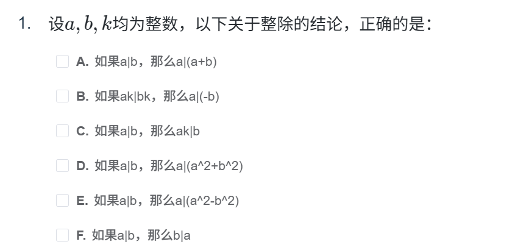
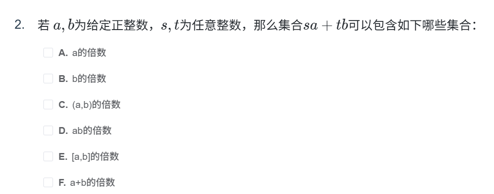
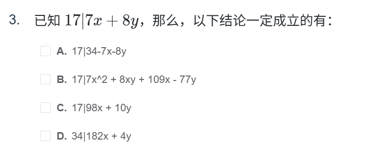
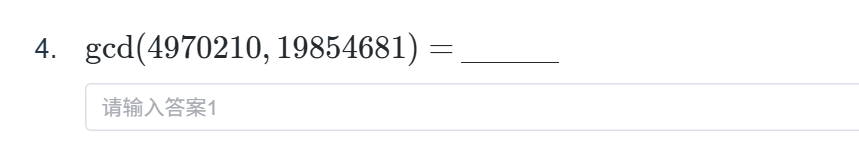
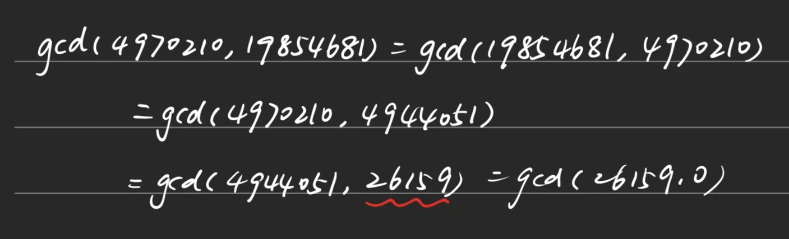

因为感觉VMcourse上面的作业都很困难，再加上这个只有提交按钮没有保存按钮，感觉这个是考试形式不能够重复提交，所以开一个博客记录每一次的作业吧。

- [T1：整除的性质](#t1整除的性质)
- [T2：](#t2)
- [T3：](#t3)
- [T4：辗转相除法](#t4辗转相除法)

# T1：整除的性质



- A.基本性质，√；

- B.首先k不会等于0，等于0条件是不成立的，那么左右就可以直接除掉，√；

- C.这个的反例就很好举了，2|6，k=4就不行，×；

- D.E.直观的感觉就是a|a^2，a|b^2，右边加\减也成立，√；

- F.只要b>a就不成立，×。

选择**A、B、D、E**。

# T2：



按照书本的内容就是(a,b)的倍数，不过这个题目我们还是一个一个看。

- A.t = 0，√；

- B.s = 0，√；

- C.定理，√；

- D.E.因为是(a,b)的倍数，所以也是ab和(a,b)的倍数，√；

- F.s = t，√。


所以全选。

# T3：



# T4：辗转相除法



很适合写python直接得出答案：

```python
from math import *
print(gcd(4970210,19854681))
```

可以得到答案是**26159**

具体用辗转相除做：



本人荣幸地算错了…

