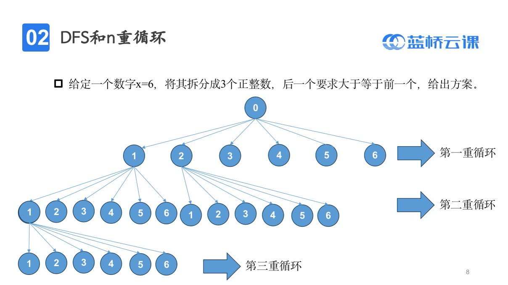
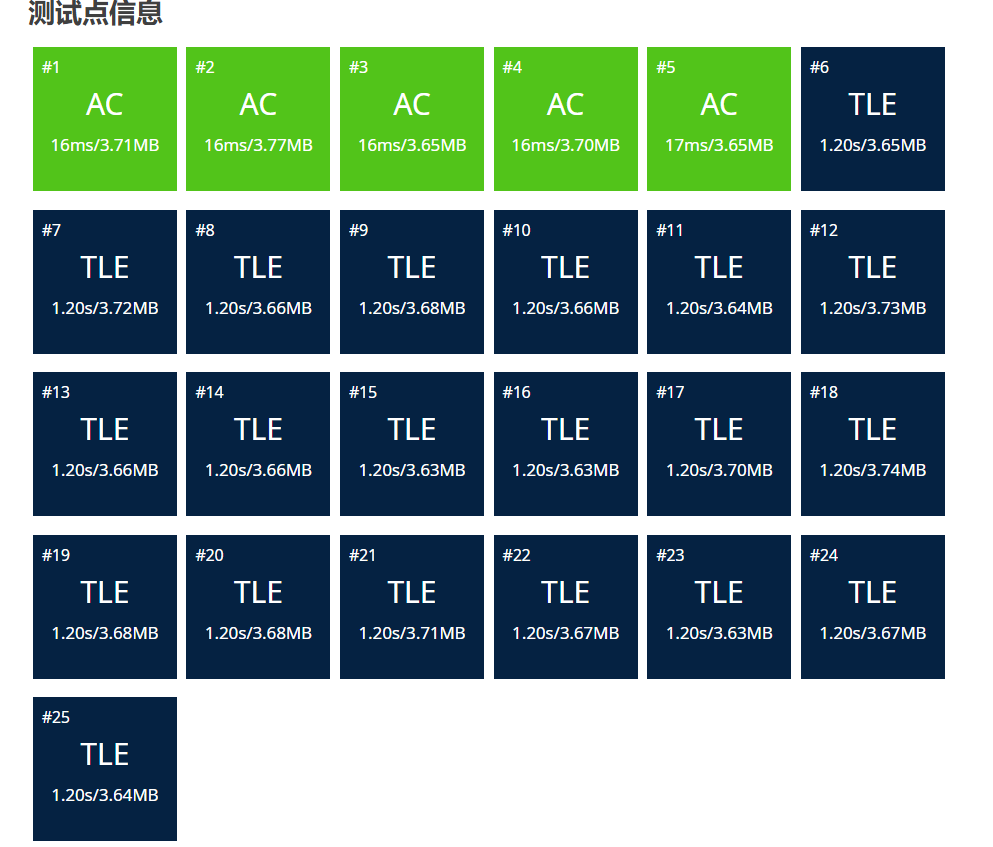

- [DFS-基础](#dfs-基础)
  - [DFS简介](#dfs简介)
  - [n重循环](#n重循环)
  - [例题：分糖果](#例题分糖果)
  - [例题：买瓜](#例题买瓜)

# DFS-基础

## DFS简介

- 搜索：穷举问题解空间的**部分/所有解**，从而求出问题的解
- 深度优先搜索：尽可能一条路走到底，走不通了再回退

## n重循环

本质上就是暴力，呈现出一种树状结构。n重循环就是n层的树



大致的模板：


模板题目如下：

```python
x = int(input())
n = int(input())
path = [0]*n

#depth:当前处于第几层
def dfs(depth):
    #递归出口
    if depth == n:
        #条件判断
        for i in range(1,n):
            if path[i] < path[i-1]:
                return
        if sum(path) != x:
            return
        print(path)
        return
    #对于每一层枚举当前拆出来的数字
    for i in range(1,x+1):
        #记录当前层
        path[depth] = i
        dfs(depth+1)

#对应递归出口，看你的习惯
dfs(0)
```

有的搜索确实没必要或者优化，剪枝详细讲！优化如下：

```python
x = int(input())
n = int(input())
path = [0]*n

#depth:当前处于第几层
def dfs(depth,last_value):
    #递归出口
    if depth == n:
        #就不需要判断递增性
        if sum(path) != x:
            return
        print(path)
        return
    #对于每一层枚举当前拆出来的数字
    for i in range(last_value,x+1):
        #记录当前层
        path[depth] = i
        dfs(depth+1,i)

#对应递归出口，看你的习惯
dfs(0,1)
```

## 例题：[分糖果](https://www.lanqiao.cn/problems/4124/learning/?page=1&first_category_id=1&tags=%E6%9E%9A%E4%B8%BE,%E6%A8%A1%E6%8B%9F,%E5%89%8D%E7%BC%80%E5%92%8C,%E5%B7%AE%E5%88%86,%E4%BA%8C%E5%88%86,%E8%BF%9B%E5%88%B6%E8%BD%AC%E6%8D%A2,%E8%B4%AA%E5%BF%83,%E4%BD%8D%E8%BF%90%E7%AE%97,%E5%8F%8C%E6%8C%87%E9%92%88&tag_relation=union&name=%E5%88%86%E7%B3%96%E6%9E%9C)

跟之前的不同之处就在于两种糖果怎么体现出不同，方法就是用两个循环去枚举。思路还是枚举7个小朋友，循环7次。

## 例题：[买瓜](https://www.luogu.com.cn/problem/P9234)

莫名其妙在蓝桥杯官网找不到这个题了。

**思路**

1. 对于一个瓜来说有三种可能：0，一半，全买了；
2. 用乘2倍的方式避免小数。

```python
import sys
input = lambda:sys.stdin.readline().strip()
n,m = map(int , input().split())
#避免小数
m *= 2
w1 = list(map(int ,input().split()))
w = [x*2 for x in w1]
ans = -1

def dfs(depth,sum,count):
    #剪枝，已经不合法，没必要进行下去
    if sum > m:
        return
    if sum == m:
        global ans
        ans = max(ans,count)
    if depth == n:
        return
    #不买
    dfs(depth+1,sum,count)
    #买一半
    dfs(depth+1,sum+w[depth]//2,count+1)
    #全买
    dfs(depth+1,sum+w[depth],count)

dfs(0,0,0)
print(ans)
```

超时是搜索的宿命（抽烟）。放宽心吧我只能说。

