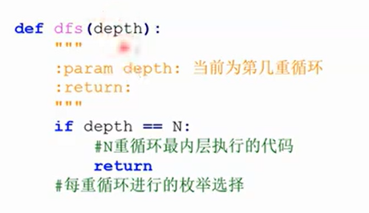

- [DFS-基础](#dfs-基础)
  - [DFS简介](#dfs简介)
  - [n重循环](#n重循环)
  - [例题：分糖果](#例题分糖果)
  - [例题：买瓜](#例题买瓜)
- [DFS-回溯](#dfs-回溯)
  - [是什么？](#是什么)
  - [回溯模板](#回溯模板)
    - [排列模板题](#排列模板题)
    - [子集模板题](#子集模板题)
  - [例题:N皇后](#例题n皇后)
  - [例题：小朋友崇拜圈](#例题小朋友崇拜圈)
  - [例题：全球变暖](#例题全球变暖)
- [DFS-剪枝](#dfs-剪枝)
  - [是什么？](#是什么-1)
  - [分类](#分类)
  - [例题：数字王国之军训排队](#例题数字王国之军训排队)
  - [例题：特殊的多边形](#例题特殊的多边形)
- [记忆化搜索](#记忆化搜索)
  - [是什么？](#是什么-2)
  - [例题：斐波拉契数列](#例题斐波拉契数列)
  - [例题：混境之地5](#例题混境之地5)
  - [例题：地宫寻宝](#例题地宫寻宝)

# DFS-基础

## DFS简介

- 搜索：穷举问题解空间的**部分/所有解**，从而求出问题的解
- 深度优先搜索：尽可能一条路走到底，走不通了再回退

## n重循环

本质上就是暴力，呈现出一种树状结构。n重循环就是n层的树


大致的模板：



模板题目如下：

```python
x = int(input())
n = int(input())
path = [0]*n

#depth:当前处于第几层
def dfs(depth):
    #递归出口
    if depth == n:
        #条件判断
        for i in range(1,n):
            if path[i] < path[i-1]:
                return
        if sum(path) != x:
            return
        print(path)
        return
    #对于每一层枚举当前拆出来的数字
    for i in range(1,x+1):
        #记录当前层
        path[depth] = i
        dfs(depth+1)

#对应递归出口，看你的习惯
dfs(0)
```

有的搜索确实没必要或者优化，剪枝详细讲！优化如下：

```python
x = int(input())
n = int(input())
path = [0]*n

#depth:当前处于第几层
def dfs(depth,last_value):
    #递归出口
    if depth == n:
        #就不需要判断递增性
        if sum(path) != x:
            return
        print(path)
        return
    #对于每一层枚举当前拆出来的数字
    for i in range(last_value,x+1):
        #记录当前层
        path[depth] = i
        dfs(depth+1,i)

#对应递归出口，看你的习惯
dfs(0,1)
```

## 例题：[分糖果](https://www.lanqiao.cn/problems/4124/learning/?page=1&first_category_id=1&tags=%E6%9E%9A%E4%B8%BE,%E6%A8%A1%E6%8B%9F,%E5%89%8D%E7%BC%80%E5%92%8C,%E5%B7%AE%E5%88%86,%E4%BA%8C%E5%88%86,%E8%BF%9B%E5%88%B6%E8%BD%AC%E6%8D%A2,%E8%B4%AA%E5%BF%83,%E4%BD%8D%E8%BF%90%E7%AE%97,%E5%8F%8C%E6%8C%87%E9%92%88&tag_relation=union&name=%E5%88%86%E7%B3%96%E6%9E%9C)

跟之前的不同之处就在于两种糖果怎么体现出不同，方法就是用两个循环去枚举。思路还是枚举7个小朋友，循环7次。

## 例题：[买瓜](https://www.luogu.com.cn/problem/P9234)

莫名其妙在蓝桥杯官网找不到这个题了。

**思路**

1. 对于一个瓜来说有三种可能：0，一半，全买了；
2. 用乘2倍的方式避免小数。

```python
import sys
input = lambda:sys.stdin.readline().strip()
n,m = map(int , input().split())
#避免小数
m *= 2
w1 = list(map(int ,input().split()))
w = [x*2 for x in w1]
ans = -1

def dfs(depth,sum,count):
    #剪枝，已经不合法，没必要进行下去
    if sum > m:
        return
    if sum == m:
        global ans
        ans = max(ans,count)
    if depth == n:
        return
    #不买
    dfs(depth+1,sum,count)
    #买一半
    dfs(depth+1,sum+w[depth]//2,count+1)
    #全买
    dfs(depth+1,sum+w[depth],count)

dfs(0,0,0)
print(ans)
```

超时是搜索的宿命（抽烟）。放宽心吧我只能说。


# DFS-回溯

## 是什么？

DFS的一种，用到了剪枝的技巧。强调走过的路打标记。

1. 排列树


2. 子集树


## 回溯模板

1. 每次选择的数字打标记——vis数组；
2. 记录路径——path数组；
3. 回溯总流程：打标机-记录路径-下一层-回到上一层-清楚标记


### 排列模板题

```python
import sys
input = lambda:sys.stdin.readline().strip()

def dfs(depth):
    #回到上一层
    if depth == n:
        print(path)
        return
    
    for i in range(1,n+1):
        #未标记数字
        if vis[i]:
            continue
        #打表记
        vis[i] = True
        #记录路径
        path.append(i)
        #下一层
        dfs(depth+1)
        #消除标记
        vis[i] = False
        path.pop(-1) #弹出列表最后一个元素

n = int(input())
vis = [False] * (n+1)
path = []
dfs(0)
```

输入3可以得到：

```python
[1, 2, 3]
[1, 3, 2]
[2, 1, 3]
[2, 3, 1]
[3, 1, 2]
[3, 2, 1]
```

### 子集模板题

```python
import sys
input = lambda:sys.stdin.readline().strip()

def dfs(depth):
    #回到上一层
    if depth == n:
        print(path)
        return
    
    #不需要用vis进行标记
    #选择该数字
    path.append(ls[depth])
    dfs(depth+1)
    path.pop(-1)

    #不选择该数字
    dfs(depth+1)

n = int(input())
ls = list(map(int , input().split()))
vis = [False] * (n+1)
path = []
dfs(0)
```

输入：

```python
3
1 2 3
```

得到输入：

```python
[1, 2, 3]
[1, 2]
[1, 3]
[1]
[2, 3]
[2]
[3]
[]
```

## 例题:[N皇后](https://www.lanqiao.cn/problems/1508/learning/?page=1&first_category_id=1&tag_relation=union&name=N%E7%9A%87%E5%90%8E)

不知道干嘛，这个题也没了。读了一下题目，感觉是有点歧义。探究一下如何保证两条对角线上面没有皇后。

- 从左上到右下


可以看到，同一对角线上的(x,y)**差值**一定。从(1,1)开始，**x-y**的范围为[-N+1,N-1]，因此对于N\*N的图像，总共有(2\*N - 1)条对角线。

- 从左下到右上


可以看到，同一对角线上的(x,y)**和值**一定。从(1,1)开始，**x+y**的范围为[2,2\*N]，因此对于N\*N的图像，总共有(2\*N - 1)条对角线。

```python
import sys
input = lambda:sys.stdin.readline().strip()
cnt = 0
def dfs(depth):
    #第depth层的皇后，保证一行只有一个皇后
    if depth == n+1:
        global cnt
        cnt += 1
        return

    for y in range(1,n+1):
        if vis1[y] is False and vis2[depth-y+n] is False and vis3[depth+y] is False:
            #打标记
            vis1[y] = vis2[depth-y+n] = vis3[depth+y] = True
            #下一层
            dfs(depth+1)
            #清空标记
            vis1[y] = vis2[depth-y+n] = vis3[depth+y] = False

n = int(input())
#一以下就是剪枝
#保证列
vis1 = [False] * (n+1)
#差的范围为[-N+1,N-1]
vis2 = [False] * (2*n+1)
#和的范围为[2,2N]
vis3 = [False] * (2*n+1)
dfs(1)
print(cnt)
```

## 例题：[小朋友崇拜圈](https://www.lanqiao.cn/problems/182/learning/?page=1&first_category_id=1&tag_relation=union&name=%E5%B0%8F%E6%9C%8B%E5%8F%8B)

说明搜索不仅能用在n重循环中，还可以用在图论上。

**思路**

1. 标记每个走过的点，走到一个走过的地方就停；
2. 环长计算：对同一个点，两个length相减。

同时，预估一下递归层数，可以对它进行扩大。

```python
import sys
#增加深度
sys.setrecursionlimit(100000)
input = lambda:sys.stdin.readline().strip()
n = int(input())
ls = [0] + list(map(int , input().split()))
ans = 0

def dfs(x,length):
    #x是第几个小朋友，length是走的步数
    if vis[x] != -1:
        global ans
        ans = max(ans,length - vis[x])
        return
    #标记
    vis[x] = length
    dfs(ls[x],length+1)

#直接用vis记录步长就行，同时可以作为是否已经遍历过的依据 
vis = [-1] * (n+1)
#找到不同的圆
for i in range(1,n+1):
    if vis[i] == -1:
        dfs(i,0)
print(ans)
```

## 例题：[全球变暖](https://www.lanqiao.cn/problems/178/learning/?page=1&first_category_id=1&tag_relation=union&name=%E5%85%A8%E7%90%83)

题意有一些难理解，但是本质上就是找有几块这样的地，上下左右都是'#'。所以这个题目其实需要分成两个步骤：

1. 统计有多少个岛屿；
2. 统计岛屿里面是否有上下左右都是'#'的地，如果有就不会被完全淹没。

```python
import sys
sys.setrecursionlimit(100000)
input = lambda:sys.stdin.readline().strip()
n = int(input())
ls=[]
for i in range(n):
    ls.append(list(input()))
#注意这里的位置变换啊啊啊啊，不要想当然
d = [(-1,0),(1,0),(0,-1),(0,1)]
ans = 0

def dfs(x,y):
    vis[x][y] = 1
    count = 0
    for dx,dy in d:
        if 0 <= x+dx <n and 0 <= y+dy <n:
            #周围是陆地
            if ls[x+dx][y+dy] == '#':     
                count += 1
                #没有遍历过
                if vis[x+dx][y+dy] == 0:
                    dfs(x+dx,y+dy)
    if count == 4:
        global f
        f = 1
    return

vis = [[0]*n for i in range(n)]    
for i in range(n):
    for j in range(n):
        if vis[i][j] == 0 and ls[i][j] == '#':
            #当前岛屿是否存在标记
            f = 0
            dfs(i,j)
            #注意这是没有高地才加一
            if f == 0:
                ans += 1
print(ans)
```

很漂亮（大哭）


# DFS-剪枝

## 是什么？

根据当前状态判断后续无解，可以及时停止。

eg.N个正整数有多少个子集之和小于等于K。前面几个数如果达到了K，就可以及时停止。

## 分类

1. 可行性剪枝：状态与题意不符。例如：排列；
2. 最优性剪枝：当前状态不如最优解。例如：最小值。

## 例题：[数字王国之军训排队](https://www.lanqiao.cn/problems/2942/learning/?page=1&first_category_id=1&tag_relation=union&name=%E6%95%B0%E5%AD%97%E7%8E%8B%E5%9B%BD)

啊啊啊这个自己写对了啊啊啊啊

```python
import sys
input = lambda:sys.stdin.readline().strip()
n = int(input())
ls = list(map(int,input().split()))
ans = n

def check(l,x):
    for i in l:
        if i % x == 0 or x % i == 0:
            return False
    return True

def dfs(depth):
    if depth == n:
        global ans
        ans = min(ans,len(teams))
        return
    for i in range(len(teams)):
        if check(teams[i],ls[depth]):
            teams[i].append(ls[depth])
            dfs(depth+1) 
            teams[i].pop(-1)
    new = [ls[depth]]
    teams.append(new)
    dfs(depth+1)
    teams.pop(-1)

teams = []
dfs(0)
print(ans)
```

## 例题：[特殊的多边形](https://www.lanqiao.cn/problems/3075/learning/?page=1&first_category_id=1&tag_relation=union&name=%E7%89%B9%E6%AE%8A%E7%9A%84%E5%A4%9A%E8%BE%B9%E5%BD%A2)

我感觉比较不清楚的是，怎么保证能够组成一个多边形。例如三角形，1、2、3就无法构成。但是这完全就是数学知识了：

>任意N-1条边之和大于第N条边，可以构成N边形。要注意的是，这里验证N变形不需要验证i边形成立，只需要最后递归出口的地方验证一下就行。

预处理（打表）+前缀和求解答案

```python
import sys
input = lambda:sys.stdin.readline().strip()
t,n = map(int ,input().split())
r_max = 0
l_min = 100000
ls = []
for i in range(t):
    l,r = map(int , input().split())
    l_min = min(l_min,l)
    r_max = max(r_max,r)
    ls.append((l,r))

#用单增进行优化
def dfs(depth,last_num,k):
    if depth == n:
        if sum(path) <= 2*last_num:
            return
        vis[k] += 1
        return
    for i in range(last_num+1,r_max):
        #剪枝
        if k * (i ** (n - depth)) > r_max:
            return
        path.append(i)
        dfs(depth+1,i,k * i)
        path.pop(-1)

vis = [0] * 100001
path = []
#类似地，这里也不要想当然，边长是可以等于1的
dfs(0,0,1)
for i in range(1,len(vis)):         #构造前缀和数组
  vis[i] += vis[i-1]
for l,r in ls:
    print(vis[r] - vis[l-1])
```

# 记忆化搜索

## 是什么？

通过**记录**已经遍历过的状态的信息，避免对同一状态的重复遍历

记忆化 = dfs + 额外字典

## 例题：斐波拉契数列

求f(n)，对1e9+7取模

```python
import sys
input = lambda:sys.stdin.readline().strip()
sys.setrecursionlimit(100000)
dic = {0:1,1:1}
def f(n):
    if n in dic.keys():
        return dic[n]
    dic[n] = (f(n-1)+f(n-2))%1000000007
    return dic[n]

n = int(input())
print(f(n))
```

卧槽python你个老六你他妈又写好了

```python
from functools import lru_cache
#直接把普通递归变成记忆化递归
@lru_cache(maxsize=None)
#不用改动原本的递归函数
def f(n):
    if n == 0 or n == 1:
        return 1
    else:
        return f(n-1)+f(n-2)
n = int(input())
print(f(n))
```

## 例题：[混境之地5](https://www.lanqiao.cn/problems/3820/learning/?page=1&first_category_id=1&tag_relation=union&problem_id=3820)

其实我感觉这个题目最重要的教训在于map本身就是一个关键词，最好还是不要作为变量。遇到那种**list object is not callable**的错误要考虑这种关键词用作变量名称的可能。

```python
#因为先往下，再往右和线往右再往下的结果是一样的，所以可以用记忆化搜索的方式
from functools import lru_cache
@lru_cache(maxsize = None)
def dfs(x,y,z):
    #到达终点
    if x == c-1 and y == d-1:
        return True

    for dx,dy in [(-1,0),(1,0),(0,-1),(0,1)]:
        xx = x+dx
        yy = y+dy
        if xx < 0 or xx >= n or yy < 0 or yy >=m:
            continue
        #新坐标比旧坐标低，能够走到新坐标
        if Map[xx][yy] < Map[x][y]:
            if dfs(xx,yy,z):
                return True
        #可以用喷气背包
        elif Map[xx][yy] < Map[x][y] + k and z==False:
            if dfs(xx,yy,True):
                return True          

n,m,k = map(int , input().split())
a,b,c,d = map(int , input().split())
Map = []
for i in range(n):
    Map.append(list(map(int , input().split())))

if dfs(a-1,b-1,False):
    print("Yes")
else:
    print("No")
```

## 例题：[地宫寻宝](https://www.lanqiao.cn/problems/216/learning/?page=1&first_category_id=1&tag_relation=union&problem_id=216)

这个题目相比于之前就是对运动方向进行了严格限定。遇到了之前就比较常见的问题，一个题目没有想清楚函数是处理当前状态还是下一状态的时候，脑子里突然乱掉了。学习这道题的处理方法吧！

```python
import sys
from functools import lru_cache
sys.setrecursionlimit(100000)
input = lambda:sys.stdin.readline().strip()
n,m,k = map(int,input().split())
Map = []

#当前坐标，之前的宝物数量与最大值
@lru_cache(maxsize = None)
def dfs(x,y,sum_num,max_num):
    #递归出口
    if x == n-1 and y == m-1:
        if sum_num == k:
            return 1
        if sum_num == k-1 and max_num < Map[x][y]:
            return 1
        return 0
    ans = 0
    #方案数 = 右边的方案数 + 下面的方案数
    for dx , dy in [(1,0),(0,1)]:
        xx = x+dx
        yy = y+dy
        if xx < 0 or xx >= n or yy < 0 or yy >= m:
            continue
        #当前不选择宝物，走到(xx,yy)
        ans += dfs(xx,yy,sum_num,max_num)
        #当前选择宝物，走到(xx,yy)
        #注意这里是准备拿现在的宝物
        if max_num < Map[x][y]:
            ans += dfs(xx,yy,sum_num+1,Map[x][y])
        ans %= 1000000007
    return ans

for i in range(n):
    Map.append(list(map(int , input().split())))
print(dfs(0,0,0,-1))
```

完结撒花！