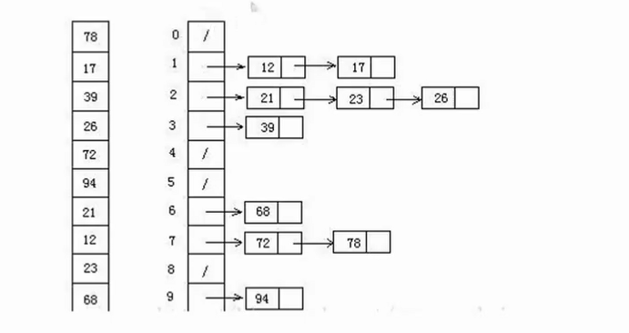

- [蓝桥网课！启动！](#蓝桥网课启动)
  - [冒泡排序](#冒泡排序)
    - [思想](#思想)
    - [复杂度分析](#复杂度分析)
    - [例题：宝藏排序](#例题宝藏排序)
  - [选择排序](#选择排序)
    - [思想](#思想-1)
    - [复杂度分析](#复杂度分析-1)
    - [例题还是宝藏排序](#例题还是宝藏排序)
  - [插入排序](#插入排序)
    - [思想](#思想-2)
    - [复杂度分析](#复杂度分析-2)
    - [例题还是上面那个](#例题还是上面那个)
  - [快速排序](#快速排序)
    - [思想](#思想-3)
    - [复杂度分析](#复杂度分析-3)
  - [归并排序](#归并排序)
    - [引入：如何把两段有序的列表合并成一个有序的列表？](#引入如何把两段有序的列表合并成一个有序的列表)
    - [归并排序思想：分治法的典型应用](#归并排序思想分治法的典型应用)
    - [复杂度分析](#复杂度分析-4)
  - [桶排序](#桶排序)
    - [思想](#思想-4)
    - [注意事项：](#注意事项)
    - [编程实现](#编程实现)

# 蓝桥网课！启动！

某天在闲鱼上看到了3块钱的蓝桥杯省赛网课，只能说我对这一途径还是太不熟练了（）今天从最基础的排序开始看吧，老师还是很有水平的。都是以从小到大排序思考的。

## 冒泡排序

复习C语言的时候弄了。

### 思想

1.  比较相邻元素，如果前一个比后一个大就交换；
2.  从左向右遍历，重复第1步，可以保证最大的元素在最后面；
3.  重复上述操作，从头开始，每次的操作次数减1（最后面的一对不需要比较了），得到第二大、第三大……

### 复杂度分析

长度为n的列表，循环n-1次。


时间复杂度：O(n^2)

空间复杂度：O(1)，在原来的数组上交换

算法稳定，说的是比较的次数是限定的、可以计算出来的。

### 例题：[宝藏排序](https://www.lanqiao.cn/problems/3225/learning/?page=1&first_category_id=1&tag_relation=union&name=%E5%AE%9D%E8%97%8F%E6%8E%92%E5%BA%8F "宝藏排序")

就是对n个数字进行排序。中间有一个python用于交换数值的写法还是要学习一下。输出的写法也很帅啊。

```python
import sys
input = lambda:sys.stdin.readline().strip()
n = int(input())
a = list(map(int , input().split()))
for i in range(1,n):
    for j in range(0,n-i):
        if a[j] > a[j+1]:
            a[j],a[j+1] = a[j+1],a[j]
print(" ".join(map(str,a)))
```

## 选择排序

### 思想

1.  从左往右找到最小的元素，通过**交换**放在最左边；
2.  重复上述操作，依次找到第2小的、第3小的……

### 复杂度分析

长度为n的列表，循环n-1次。


时间复杂度：O(n^2)

空间复杂度：O(1)，在原来的数组上交换

算法稳定，说的是比较的次数是限定的、可以计算出来的。

### 例题还是宝藏排序

```python
import sys
input = lambda:sys.stdin.readline().strip()
n = int(input())
a = list(map(int , input().split()))
# 注意此时从0开始循环比较好
for i in range(n-1):
    # 每一轮找最小值都要重置初始最小值与其下标
    min_value = a[i]
    min_index = i
    for j in range(i,n):
        if a[j] < min_value:
            min_value = a[j]
            min_index = j
    # 将最小值放到前面去
    a[i],a[min_index] = a[min_index],a[i]
print(" ".join(map(str,a)))
```

## 插入排序

瓦达西好久没看过这个了！

### 思想

将队列看成两部分：已排序的和未排序的。已排序的在左边。

1.  初始状态：第一个元素看成已排序；
2.  第二个元素开始，从左往右遍历，把每一个元素在已排序元素中**从后往前**扫描，如果前一个元素大于该元素，就**将该位置的值修改为前一个元素的值**（没必要替换）；
3.  重复上述操作，直到找到小于等于新元素或到队列头了后停止，说明已经插入到了应该在的位置上。

### 复杂度分析

时间复杂度：O(n^2)

空间复杂度：O(1)

不稳定

### 例题还是上面那个

```python
import sys
input = lambda:sys.stdin.readline().strip()
n = int(input())
a = list(map(int , input().split()))
# 对下标为i的数，在[0,i-1]中从后往前找对应的位置
for i in range(1,n):
    # 处理覆盖问题
    value = a[i]
    # 这里初始化为0是因为有可能拿到的就是队列中最小的数字，这种情况下只会执行不断后移的操作
    insert_index = 0
    for j in range(i-1,-1,-1):
        if a[j] > value:
            # 往后移动
            a[j+1] = a[j]
        else:
            # 注意这里是j+1
            insert_index = j+1
            break
    a[insert_index] = value
print(" ".join(map(str,a)))
```

## 快速排序

### 思想

将大问题不断分成小问题。

1.  找一个**基准值**x；
   
    怎么定？习惯性设置最左边的left就行。

2.  把列表分成三个部分：小于等于x的数字，x，大于x的数字；
   
   划分的过程：
   - 设定存放小于等于基准值下标为idx = left+1
   - 遍历此时[left+1,right]的每个元素：如果元素小于等于基准值，则swap(a[i],a[idx])，idex+=1
   - 遍历完所有的元素后，swap([idex-1],a[left])【idex指向的是第一个大于a[left]的值】。

编程实现：

```python
# 列表a，左端点为left，右端点为right
# 快排递归二改：需要返回基准值的位置
def partition(a,left,right):
    idx = left + 1
    for i in range(left + 1,right + 1):
        if a[i] <= a[left]:
            a[i],a[idx] = a[idx],a[i]
            idx += 1
    a[left],a[idx-1]=a[idx-1],a[left]
    return idx - 1 
```

3.  左半部分和右半部分**递归**使用该策略。

如何实现递归？

```python
# 对a列表的[left,right]排序
def quicksort(a,left,right):
    if left < right:
        #按照基准值划分
        mid = partition(a,left,right)
        #已经划分成三个部分，开始递归
        quicksort(a,left,mid-1)
        quicksort(a,mid+1,right)
```

程序可以放在宝藏排序2里面测试，2的时间复杂度要求更高。

### 复杂度分析

时间复杂度：O(nlogn)

空间复杂度：O(logn)~O(n)

不稳定

## 归并排序

### 引入：如何把两段有序的列表合并成一个有序的列表？

以列表A、B为例：

1. 创建result=[]；
2. 在A、B列表**均不为空**的情况下：比较A[0]与B[0]的大小
   
   result.append(min(A[0],B[0]))

   可以使用到列表的pop(index)方法，在返回下标对应值的同时删除对应元素。

3. A、B列表其中一个为空时，退出循环，把两个列表都加到末尾（空列表没用，省去判断的时间）

编程实现：

```python
def Merge(A,B):
    result = []
    while len(A)!=0 and len(B)!=0:
        if A[0] < B[0]:
            result.append(A.pop(0))
        else:
            result.append(B.pop(0))
    # 注意区别append和extend
    result.extend(A)
    result.extend(B)
    return result
```

### 归并排序思想：分治法的典型应用

1. 将数组分成两个部分

    怎么分？平分。mid = len(A) // 2

2. 分别操作数组，让两个部分有序。而让数组变得有序的过程也是排序，对应的也可以使用归并排序，也就是使用到递归的思想。

    那么递归什么时候结束呢？显然，当数组中只有一个元素的时候，我们能够判定数组是绝对有序的。相应的，递归返回的是一个有序的数组，可能是将整个数组排序后的结果，也可能是子数组有序的结果。
 
3. 合并两个有序的数组

编程实现如下：

```python
def MergeSort(A):
    #只有一个元素，绝对有序
    if len(A) == 1:
        return A
    mid = len(A)//2
    #分别将左右子序列排序
    left = MergeSort(A[:mid])
    right = MergeSort(A[mid:])
    #将左右子数组有序后，合并并返回整体有序的结果
    return Merge(left,right)
```

### 复杂度分析

时间复杂度：O(nlogn)

空间复杂度：O(n)

稳定

## 桶排序

### 思想

1. 初始化若干个桶，每个桶之间数据有绝对的大小关系；

怎么分桶子？经验性的判断，例如：



要排列的数字全是二位数，所以可以按照十位来分，分成十个桶。

2. 把数据放在对应的桶中；
3. 每个桶单独排序：在小规模的数据里面用不同的排序方法时间上差异不大，所以用sort()就行；
4. 把每个桶的数据拼接起来。

### 注意事项：

1. 避免过多元素放入同一个桶中：问题规模减小效果不好
   
   - 优化映射方法，让桶内的元素均匀；

        相应：计算最大值于最小值

   - 增加桶的数量，时间换空间
  
2. 数据如果服从均匀分布，则利用桶排序效率更高；

### 编程实现

```python
# 传入数列表与桶的数量
def BucketSort(a,bucketcount):
    # 求最大值与最小值
    minnum , maxnum = min(a),max(a)
    # 根据桶的数量计算每个桶应该平均分多少个数字 
    bucketsize = (maxnum - minnum + 1) // bucketcount
    # +1是针对取整操作
    # res是一个二维数组
    res = [[] for _ in range(bucketcount + 1)]
    # 把所有元素放到对应桶子里面
    for x in a:
        idx = (x - minnum ) // bucketsize
        res[idx].append(x)
    # 对每个桶单独排序，追加到答案队列中
    ans = []
    for ls in res:
        ls.sort()
        ans.extend(ls)
    return ans

n = int(input())
a = list(map(int , input().split()))
#这里填你想要的桶的数量
print(' '.join(map(str,BucketSort(a,min(10000,n)))))

```

虽然说排序就是听个思路，但是也不知道后面会不会真的用到。一个排序就拖延了这么久，唉。