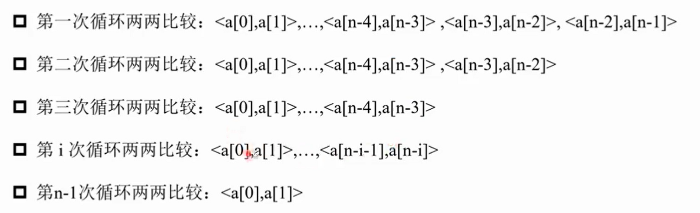
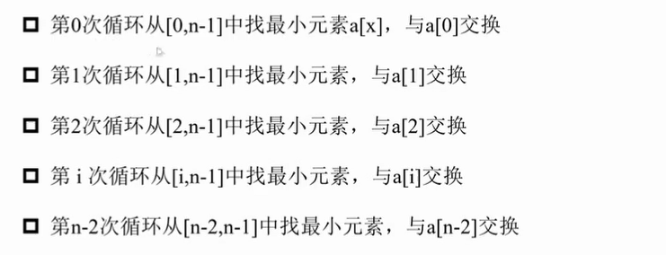

# 蓝桥网课！启动！

某天在闲鱼上看到了3块钱的蓝桥杯省赛网课，只能说我对这一途径还是太不熟练了（）今天从最基础的排序开始看吧，老师还是很有水平的。都是以从小到大排序思考的。

## 冒泡排序

复习C语言的时候弄了。

### 思想

1. 比较相邻元素，如果前一个比后一个大就交换；
2. 从左向右遍历，重复第1步，可以保证最大的元素在最后面；
3. 重复上述操作，从头开始，每次的操作次数减1（最后面的一对不需要比较了），得到第二大、第三大……

### 复杂度分析

长度为n的列表，循环n-1次。



时间复杂度：O(n^2)

空间复杂度：O(1)，在原来的数组上交换

算法稳定，说的是比较的次数是限定的、可以计算出来的。

### 例题：[宝藏排序](https://www.lanqiao.cn/problems/3225/learning/?page=1&first_category_id=1&tag_relation=union&name=%E5%AE%9D%E8%97%8F%E6%8E%92%E5%BA%8F)

就是对n个数字进行排序。中间有一个python用于交换数值的写法还是要学习一下。输出的写法也很帅啊。

```python
import sys
input = lambda:sys.stdin.readline().strip()
n = int(input())
a = list(map(int , input().split()))
for i in range(1,n):
    for j in range(0,n-i):
        if a[j] > a[j+1]:
            a[j],a[j+1] = a[j+1],a[j]
print(" ".join(map(str,a)))
```

## 选择排序

### 思想

1. 从左往右找到最小的元素，通过**交换**放在最左边；
2. 重复上述操作，依次找到第2小的、第3小的……

### 复杂度分析

长度为n的列表，循环n-1次。



时间复杂度：O(n^2)

空间复杂度：O(1)，在原来的数组上交换

算法稳定，说的是比较的次数是限定的、可以计算出来的。

### 例题还是宝藏排序

```python
import sys
input = lambda:sys.stdin.readline().strip()
n = int(input())
a = list(map(int , input().split()))
# 注意此时从0开始循环比较好
for i in range(n-1):
    # 每一轮找最小值都要重置初始最小值与其下标
    min_value = a[i]
    min_index = i
    for j in range(i,n):
        if a[j] < min_value:
            min_value = a[j]
            min_index = j
    # 将最小值放到前面去
    a[i],a[min_index] = a[min_index],a[i]
print(" ".join(map(str,a)))
```

## 插入排序

瓦达西好久没看过这个了！

### 思想

将队列看成两部分：已排序的和未排序的。已排序的在左边。

1. 初始状态：第一个元素看成已排序；
2. 第二个元素开始，从左往右遍历，把每一个元素在已排序元素中**从后往前**扫描，如果前一个元素大于该元素，就**将该位置的值修改为前一个元素的值**（没必要替换）；
3. 重复上述操作，直到找到小于等于新元素或到队列头了后停止，说明已经插入到了应该在的位置上。

### 复杂度分析

时间复杂度：O(n^2)

空间复杂度：O(1)

不稳定

### 例题还是上面那个

```python
import sys
input = lambda:sys.stdin.readline().strip()
n = int(input())
a = list(map(int , input().split()))
# 对下标为i的数，在[0,i-1]中从后往前找对应的位置
for i in range(1,n):
    # 处理覆盖问题
    value = a[i]
    # 这里初始化为0是因为有可能拿到的就是队列中最小的数字，这种情况下只会执行不断后移的操作
    insert_index = 0
    for j in range(i-1,-1,-1):
        if a[j] > value:
            # 往后移动
            a[j+1] = a[j]
        else:
            # 注意这里是j+1
            insert_index = j+1
            break
    a[insert_index] = value
print(" ".join(map(str,a)))
```

## 快速排序

### 思想

将大问题不断分成小问题。

1. 找一个基准值；
2. 把列表分成三个部分：小于等于x的数字，x，大于x的数字；
3. 左半部分和右半部分**递归**使用该策略。

### 时间复杂度