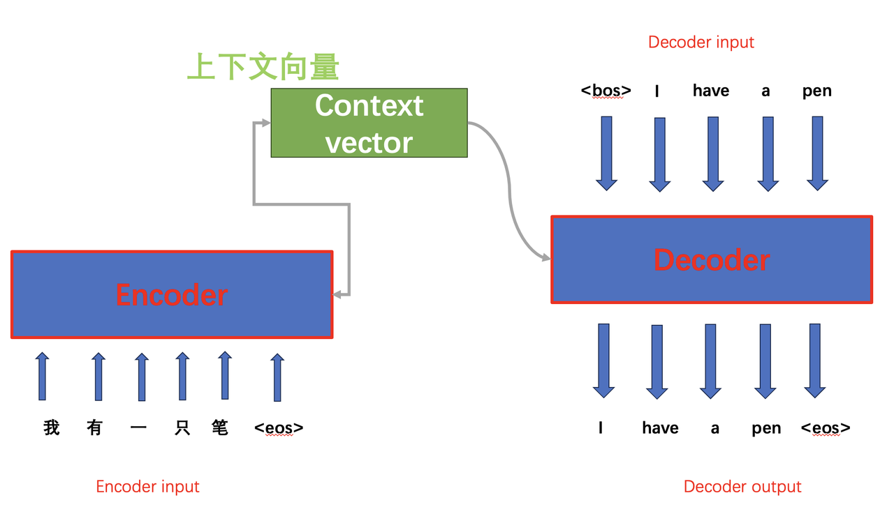
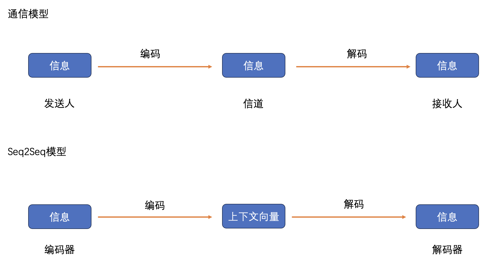
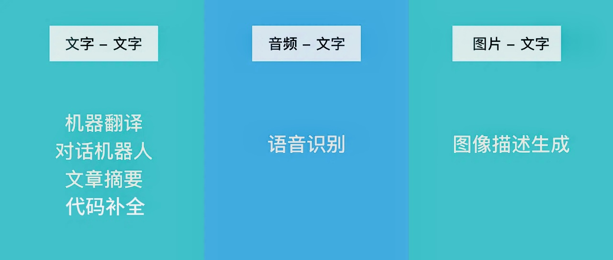
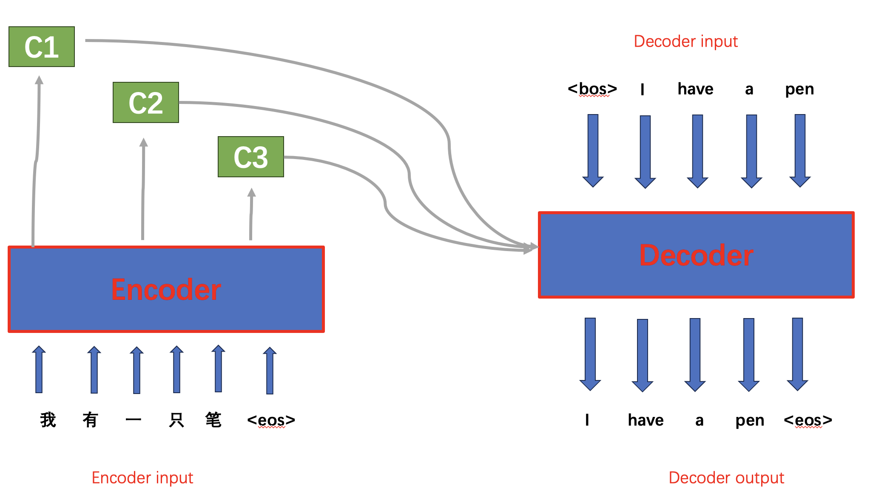

[TOC]


在开头放一下[课程资源](http://www.datawhale.cn/learn/summary/87)。

# 序列到序列（Seq2Seq）模型

## 由来

在 Seq2Seq 框架提出之前，深度神经网络处理的问题中的输入输出通常可以表示为固定的长度。遇到长度改变，就会用**填充**（padding）手段弥补。

> 填充：用0填补位置，使序列数据转换成固定长度的格式

但是，填充手段有所不足：

1. 需要用**掩码**（Mask）处理忽略补零元素，否则可能对模型有干扰。

2. 许多重要的问题，例如机器翻译、语音识别、对话系统等，表示成序列后，其**长度事先并不知道**。

由此，Seq2Seq应运而生。

## 是什么？

Seq2Seq模型，全称Sequence to Sequence模型，也就是输入一个序列，输出一个序列。创新在于**输入序列和输出序列的长度可变**，采用了类似于标签的手段减少对填充的依赖：

```python
<bos>：Begin Of Sequence（BOS）
<eos>：End Of Sequence（EOS）
```

因此，对于一段序列：

```python
BOS I have a pen EOS
```

我们可以提取出序列要传达的内容为：

```python
I have a pen
```

我们用一个具体的模型案例来体会序列的可变性：



解读：输入了“我有一支笔”五个汉字，输出了"I have a pen"四个英文单词，长度不相同。而抽象出里面的模型可以得到：



可以看到，Seq2Seq模型与通信模型十分类似。

## 特点

1. 不需要人工提取特征或进行复杂的预处理；
2. 把整个输入序列压缩成一个**固定维度**的上下文向量：成也萧何败也萧何
   - 信息提炼高效；
   - 信息压缩和信息损失的问题，尤其是细粒度细节的丢失（忽略细节）；
3. 可以轻松地与其他神经网络技术结合，处理更加复杂和多样化的任务；
4. 在处理长序列时存在短期记忆限制
5. *暴露偏差（Exposure Bias）*
>模型在测试时可能无法很好地适应其自身的错误输出。
>
>“teacher forcing”的方法让Seq2Seq模型在训练过程中过分依赖“答案提示”，缺乏独立解决问题的能力，导致实际应用时的表现有差异。

# Encoder - Decoder模型

我觉得这个标题更能够体现它的本质。在前面说Seq2Seq的时候，图里面也要有encoder与decoder的存在，说明两者肯定有一定联系。

## Seq2Seq与Encoder-Decoder的关系

1. Seq2Seq本质上采用了Encoder - Decoder**架构模式**，是Encoder-Decoder架构的一种具体应用

   具体而言，二者核心功能都是完成数据从一种表示到另一种表示的转换。Encoder - Decoder架构适用于**多种数据转换任务**，Seq2Seq**专注于**序列数据转换。

2. Seq2Seq更强调目的，Encoder-Decoder更强调方法

   Encoder - Decoder强调架构通用性，为解决不同类型数据转换问题提供框架，而Seq2Seq为序列数据而生。
   
## 概念

**Encoder-Decoder**将现实问题转化为数学问题，通过求解数学问题，从而解决现实问题。将过程细化：

- Encoder：编码器
将现实问题转化为数学问题

- Decoder：解码器
  求解数学问题，并转化为现实世界的解决方案

- 根据不同的任务可以选择不同的编码器和解码器。

## 过程

### 编码器（Encoder）

- 本质：循环神经网络（RNN），由多个循环单元（如LSTM或GRU）堆叠而成。

- 功能：依次处理输入序列中的一个元素，生成一个**固定长度**的**上下文向量**，传递给解码器

- 工作流程：

  1. 词序列转换：词嵌入

     **嵌入层**将每个词汇映射到一个携带了语义的**高维空间中的稠密向量**；

>位置确定：词汇的语义相似性，词义相近，位置也相近。使得词汇之间的关系可以通过向量之间的距离或角度来度量。代码示例是定义词汇及其对应的三维向量，至于为什么这么定义，有没有高效有依据的定义方法没有说明。
>
>在实际应用中，词嵌入通常是在一个更高的维度空间中进行的。

​           2. 序列处理

高维空间中的稠密向量组成一个向量序列，被送入一个基于循环神经网络的结构，捕捉输入序列中的顺序信息和上下文关系。RNN 按顺序逐个处理这些词汇的向量，这个顺序处理的过程就是 “时间步”。每个时间步对应处理一个词汇的向量。在每个时间步，RNN单元不仅处理当前词汇的向量，还结合了来自前一个时间步的**隐藏状态信息**。这种机制使得 RNN 能够捕捉序列数据中的长期依赖关系，考虑到上下文信息。

​          3. 生成上下文向量

RNN的最后一个隐藏层输出的**上下文向量**被用作整个输入序列的表示，作为Decoder端的重要输入。上下文向量通过汇总和压缩整个序列的信息，有效地编码了输入文本的整体语义内容。

### 解码器（Decoder）

- 本质：RNN

- 功能：接收编码器输出的上下文向量作为其初始输入，并依次合成目标序列的各个元素。

- 工作流程：

  1. 参数初始化：包括W、b，与吴恩达老师的课程中讲述的是一致的。
     $$
     Z=WX+b
     $$
     初始化通常涉及对它们赋予随机的小数值。针对不同激活函数采用不同的初始化策略，旨在维持各层激活值和梯度的大致稳定性，从而优化训练过程：

     - Sigmoid或Tanh激活函数：**Xavier初始化**

     - ReLU激活函数：**He初始化**

       *初始化的内容我还没学完/没学通，留个坑在这里*
  
  2. 设定初始隐藏状态
  
     上下文向量通常被设定为解码器的初始隐藏状态，或者基于上下文向量计算出初始隐藏状态。
     
  3. 逐词生成

     解码器需要一个触发信号bos来启动序列生成。解码器在每个时间步，会根据当前输入和隐藏状态计算隐藏状态。然后，基于当前隐藏状态，计算输出的概率分布，从概率分布中选择概率最高的作为输出。重复上述步骤，将上一个时间步的生成作为下一个时间步的输入，继续计算新的隐藏状态、概率分布并计算预测。
     
  4. tips：注意力权重

     如果模型采用了**注意力机制**（稍后详解），那么每个时间步解码器还会接收一组注意力权重。这些权重反映了当前解码位置对源序列不同部分的关注程度。

### Seq2Seq模型的训练过程

1. 准备数据：
   - 数据预处理：分词、编码
   - 批量处理
2. 初始化模型参数：
   - 解码器RNN：初始化W、B，如前所述
   - 输出层：初始化W、B，用于将解码器的隐藏状态映射到目标词汇的概率分布
3. 编码器处理：生成上下文向量
4. 解码器训练：加上一个损失计算（计算预测的概率分布和实际目标词汇之间的损失）
5. 反向传播和参数更新：又与吴老师的课衔接上了

   - 计算梯度
   - 参数更新
6. 循环训练
7. 评估与调优

   - 验证集评估：在新的验证集上测试
   - 超参数调优：调整学习率、批次大小

## 应用

几个应用场景与对应的论文，有空研究研究：



1. [Seq2Seq-机器翻译](https://arxiv.org/pdf/1409.3215)
2. [Seq2Seq-语音识别](https://www.isca-archive.org/interspeech_2017/prabhavalkar17_interspeech.pdf)
3. [Seq2Seq-图片特征](https://arxiv.org/pdf/1505.00487)

## 缺陷

信息丢失问题。

# Attention机制

## Attention机制如何解决信息丢失问题

Attention 机制允许解码器在生成每个输出时，动态地从编码器的所有隐藏状态中选择并聚焦于与当前输出最相关的信息，而不是依赖单一的固定长度上下文向量。这一实现依赖于Encoder将整个输入序列编码为一个向量序列而并非固定长度的“向量C”。



传统的循环神经网络（RNN）在处理长序列时，由于梯度消失或爆炸问题，很难有效捕捉长距离依赖关系，导致信息在传递过程中丢失。Attention机制通过直接在编码器和解码器的所有位置之间建立联系，能够更好地捕捉序列中的长距离依赖。

## Attention机制的核心工作：关注重点！

将有限的注意力集中在重点信息上，从而节省资源，快速获得最有效的信息。类似于人看一张照片，我们能够区分出主体与背景，在众多信息中挑选出关键部分进行重点处理的。 

## Attention机制的3大优点

1. **参数少**：对算力的要求也就更小；
2. **速度快**：可以进行并行处理；
3. **效果好**：正如之前所说，弥补了长距离的信息被弱化的问题。
