# Attention机制

## 产生背景

- 领域：**神经机器翻译**(Neural Machine Translation)系统

- 原本技术：基于Encoder - Decoder 的 RNN / LSTM

> task1介绍的内容

- 缺点：
  1. 长程依赖问题。由于梯度消失/爆炸问题，RNN 无法记住较长的句子和序列；
  2. 在翻译句子时，无法赋予某些输入词比其他词更重要的重要性。

- 提出问题：在创建上下文向量时，我们有没有办法保持输入句子中的所有相关信息完好无损？

Attention机制应运而生。

## Attention机制如何起作用？

- 核心：**加权求和**

- 工作原理：

1. **分解输入**：例如把一堆单词划分为单个；

2. **挑出重要部分**：找出输入中与当前任务最相关的部分

   将问题或者生成任务作为“查询”，去对比源语言中的各个单词，看哪个单词与之关联度最高。

3. **分配重要性**：根据每个部分与问题的匹配程度，为其分配一个分数；

4. **集中注意力**：通过前面步骤得到的分数，还不能直接用于后续计算，需要将其转化为概率分布，即注意力权重。较高的得分对应较高的注意力权重，会获得更多关注；

5. **加权求和**：每个部分的数据（通常是向量表示）乘以其对应的注意力权重，然后将所有结果相加，得到一个新的向量。

## 分类：全局注意力与局部注意力

- 思想来源：计算机视觉任务的**软注意力**和**硬注意力**概念

1. 软注意力：全局注意力，可微的注意力机制，它会对输入的所有元素都分配一个权重，这些权重构成一个概率分布，所有元素的权重之和为 1；
2. 硬注意力：非可微的注意力机制，它只选择输入中的一个或几个元素进行关注，而忽略其他元素。

### 全局注意力

- 思想：所有输入都很重要
应用于之前的Encoder-decode模型，全局注意力考虑编码器 LSTM 和解码器 LSTM 的**所有隐藏状态**来计算“可变长度上下文向量 ”

- 缺点：计算量很大

- 如何改善：局部注意力

### 局部注意力

- 与软计算与硬计算的关系：

  1. 避免了软注意力中产生的昂贵计算

     局部注意力只考虑一部分输入，减少了需要处理的元素数量，从而降低了计算的复杂度和成本，提高了计算效率。

  2. 比硬注意力更容易训练

     局部注意力具有一定的可微性，能够在一定程度上利用反向传播算法进行训练，所以训练过程相对简单，更容易实现模型的优化。

- 实现：
  
  1. **预测对齐位置**
  
     明确**源数据**中的哪些部分与当前正在生成的**目标数据部分**最为相关。
  
     其中，对齐位置有以下两种选择：

     - 单调对齐

     ​       直接将对齐位置设置为时间步，即Pt = t。适用于一些输入序列和输出序列具有较强顺序对应关系的任务，例如在某些文本生成任务中，如果源文本和目标文本的顺序关联性很强，就可以采用单调对齐。
     - 预测对齐

       对齐位置是由模型本身预测得到的，计算公式为：
       
       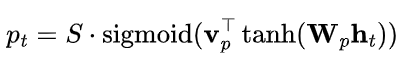
       
       其中，ht表示在时间步时的隐藏状态向量，它包含了模型在该时刻对输入信息的特征表示。
  
  2. **定义注意力窗口**
  
     由于有前面步骤找到的位置，我们不会对整个源句子进行注意力计算，而是在这个预测位置周围划定一个范围，这个范围就是注意力窗口。窗口的大小设定为2D，D是**经验选择**的参数。               
     例如，假设位置pt为5，D=2，那么窗口的范围为[3,7]。
  
  3. **计算上下文向量**
  
     对应attention机制的工作原理中最后一步，上下文向量是窗口内输入序列的加权平均值。
     
### 对比图示

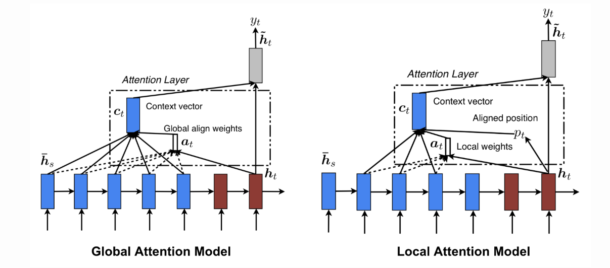

# Transformer概述

## Transformer发展历程

图片与各个阶段：

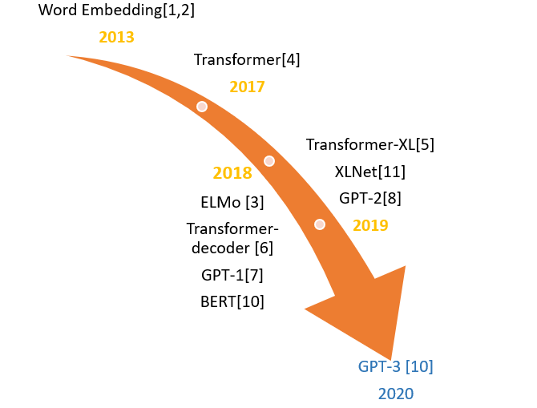

1. 2013年，词嵌入（word Embedding）技术出现，为后续 NLP 模型发展奠定基础；

2. 2017年，Transformer模型诞生；

3. 2018年，ELMo、Transformer-decoder、GPT-1、BERT等模型将Transformer不断丰富；

4. 2019年，Transformer-XL引入相对位置编码等技术解决长序列依赖问题，XLNet、GPT-2在前人基础上不断发展；

5. 2020年，GPT-3推出，它以超大的模型参数和强大的语言生成能力引起广泛关注，在多种自然语言处理任务中表现卓越。

Transformer模型的**并行计算能力**使得**扩大模型规模**成为可能。BERT、GPT系列等模型都是在Transformer的基础上通过**增加层数和宽度**来扩大模型规模，从而在多项NLP任务上取得突破。

下图展示了各个模型发展了Transformer模型的哪方面内容：

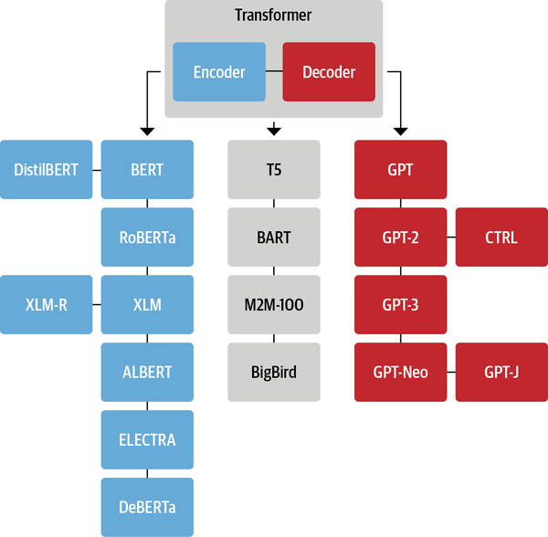

## Transformer模型概述

模型整体如图所示：

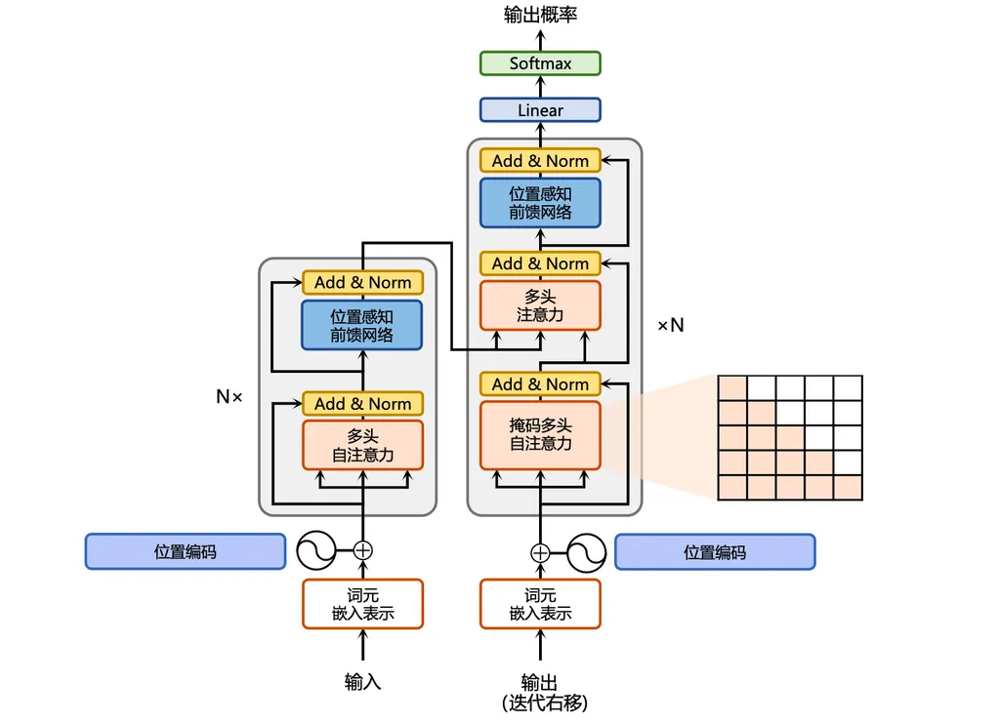

其中每个部分：

- 编码器-解码器架构（灰色方框部分）

  Transformer的**核心**，分别负责处理输入序列、生成输出序列。包含了：

  - 多头注意力

    能够**同时**关注输入序列的不同部分。通过将输入分成多个头（head），在不同的表示子空间中并行地计算注意力，最后将各个头的输出拼接并进行**线性变换**，得到最终的输出。这样可以让模型从多个不同的角度来捕捉输入序列中的信息，增强模型的表达能力。

  - 前馈网络

    捕捉序列中元素之间复杂关系的多功能组件。通过使用**线性变换和非线性激活函数**，前馈网络使模型能够在语言的复杂语义景观中航行，促进文本的理解和生成。
  
- 位置编码

  将输入嵌入与位置信息结合起来，使模型能够区分序列中元素的相对位置，提高对于内部元素的理解。

## Transformer工作流程

通过一个实例，结合**箭头方向**理解transformer运行过程：

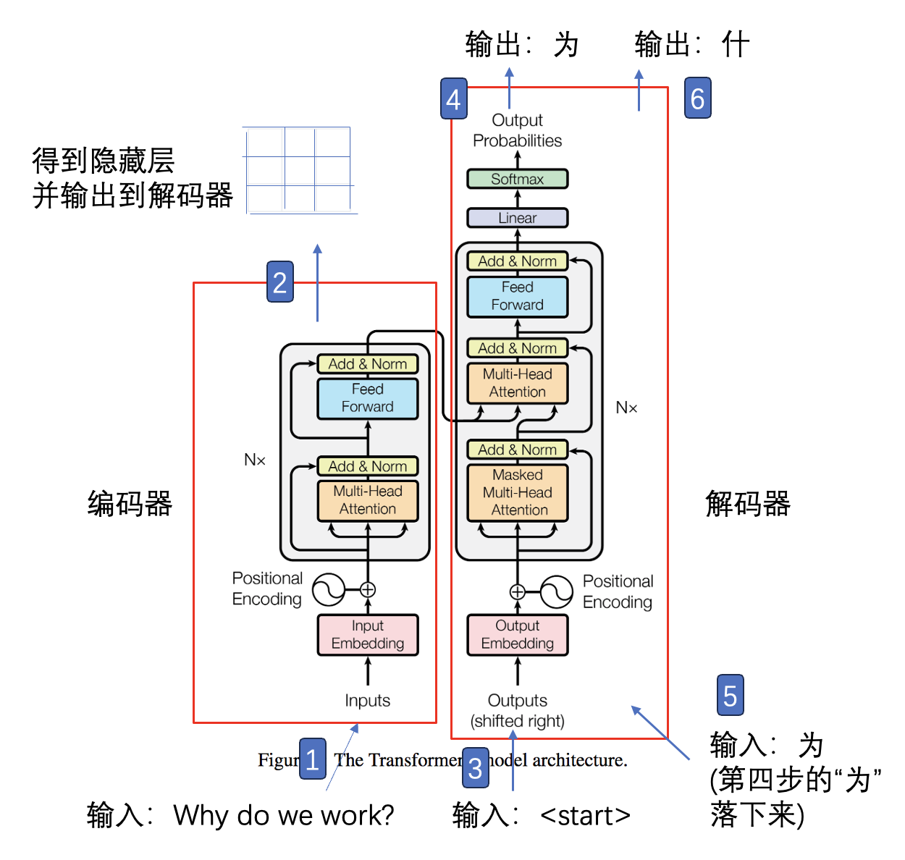

序号分别对应的步骤：

1. （策划阶段）接受信息并处理：

   处理内容：输入序列进行**词嵌入**与**位置编码**；

2. （统筹安排）经过Encoder，得到**隐藏层**输出给decoder：

   如何得到？自注意力机制识别信息之间的关联性并分配权重

3. （执行阶段）Decoder据编码器输出的特征表示，**逐步**生成目标序列：

   最后一层解码器的输出经过线性变换和 softmax 函数，得到每个位置上词汇表中各词汇的概率分布，选取概率最大的词汇作为当前位置的输出，依次生成完整的目标序列。
   
## Transformer对seq2seq模型的影响

1. 摒弃RNN结构，使得模型能够并行处理序列中的所有元素，大大提高了计算效率；
2. 引入自注意力机制，有助于捕捉长距离依赖关系；
3. 引入位置编码，为序列中的每个元素提供了一个位置向量，将位置信息与元素的特征表示相融合；
4. 编码器-解码器架构的改进；
5. 训练效率的提升，训练时间缩短；
6. 推动了自然语言处理（NLP）领域的发展；
7. 为BERT等**预训练模型**的出现奠定了基础，这些模型进一步推动了NLP技术的边界。

## 预训练与迁移学习

### 预训练

- 兴起原因：Transformer模型的**自注意力机制和深度堆叠架构**为预训练模型提供了一个强大的基础。除了Transfomer本来的优势，预训练还能够从大量**未标注文本**中学习丰富的**语言表示**。

- 语言表示的学习过程

1. 掩码语言模型（Masked Language Model, MLM）

   对输入文本中的部分**标记**（token）进行随机掩码（mask）操作，让模型根据上下文信息来预测这些被掩码的标记。

2. 下一句预测（Next Sentence Prediction, NSP）

   让模型学习到**句子**之间的**逻辑连贯关系**。在这个任务里，模型会接收两个句子作为输入，然后需要判断第二个句子是否是第一个句子的真实后续句子。
   
- 图示

  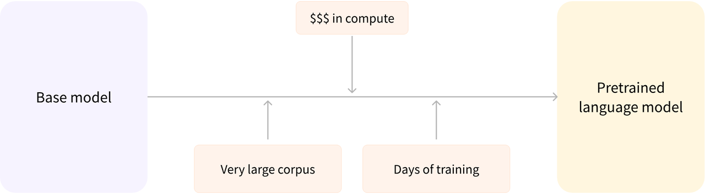
### 迁移学习

- 产生原因：预训练（从头开始训练模型）需要海量的训练数据，而且时间和经济成本都非常高；

- 内涵：一种机器学习技术，核心思想是把在一个任务（通常是大规模、通用的源任务）上学习到的知识，迁移应用到另一个不同但相关的任务（目标任务）上。其中，**微调**（fine-tuning）是迁移学习的重要手段

- 图示：

  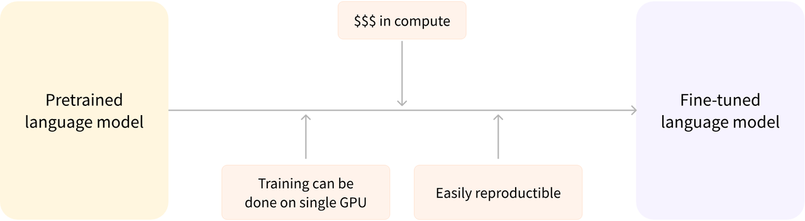

# Transformer vs CNN vs RNN

## Q、K、V知识引入

在Self-Attention中，每个输入元素被映射为Q、K、V三个元素。

| 名称 | 含义                                                         | 生活举例 |
| ---- | ------------------------------------------------------------ | -------- |
| Q    | Query，查询，可以把 Query 想象成一个问题，模型通过这个问题去序列中寻找相关的信息。 | 购买需求 |
| K    | Key，键，是每个元素的一种特征表示，用于与 Query 向量进行匹配。 | 商品特征 |
| V    | Value，值，是每个元素携带的 “有价值” 的信息。                | 实际体验 |

对于输入序列中的每个Q向量，我们需要将其与所有K向量进行点乘操作。假设输入序列长度为n，每个元素的**维度为 d**，输出序列**长度也为 n**，每个元素的**维度也是 d**。那么总共有n个Q向量，n个K向量，每次点乘操作的计算复杂度为O(d)。

从每层的计算复杂度、并行的操作数量、学习距离长度三个方面比较，结果如图：

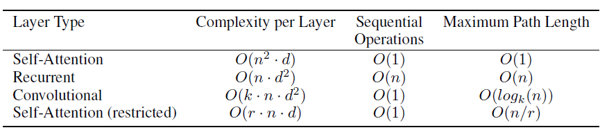

可以得出。Transformer、CNN和RNN都是非常重要的模型架构，它们各自有独特的优势和局限性，适用于不同的应用场景。

# 输入嵌入(Input Embedding)

总体上，Transformer的输入嵌入过程：

1. token化：将输入的文本序列分割成一个个token；

2. 词嵌入：将每个token转换为对应的嵌入向量，得到token的向量表示;

3. 位置编码：根据token在序列中的位置，生成对应的位置编码向量;

4. 向量相加：将词嵌入向量和位置编码向量相加，得到最终的输入嵌入向量。

因此，最终的向量既包含了token的语义信息，又包含了其在序列中的位置信息，可以作为Transformer模型编码器或解码器的输入。

## 词嵌入（Word Embedding）

- 温故而知新：目的是让矩阵中的向量能够尽可能准确地表示单词的语义和语法信息

- 方法：

1. 使用预训练(Pre-trained) 的Embeddings并固化

   权重矩阵是从预训练的词嵌入模型中加载的，比如Word2Vec、GloVe或FastText等。这种情况下，权重设置为**不可训练**(Freeze)。
   
   优点是可以利用预训练嵌入中包含的丰富语义信息，弥补数据不足的可能情况。
   
   要用Python实现，需要调用Python的gensim库，这个库能够处理大规模的文本数据，在自然语言处理（NLP）领域被广泛使用。我们以Word2Vec模型为例简单说明：

```python
#引入模型
from gensim.models  import Word2Vec
#训练词向量模型，上下文窗口大小为5，单词在语料中出现的最小次数为1，线程数为4
#sentences的内容要提前进行分词处理
model = Word2Vec(sentences, window=5, min_count=1, workers=4)
# 获取所有词
vocab = model.wv.index_to_key
# 获取所有词向量
vectors = model.wv[vocab]
#查看词向量
print(vectors)
```

2. 随机初始化

   权重矩阵是随机初始化的，通常使用**均匀分布**(高斯分布)进行初始化。这种情况下，权重设置为**可训练**(Trainable)。
   
   优点是嵌入向量可以根据特定任务进行调整，满足特定领域的需求。
   
## 位置编码(Position Embedding)

- 编码实现：

公式如下：

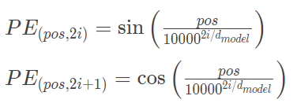

pos就是word position，表示元素在序列中的位置；i表示嵌入向量的维度索引，取值是[0,d/2-1]。式子中d不变，pos与i改变，共同导致了不同的PE值。

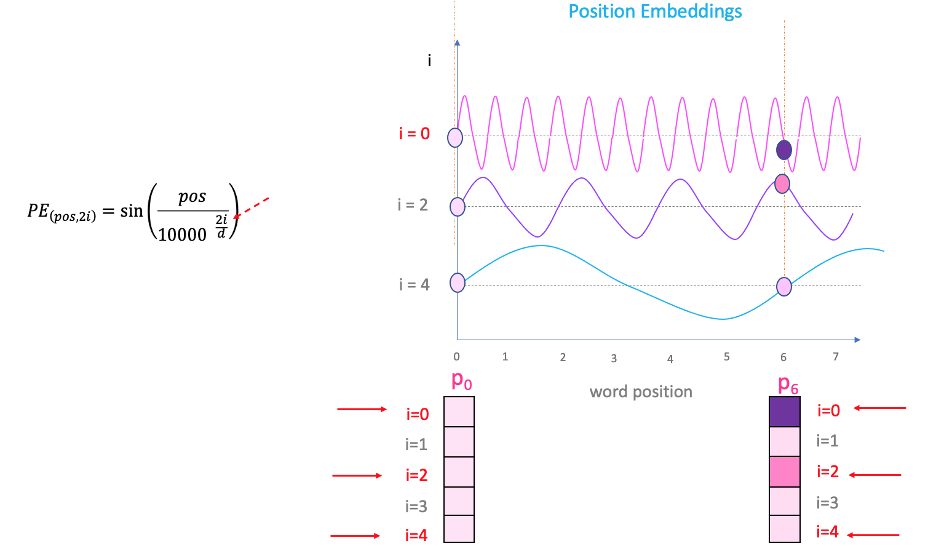如图，p0与p6的位置，如果i相同，两者的值一定。这就是等式中的i部分发挥作用的地方。不同的i对应一系列具有不同频率的曲线。通过读取不同频率的位置嵌入值，最终会为 P0和P6 在不同嵌入维度上提供不同的值。

用代码实现方程：

```python
# 计算正弦和余弦函数中的分母部分，形状为 (d_model // 2,)
div_term = torch.exp(torch.arange(0, d_model, 2) * -(math.log(10000.0) / d_model))
# 计算正弦编码，并填充到偶数索引位置
self.encoding[:, 0::2] = torch.sin(position * div_term)
# 计算余弦编码，并填充到奇数索引位置
self.encoding[:, 1::2] = torch.cos(position * div_term)
```

由于三角恒等式的存在，这一公式便于模型捕捉序列中不同位置的元素之间的**相对位置**关系。

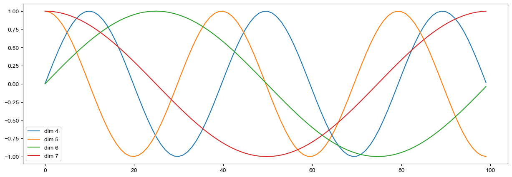

从图可以看出，相对位置具有周期性变化。同时，同一序列的不同单词在单个纬度符合某个正弦或者余弦，可认为他们的具有相对关系。
