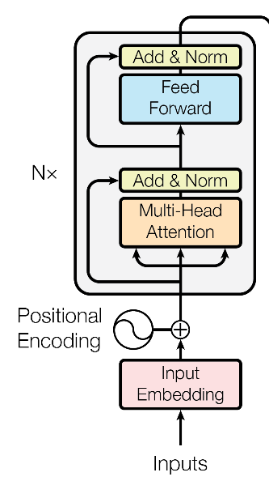
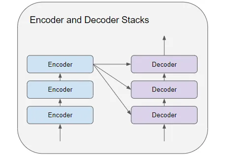

# 编码器(Encoder)

## Encoder的组成成分

回顾上一讲Transformer的图，我们在中间找到Encoder的结构：

从这张图中，我们可以把Encoder分成以下几个结构：

### 输入阶段：Input Embedding（输入嵌入）

位于图片最下方，将输入的**离散符号**转换为连续的**向量**表示。

我们关注到灰色方框旁边的N，代表Encoder模块会堆叠几次，整体上Transformer呈现以下的结构：

对于后续的Encoder模块，它们从前一个Encoder接收相应的输入，形成一个顺序传递信息的链路。

### 核心处理阶段：Multi - Head Attention（多头注意力机制）、Feed Forward（前馈网络）

- **Multi-Head Self-Attention（多头自注意力机制）**：橙色方框

  Encoder接收输入后优先传入多头注意力机制中，允许模型在**不同的表示子空间**里通过”头“(head)**并行**地捕捉信息，从**不同角度**对输入进行分析，从而更好地捕捉序列中的依赖关系和语义信息。

- **Feed Forward（前馈网络）**：蓝色方框

  收到多头注意力机制的输出，做进一步处理，为每个位置的向量进行相同的**非线性变换**，提取更复杂、高层次的**特征**，增强模型的表达能力。
  
### 残差与归一化阶段：Add & Norm（残差连接与归一化）

- 残差连接（Residual Connection）

  将**输入**直接与经过 “Multi - Head Attention” 层或 “Feed Forward” 层处理后的**输出**相加。有助于缓解深度网络训练过程中的**梯度消失或梯度爆炸**问题，使得网络能够更容易地训练深层模型，并且能够让信息更顺畅地在网络中传递。
  
- 层归一化（Layer Norm）

  在残差连接之后进行，表示对**每一层**的神经元的**输入**进行**归一化处理**。可以加速网络的收敛速度、提高模型的泛化能力等，使得模型训练更加稳定、高效。
  
# 多头注意力机制

每个头都有自己的Q、K和V_(联系前面的知识)_，最后将所有头的输出通过一个**线性层**拼接起来。